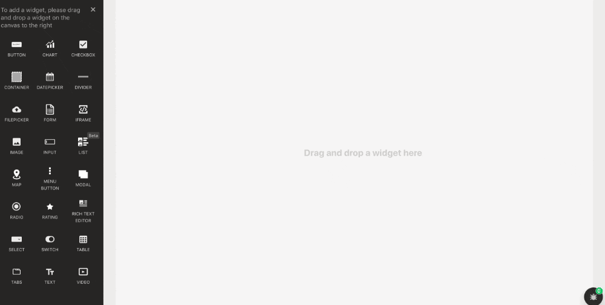

# Download

We use [downloadjs](https://github.com/rndme/download) for this functionality

## Download


### Signature

```javascript
download(data: any, fileName: string, fileType?: string): Promise
```

#### Arguments

| **Argument Name** | **Description**                            |
| ----------------- | ------------------------------------------ |
| **data**          | Data or URL that would be downloaded       |
| **fileName**      | Name of the file to be downloaded          |
| **fileType**      | The mime type of the file to be downloaded |

### Use cases

*   **Downloading a Plain Text**

    To download a plain text, the _expected data_ is a string representing the text content to be downloaded.

    ```javascript
    download(data: string, fileName: string, fileType?: string): void
    ```

    
*   **Downloading an image**

    To download an Image, the _expected data_ is the image's URL or Base64 string.

    
*   **Downloading a file**

    By supplying the URL of the file to be downloaded, files of different types can be downloaded via the download action.

    > For files to be successfully downloaded, **their contents must be served over HTTPS** to prevent requests from being blocked. To prevent Cross-Origin Resource Sharing (CORS) errors, ensure that the server where the file is fetched from is **CORS-enabled** and returns the required headers in the response.
