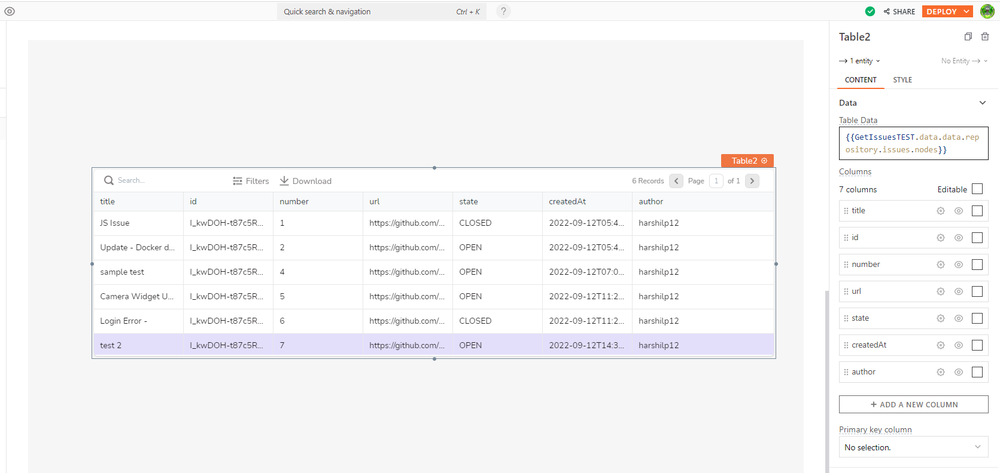

# GraphQL

GraphQL is a query language that allows a requesting client to ask for exactly what it's looking for, where it's looking for it, and receive just the response it needs. Making things easier for developers and clients alike. As an alternative to the popular REST services, it offers a single point for retrieving data from multiple sources in the format specified by the consumer.

Appsmith provides an easy way to integrate with GraphQL, and enables you to perform different operations using a custom UI built with minimal configurations.

## Create GraphQL API

To add a GraphQL API, navigate to **Explorer** >> Click on the **+** icon (next to Datasources) >> Select **GraphQL API** under APIs.


How to create GraphQL Datasource?


## Connection Settings

Configure the GraphQL API as illustrated below:

<figure><figcaption><p>Create GraphQL Datasource</p></figcaption></figure>


All required fields are suffixed with an asterisk (\*).


#### URL

Use this field to add the API URL you want to access. For instance, if you want to visit [GitHub GraphQL API](https://docs.github.com/en/graphql), enter [https://api.github.com/graphql ](https://api.github.com/graphql)in the URL field.

#### Headers

HTTP Headers are an important part of the API request and response, representing the meta-data associated with the API request and response. Headers carry the following information:

1. Request and Response Body;
2. Request Authorization;
3. Response Caching;
4. Response Cookies.

#### Query Parameters

A parameter is a piece of information you provide to a query during its execution. In the query, parameters can be used independently or as a component of a larger expression to build a criterion. The API you integrate allows you to include one or more[ query parameters](https://docs.appsmith.com/core-concepts/data-access-and-binding/querying-a-database) as part of the request.

#### Send Appsmith signature header\*

You can enable [Send Appsmith Signature Header](https://docs.appsmith.com/core-concepts/connecting-to-data-sources/authentication#send-appsmith-signature-header) to ensure that the incoming requests originate from Appsmith.

#### Authentication Type

GraphQL API[ authentication types](https://docs.appsmith.com/core-concepts/connecting-to-data-sources/authentication/authentication-type) can be defined using the protocols offered by Appsmith.

#### Use Self-signed certificate

Self-signed certificates are sometimes used in testing or internal environments, as they provide incoming/outgoing data encryption and can be created at no cost.

The GraphQL Datasource allows you to upload your own self-signed certificate within the API's configuration page. You can follow this [document ](https://docs.appsmith.com/core-concepts/connecting-to-data-sources/authentication/self-signed-certificates)to learn more about Self-signed certificates.


This information needs to be provided in .PEM (Privacy Enhanced Mail) format, as shown [here](https://docs.appsmith.com/core-concepts/connecting-to-data-sources/authentication/self-signed-certificates).


## Create Queries

You can add queries to the newly created GraphQL datasource in one of the below ways:

#### GraphQL Datasource Page

You can add queries to GraphQL datasource by selecting the **New API +** button available on the datasource page.

<figure><figcaption><p>GraphQL Datasource Page</p></figcaption></figure>

#### Query/JS page

By navigating to **Explorer** >> Click plus sign (**+**) next to **Queries/JS** >> Select the GraphQL **datasource.**

<figure><figcaption><p>Query/JS page</p></figcaption></figure>

#### Datasource Page

Similar to REST APIs, you can choose to create a one-off query by clicking on the “**+**” icon next to “Datasources” and selecting “_**Create New GraphQL API**_”.

<figure><figcaption><p>Datasource Page</p></figcaption></figure>

You can create and run queries for an existing GraphQL datasource. You can provide the URL and additional information like the Headers, Params, Body, and Pagination. Once you have added code in the body section, you can directly run the query and connect it with widgets.

Let’s take an example to understand how **“Create new GraphQL API”** works.




To understand GraphQL query creation, let's use the [Public GraphQL API](https://countries.trevorblades.com/) that gives information about continents and countries.


* Click on the **+** icon next to the **Datasources** and choose your “Create new GraphQL API”.
* Add your API request URL.
* For this example, please use:[ _**https://countries.trevorblades.com**_](https://countries.trevorblades.com)_**.**_
* In the **Body** of the request, put the GraphQL query to get details of countries.

```
query CountryFilterInput{
    countries{
        code
        name
        capital
        continent{
            code
            name
        }
    }
}
```

* Now **run** the query.

With this, all of a country's information, including its code, name, capital, etc., will be displayed in the response section.

## Query

You can create queries to fetch, update and delete data from a datasource using the Appsmith query editor. Let's discuss the following query methods:

| Query Name                                                  | Description                             |
| ----------------------------------------------------------- | --------------------------------------- |
| [​List Records​](graphql.md#list-records)                   | Fetches all the data from the database. |
| [​Retrieve A Record​](graphql.md#retrieve-a-record)         | Retrieve a particular record.           |
| [Insert Records​](graphql.md#insert-records-create-records) | Insert a new record in the database.    |
| [​Delete A Record​](graphql.md#delete-a-record)             | Delete a specific record.               |
| [​Update Records​](graphql.md#update-records)               | Update a few fields in a record.        |


[GraphQL Queries ](https://graphql.org/learn/queries/)(Read operations like List, Retrieve, etc.) and [GraphQL Mutations](https://graphql.org/learn/queries/#mutations) (Write operations like insert, update, etc.) are collectively termed [Queries ](https://docs.appsmith.com/core-concepts/data-access-and-binding/querying-a-database)in Appsmith.


### **List Records**

List command lets you display all the data from the database. With Appsmith, you can present data that has been filtered and sorted based on fields, records, etc.

* Click on the **+** icon next to the **queries/js** and choose your GraphQL datasource.
* Rename the query.
* Add your code in the body section.

Once the parameters have been specified, click **Run**. The response section will now display the data.

Let's take an example to understand how the list record command works.

In this example, we will use [Github’s GraphQL API](https://docs.github.com/en/graphql) to **view** and **manage issues,** including **issue assignees, comments, labels,** and **milestones.**


Please understand key terms and concepts before using the [GitHub GraphQL API.](https://docs.github.com/en/graphql)


* Add the following code to the query to get issues from a specified repository:

```
query GetRepositoryWithIssues {
  repository(owner: "harshilp12", name: "Test"){
    id
    nameWithOwner
    description
    url
    issues(last: 50) {
      totalCount
      nodes{
        title
        id
        number
        url
        state
        createdAt
        author {
              login
        }
       
      }
    }
  }
}
```

In the preceding query, we obtained information on issues (totalCount), the most recent issues with their titles and creation dates (createdAt), as well as information on the issue author.

You can use a table widget to display your data. You can follow this [document](../widgets/table/) to understand how the table widget works.

<figure><figcaption><p>Display Data Using Table Widget</p></figcaption></figure>

When you make requests to the API, it returns many results. To make the responses more manageable, paginate the results. The benefit of this approach is that it doesn't require additional backend logic. Appsmith supports both [Limit/Offset Based Pagination ](graphql.md#pagination)and [Cursor-based Pagination.](graphql.md#cursor-based-pagination)

### **​Retrieve A Record​**

Retrieve record lets you fetch data for a particular user detail.

* Click on the **+** icon next to the **queries/js** and choose your GraphQL datasource.
* Rename the query.
* Add your code in the body section.

Let's look at an example where we retrieve the number of GitHub issues(**total**, **open** and **closed**):

```
query { 
  repository(owner:"harshilp12", name:"Test") { 
    issues {
      totalCount
    }
    open: issues(states:OPEN) {
      totalCount
    }
    closed: issues(states:CLOSED) {
      totalCount
    }
  }
}
```

* Now **run** the query.

You receive a response from the preceding query that includes the total number of issues, number of closed issues, and number of open issues. Something like this:

```
{
  "data": {
    "repository": {
      "issues": {
        "totalCount": 7
      },
      "open": {
        "totalCount": 5
      },
      "closed": {
        "totalCount": 2
      }
    }
  }
}
```


The advantage of using GraphQL over REST API is that you can cherry-pick the response. The API provides the information that you explicitly state in the query.


In GraphQL, you **insert**, **update** or **delete** data with mutations. A **Mutation** is a GraphQL Operation that allows you to insert new data or modify the existing data on the server side. You can think of GraphQL Mutations as the equivalent of POST, PUT, PATCH, and DELETE requests in REST.


**Queries**, and **Mutations** to perform CRUD operations on data are collectively termed **Queries** in Appsmith.


### **Insert Records​/Create Records**

Insert is a widely used command in the Structured Query Language (SQL). The insert command is used to insert **one** or **more rows** into \*\*\*\* a **database table** with **specified table values**.


Create New Record


* Click on the **+** icon next to the **queries/js** and choose your GraphQL datasource.
* Rename the query to **`create_user`**.
* Next, add your code in the body section and run your query.

To create a GitHub issue, you first require the \*\*`id` \*\* of the target repository. Once you assign the repository ID, you can input the title and description of the issue.

```
mutation CreateIssue {
  createIssue(input: {repositoryId: "R_kgDOH-t87Q", title: "Sample Title", body: "Sample Body"}) {
    issue {
      number
      body
      url
    }
  }
}
```

You can create a new issue using the [button ](https://docs.appsmith.com/reference/widgets/button)and [modal ](https://docs.appsmith.com/reference/widgets/modal)widget.

### **Update Records​**

Update queries let you update existing objects of a particular type. With an update query, you can filter nodes and set or remove any field belonging to a type.



* Click on the **+** icon next to the **queries/js** and choose your GraphQL datasource.
* Rename the query to **`update_users`**.
* Add your code in the body section and run your query.

```
mutation updateIssueTest{
  updateIssue(input:{id:"<issue.id>",title:"<updated_title", body:"<updated_body"}){
    issue{
      id
    }
  }
}
```

The above query updates the GitHub issue’s with the ID, Title and description. You can again customize what fields you want back as a result, here we are calling `id`.

You can use the [Modal ](https://docs.appsmith.com/reference/widgets/modal)widget or[ JSON form Widget ](https://docs.appsmith.com/reference/widgets/json-form)to update the GitHub issues.

### **​Delete A Record​**

The Delete Record command deletes a particular record from the database. You can pass the below parameters to Delete Records.

* Click on the **+** icon next to the queries/js and choose your GraphQL datasource.
* Rename the query.
* Add your code in the body section and run your query.

```
mutation deleteIssueTest{
  deleteIssue(input:{issueId:"<your_ID>"}){
    repository{
      id
    }
  }
}
```

The preceding code deletes the issue using your Issue ID.

Similarly, if you want to close an issue, you can use the below-mentioned code:

```
mutation closeIssueTest{
  closeIssue(input:{issueId:"<your_id>"}){
    issue{
      id
    }
  }
}
```


You can run queries on real GitHub data using the [GraphQL Explorer](https://docs.github.com/en/graphql/guides/using-the-explorer)


## Common Settings

There are a few settings listed below that are common to many operations that you can perform on GraphQL:

### **Pagination**

Pagination refers to the process of receiving portions of a huge dataset until you receive the entire dataset. This helps optimize your app's performance because trying to get all the data results in a slow load time of your app and a slow rendering of the results in the UI.

#### **Limit/Offset Based Pagination**

Offset-based pagination is a popular technique where the user requests parameters for limit (number of results) and offset (no of records to skip). Let's define a few terms related to Limit-based Pagination.

* **Limit Variable**: It lets you select the limit variable from the query.
* **Limit Value**: Set the value of the limit variable ( limit the number of rows returned from a query.)
* **Offset Variable**: It lets you select the offset variable from the query.
* **Offset Value**: Set the value of the offset variable selected (allows you to omit a specified number of rows before the beginning of the result set)

Using both limit and offset skips both rows and limits the rows returned.

Let's take an example to understand how Limit/Offset Based Pagination works.


Limit/Offset Based Pagination


* Add the following code in the body section:

```
query GetAllUsers($limitz:Int, $offsetz:Int){
  users(limit:$limitz, offset:$offsetz){
    id
    dob
    email
    gender
    name
    phone
  }
}
```

* In the pagination section, select **Paginate via Limit and Offset.**
* Set \_**limitz** \_ as 2, and \_**offsetz** \_ as 0.
* Now **run** the query.

So, if you set **Limit Value** to 2, it returns two rows. For instance, if you set _**limitz**_ as 4, then the data of 4 users are returned (i.e., number of rows).

_**Offset**_ allows you to omit a specified number of rows before beginning the result set. For instance, if you set _**offsetz**_ to 2, it skips the first two rows, and the results from the third row are displayed.

#### **Cursor-Based Pagination**

Cursor-based pagination (also known as keyset pagination) works by returning a pointer to a specific item in the dataset. It's a popular pagination technique that stays clear of many of the difficulties of "offset-limit" pagination. Perhaps the biggest advantage of cursor pagination is its ability to handle real-time data effectively. This is because cursors don't require the data to remain static.


Cursor-based pagination works efficiently for large datasets.


It uses "_**before**_" and "_**after**_" cursors to traverse through the data and returns only a chunk of data which makes the processing faster. Let's define a few terms related to cursor-based Pagination.

**Configure Previous Page**

* **Limit Variable Name**: Select the variable from the query that holds the last or previous limit value.
* **Limit Variable Value**: Override the value for the previous number of rows to be fetched.
* **Start Cursor Variable**: Select the variable which holds the _before cursor_.
* **Start Cursor Value**: Binding the widget action to the previous page activity.

**Configure Next Page**

* **Limit Variable Name**: Select the variable from the query that holds the first or next limit value.
* **Limit Variable Value**: Update the value for the number of rows fetched next.
* **Start Cursor Variable**: Select the variable which holds the _after_ cursor.
* **Start Cursor Value**: Binding the widget action to the next page activity.

Let’s take an example to understand better how Cursor Based Pagination works. In this example, let's display the _**GitHub repository’s issues**_ in a list widget using [GitHub’s GraphQL AP](https://docs.github.com/en/graphql)I.

In this case, we declare the pagination variables that stand for **before**, **after**, **first**, and **last**. Then we can navigate through the data using the previous and next buttons highlighted in the screenshot below.

<figure><figcaption></figcaption></figure>

Let's run the following code before defining values for cursor-based pagination:

```
query nodesPagination{ 
  repository(owner:"appsmithorg", name:"appsmith"){
    issues(orderBy:{field:CREATED_AT, direction:DESC},first:6){
        id
        number
        title
      }
      pageInfo{
        endCursor
        hasNextPage
        hasPreviousPage
        startCursor
      }
    }
  }
}
```

* Add the **before**, **after**, **first**, and **last variables** in the code as highlighted below:

```
query nodesPagination($afterValue:String,$beforeValue:String,$firstValue:Int,$lastValue:Int){ 
  repository(owner:"appsmithorg", name:"appsmith"){
    issues(orderBy:{field:CREATED_AT, direction:DESC},first:$firstValue, last:$lastValue, after:$afterValue, before:$beforeValue){
        id
        number
        title
      }
      pageInfo{
        endCursor
        hasNextPage
        hasPreviousPage
        startCursor
      }
    }
  }
}

```

* In the pagination section, select **“Paginate via Cursor based”**, and map the values as follows:

```
Configure Previous Page
Limit Variable Name: lastValue 
Limit Variable Value: {{Table1.pageSize}} //your table or list's page size

Start Cursor Variable: beforeValue
Start Cursor Value: {{testapi.data.data.repository.issues.pageInfo.startCursor}}

Configure Next Page
Limit Variable Name: firstValue
Limit Variable Value: this is by default the same value as the "previous page" configuration's value. If you want to override this, please select the checkbox "enable separate value for first limit variable"

End Cursor Variable: afterValue
End Cursor Value: {{testapi.data.data.repository.issues.pageInfo.endCursor}}
```

* Set list widget’s Items property to:

```
{{yourquery.data.data.repository.issues.nodes}}
```


You can check this [document](../../core-concepts/data-access-and-binding/displaying-data-read/display-data-tables.md) to learn more about server-side pagination.


With this, you can run a query on a page change event. The below video demonstrates how you can perform cursor-based pagination:



### **Query Settings**

The Query Settings Pane provides access to properties for the query. You can specify the following [settings ](https://docs.appsmith.com/core-concepts/data-access-and-binding/querying-a-database/query-settings)in the **Settings** tab on the Appsmith Query Editor:

With Appsmith GraphQL integration, it's possible to create apps that seamlessly connect with the database and provide additional flexibility for updating and analyzing data.

## **Using Queries in Applications**

Once you have successfully run a Query, you can use it in your application to:

* [Display Data](https://docs.appsmith.com/core-concepts/data-access-and-binding/displaying-data-read)
* [Capture Data](https://docs.appsmith.com/core-concepts/data-access-and-binding/capturing-data-write/capture-form-data)
* [Execute Queries](https://docs.appsmith.com/core-concepts/data-access-and-binding/querying-a-database)
