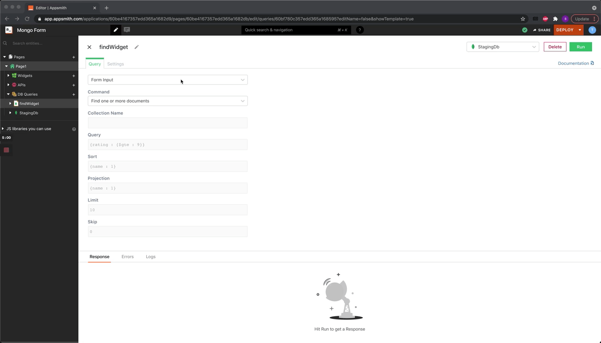

# MongoDB

[MongoDB](https://www.mongodb.com) is a document-oriented NoSQL database used for high-volume data storage. It doesn't store the data in the form of tables and rows as in traditional relational databases. Instead, it stores the data in collections and documents in JSON format (using key-value pairs).


The following document assumes that you understand the [basics of connecting to databases on Appsmith](../../../core-concepts/connecting-to-data-sources/connecting-to-databases.md#connecting-to-a-database). If not, please go over them before reading further.




## Connection Settings

Appsmith needs the following parameters for connecting to a Mongo database:


All required fields are suffixed with an asterisk (\*).


### **Connection**

To set up a connection, fill in the following parameters:

* **Connection Mode\*:** You must choose one of the following two modes:
  * **Read Only:** Choosing this mode gives Appsmith read-only permission on the database. This only allows you to fetch data from the database.
  * **Read / Write:** Choosing this mode gives Appsmith both read and write permissions on the database. This allows you to execute all CRUD queries.
* **Connection Type\*:** You must choose one of the following connection types:
  * **Direct Connection**: Choose this connection type to connect directly to a mongo instance
  * **Replicate Set**: Choose this connection type to connect to a set of mongo instances.
* **Host Address / Port\*:** Fill in the database host’s address and port. If you don’t specify a port, Appsmith will try to connect to port `27017`. You can specify multiple host addresses for a replicate set. If you have an [SRV URI](https://docs.mongodb.com/manual/reference/connection-string/#dns-seed-list-connection-format), please follow [these](./#connect-using-srv-uri) steps to connect to your MongoDB instance.
* **Default** **Database Name\*:** Fill in the name of the database you want to connect to. This is your database’s name on your mongo server.

### **Authentication**

For authentication, fill in the following parameters:

* **Database Name:** Fill in the name of the database against which you want to authenticate. This is typically admin for most MongoDB instances.
* **Authentication Type\*:** Choose the authentication mechanism to connect to your database. This can be one of `SCRAM-SHA-1`, `SCRAM-SHA-256`, or `MONGO-CR`.
* **Username:** Fill in the username required for authenticating connection requests to your database. Set this to empty if you won't want to specify a username to authenticate with.
* **Password:** Fill password required for authenticating connection requests for the given username to the database. Set this to _empty_ if you want to log in without a password (please ensure your database accepts such connections).

### **SSL**

The SSL Mode can be set to one of the following values:

* **`Default`**: Depends on Connection Type. If using the `Replica set`, this is `Enabled`. If using a `Direct connection`, this is `Disabled`.
* **`Enabled`**: Reject connection (if SSL is not available).
* **`Disabled`**: Connect without SSL, use a plain unencrypted connection.

### Connect using SRV URI

A [service record](https://en.wikipedia.org/wiki/SRV\_record) (SRV) defines the location of a service hosting, like a hostname, port number, and more. You can create a MongoDB datasource on Appsmith using. [SRV URI Formats](https://www.mongodb.com/docs/manual/reference/connection-string/#connection-string-uri-format) - [Standard URI Format](https://www.mongodb.com/docs/manual/reference/connection-string/#standard-connection-string-format) or a [DNS Seed List Format](https://www.mongodb.com/docs/manual/reference/connection-string/#dns-seed-list-connection-format).

#### Standard Connection String Format

A Standard Connection String Format(Standard Format) connects to a standalone replica set or a shared cluster of MongoDB. The standard format is represented as below:


```mongodb
mongodb://[@username:@password@]@host[:@port]/[@defaultauthdb]/[?authSource=@authDB]]
```


<figure><figcaption><p>Prefix with <strong>mongodb://</strong> to add a Standard Connection String URI</p></figcaption></figure>

Map the URI fields as below:

* `mongodb://` - a prefix to identify that it's a standard connection format.
* `@username` - the username of the MongoDB you wish to connect to.
* `@password` - the password of the MongoDB you want to connect to.


If the username or password includes (`: /? # [ ] @),` convert these characters using [percent encoding](https://www.rfc-editor.org/rfc/rfc3986#section-2.1).


* `@host` - the host address of the MongoDB you wish to connect to.
* `@port` - the port on which MongoDB is running.


You can add **multiple host** and **port** details separated by a **comma** in the connection string to connect using the same user.


* `@defaultauthdb` - the database you wish to connect to and would also authenticate the user credentials.


The <mark style="color:red;">`defaultauthdb`</mark> is a <mark style="color:red;">**required**</mark> field in Appsmith as the queries would run against it.


* `@authDB` - the database that stores the authorization information and authenticates the credentials. If you wish to use any other database instead of defaultauthdb, you can add the auth database name using the authSource keyword.


If <mark style="color:red;">**`authSource`**</mark> is unspecified, Appsmith attempts to authenticate using the <mark style="color:red;">admin</mark> database.


**Example URIs**

Some example URIs could be as follows:

* The default database is <mark style="color:red;">`users,`</mark> and <mark style="color:red;">`authSource`</mark> is set as <mark style="color:red;">`authusers`</mark> which is used to authenticate the user(<mark style="color:red;">`dbuser`</mark>).


```mongodb
mongodb://dbuser:s@cur!ty/mongodb0.standalone.com:27017/users/?authSource=authusers
```


* <mark style="color:red;">`authSource`</mark> is set as <mark style="color:red;">`admin`</mark><mark style="color:red;">,</mark> and <mark style="color:red;">`replicaSet`</mark> keyword point to set the name of the replica set (<mark style="color:red;">`mongoRepl`</mark>).


```mongodb
mongodb://dbuser:s@cur!ty@mongodb0.replicaset.com:27017,mongodb2.replicaset.com:27017/?authSource=admin&replicaSet=mongoRepl

```


* <mark style="color:red;">`authSource`</mark> keyword points to <mark style="color:red;">`admin`</mark><mark style="color:red;">.</mark> You can add multiple host and port combinations that points to the shared cluster.


```mongodb
mongodb://dbuser:s@cur!ty@mongos0.sharedcluster.com:27017,mongos1.sharedcluster.com:27017,mongos2.sharedcluster.com:27017/?authSource=admin
```


#### **Domain name service seed list format**

MongoDB also supports a Domain Name Service (DNS) Seed list for connecting with the standard format. To use the DNS seed list format, you’ll have to prefix the connection string with `mongodb+srv://`. The `+srv` indicates that the hostname corresponds to the DNS SRV. The DNS seed list format is represented as below:


```mongodb
mongodb+srv://[@username:@password@]@host[:@port]/[@defaultauthdb]/[?authSource=@authDB]]
```


<figure><figcaption><p>Prefix with <strong>mongodb+srv://</strong> to add a DNS seed list URI</p></figcaption></figure>

Like [standard format](./#standard-connection-string-format), you can map the fields as below:

* `mongodb+srv://` - a prefix to identify that it’s a DNS Seed List format.


Using the <mark style="color:red;">`+srv`</mark> automatically sets the TLS or SSL option to true. If you wish to turn off the TLS or SSL option, set <mark style="color:red;">`tls/ssl=false`</mark> in the query string.


* Like Standard format, you can add `username`, `password`, `host`, `port`, `default database,` and `authSource`.


If the username or password includes (`: /? # [ ] @),` convert these characters using [percent encoding](https://www.rfc-editor.org/rfc/rfc3986#section-2.1).


**Example URIs**

An example URI could be as follows:


```mongodb
mongodb+srv://dbuser:s@cur!ty/server.dnsseedlist.com/defaultauthdbSource?authSource=authusersb
```



Read more about the [standard format ](https://www.mongodb.com/docs/manual/reference/connection-string/#standard-connection-string-format)and [DNS seed list format](https://www.mongodb.com/docs/manual/reference/connection-string/#dns-seed-list-connection-format) available on [MongoDB documentation](https://docs.mongodb.com/manual/reference/connection-string/#mongodb-urioption-urioption.ssl).


## Querying Mongo (Form Input)

`Form input` provides an easy interface to query the Mongo database.

As part of Form Input, Appsmith supports queries like `Find one or more documents`, `Insert a document`, `Update one`, `Count,` and more.


All mongo queries return an **array of objects** where each object is a **mongo document**, and the object's properties are the document's keys.




### 1. Find Document(s)

This command selects documents in a collection or view. The following fields are supported in Appsmith for this command :

`Collection Name`: The name of the collection or view to query. The input is expected in a string format like the following :

```
restaurants
```

`Query`: The query predicate. If unspecified, then all documents in the collection will match the predicate. The input is expected in JSON/BSON format like the following :

```
{
     rating: { $gte: 9 }, 
     cuisine: "italian" 
}
```

`Sort` : (Optional) The sort specification for ordering the results. The input is expected in JSON/BSON format like the following :

```
{ name: 1 }
```

`Projection` : (Optional) The projection specification determines which fields to include in the returned documents. The input is expected in JSON/BSON format like the following :

```
{ name: 1, rating: 1, address: 1 }
```

`Limit` : (Optional) The maximum number of documents to return. If unspecified, then defaults to 10 documents. The input is expected in number format :

```
10
```

`Skip` : (Optional) Number of documents to skip. Defaults to 0. The input is expected in number format :

```
0
```

### 2. Insert Document(s)

This command inserts one or more documents and returns a document containing the status of all inserts. The following fields are supported in Appsmith for this command :

`Collection Name`: The name of the target collection. The input is expected in a string format like the following :

```
users
```

`Documents`: An array of one or more documents to insert into the named collection. The input is expected in a JSON/BSON Array format like the following :

```
[ { _id: 1, user: "abc123", status: "A" } ]
```

### 3. Update Document(s)

This command modifies multiple documents in a collection. The following fields are supported in Appsmith for this command :

`Collection Name`: The collection against which to run the command. The input is expected in a string format like the following :

```
people
```

`Query`: The query that matches documents to update. The input is expected in JSON/BSON format like the following :

```
{ name: "Andy" }
```

`Update`: The modifications are to apply. The input is expected in JSON/BSON format like the following :

```
{ $inc: { score: 1 } }
```

`Limit`: The dropdown is used to configure if this delete command should act upon a single document or if this command should delete all the matching documents according to the query.

### 4. Delete Document(s)

This command removes documents from a collection. The following fields are supported in Appsmith for this command :

`Collection Name`: The target collection against which to run the command. The input is expected in a string format like the following :

```
orders
```

`Query`: The query that matches document(s) to delete. The input is expected in JSON/BSON format like the following :

```
{ status: "D" }
```

`Limit`: The dropdown is used to configure if this delete command should act upon a single document or if this command should delete all the matching documents according to the query.

### 5. Count

This command counts the number of documents in a collection or a view. Returns a document that contains this count. The following fields are supported in Appsmith for this command :

`Collection Name`: The name of the collection or view to count. The input is expected in a string format like the following :

```
orders
```

`Query`: A query that selects which documents to count in the collection or view. The input is expected in JSON/BSON format like the following :

```
{ ord_dt: { $gt: new Date('01/01/2021') }
```

### 6. Distinct

This command finds the distinct values for a specified field across a single collection. The following fields are supported in Appsmith for this command :

`Collection Name`: The name of the collection to query for distinct values. The input is expected in a string format like the following :

```
inventory
```

`Query`: A query specifies documents from which to retrieve the distinct values. The input is expected in JSON/BSON format like the following :

```
{ dept: "A"} }
```

`Key/Field`: The field for which to return distinct values. The input is expected in a string format like the following :

```
item.sku
```

### 7. Aggregate

This command performs aggregation operations using the aggregation pipeline. The pipeline allows users to process data from a collection or other source with a sequence of stage-based manipulations. The following fields are supported in Appsmith for this command :

`Collection Name`: The name of the collection or view that acts as the input for the aggregation pipeline. The input is expected in a string format like the following :

```
articles
```

`Array of Pipelines`: An array of aggregation pipeline stages that process and transform the document stream as part of the aggregation pipeline. The input is expected in JSON/BSON array format like the following :

```
[
      { $project: { tags: 1 } },
      { $unwind: "$tags" },
      { $group: { _id: "$tags", count: { $sum : 1 } } }
]
```

The above example performs an aggregate operation on the articles collection to calculate the count of each distinct element in the tags array that appears in the collection.

## Querying Mongo (Advanced)

You can use a `Raw` command to write your custom Mongo queries.


The mongo database command syntax is slightly different from the mongo collection methods you may be familiar with. [Read more](https://docs.mongodb.com/manual/reference/command/nav-crud/).


To add a Raw query, set your query parameters as below:

* **Commands** - Select Command as **Raw.**
* **Query palette -** Add the Raw query to it.&#x20;
* Click **Run** to test your query.



All mongo queries return an **array of objects** where each object is a **mongo document**, and the object's properties are the document's keys.


The [pipeline](https://www.mongodb.com/docs/manual/core/aggregation-pipeline/) is an array that contains the aggregation stages that process the documents. In your Raw query, you'll have to include the filter criteria in a pipeline keyword when using aggregation. For example, you wish to fetch data from movies where the revenue is 42600000. You'll use `$match` that checks for documents where the `revenue` is  `42600000`. You added the below query:

```
{
   "aggregate":"movies",
   "$lookup":[
      {
         "$match":{
            "revenue":42600000
         }
      }
   ],
   "cursor":{
      "batchSize":10
   }
}

```


By default, Mongo returns only **101 records** due to its default [batchSize](https://docs.mongodb.com/manual/tutorial/iterate-a-cursor/). You can update the limit and batchSize by adding values to your query.


* Click the `Run` button to execute the query.

The queries will fail to execute and throw an exception `Pipeline option must be specified as an array.`&#x20;


* For Raw queries, you'll have to add the filter criteria to the **`pipeline`** keyword as below:

```
{
   "aggregate":"movies",
   "pipeline":[
      {
         "$match":{
            "revenue":42600000
         }
      }
   ],
   "cursor":{
      "batchSize":10
   }
}
```

* Click the `Run` button to execute the query.


## Template Queries

Appsmith provides template queries to help with the syntax.

* [Insert Query](mongo-syntax.md#insert-query)
* [Find Query](mongo-syntax.md#find-query)
* [Update Query](mongo-syntax.md#update-query)
* [Delete Query](mongo-syntax.md#delete-query)


## Using Queries in applications

Once you have successfully run a Query, you can use it in your application to

* [Display Data](../../../core-concepts/data-access-and-binding/displaying-data-read/)
* [Capture Data](../../../core-concepts/data-access-and-binding/capturing-data-write/)
