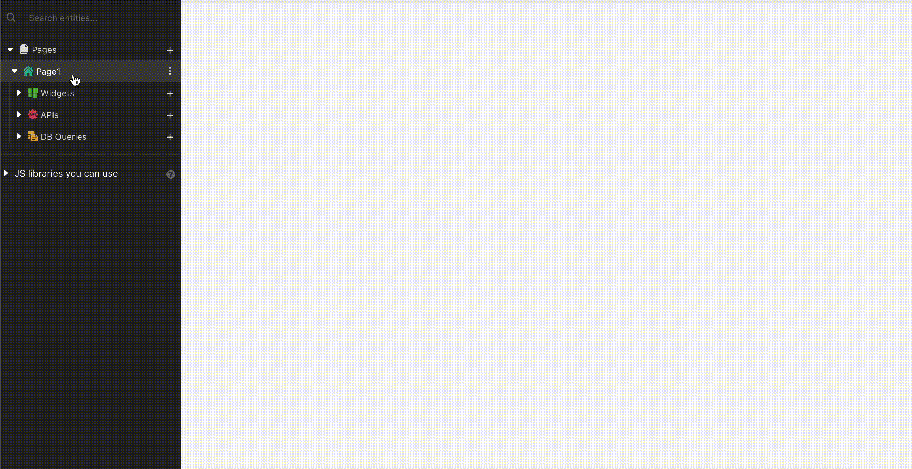

# Modal



| Property            | Description                                                                 |
| ------------------- | --------------------------------------------------------------------------- |
| **Quick Dismiss**   | Quickly dismisses or closes the Modal when the user taps outside the modal. |
| **Scroll Contents** | This property enables scrolling within the contents of the modal            |

## Reopening Created Modals

Selecting the created modal listed in the Entity Explorer will open it in Edit mode.

## Opening Modals via Widgets

To open the Modals via other widgets please refer to [Show Modal](../appsmith-framework/widget-actions/show-modal.md) function.
