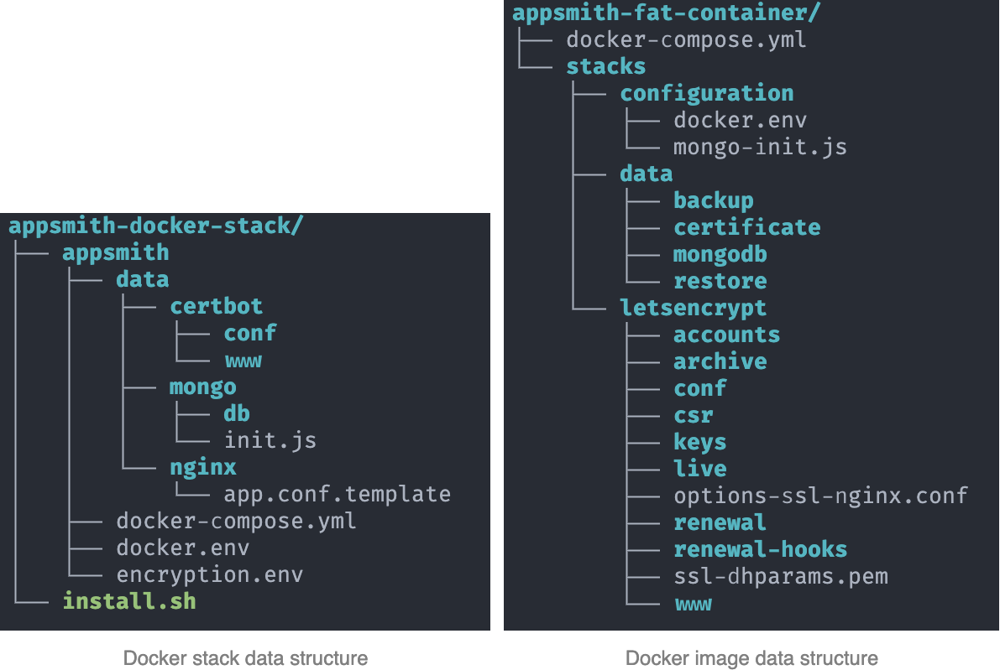
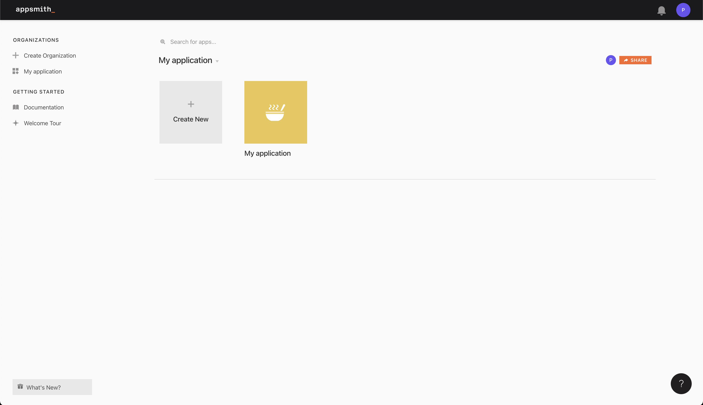

This guide helps you to migrate all Appsmith data and configuration, which currently run by old Docker stack ( multiple containers), to the new Appsmith application used new appsmith docker image (single container)

## I. Before migration
### 1. Application directory
* In this guide, we will guide you to migrate configuration and data:
  - From folder `appsmith-docker-stack/appsmith` which contain all resource of old Appsmith application that we need to migrate
  - To folder `appsmith-fat-container` which will be used for deploying new Appsmith using new appsmith container image

### 2. Folder structure

By comparing the folder structure of the current Docker stack and Fat container image, you can have an overall view of how all data and configuration to be migrated
<p>
  
</p>

## II. Migration step
We suggest the following general process when migrating an existing application from the current Docker stack to new Fat container image:

1. [Export MongoDB data](./migrate.md#1-export-database)

2. [Migrate Configuration](./migrate.md#2-migrate-configuration) 

3. [Export https config & certificate (Optional)](./migrate.md#3-export-https-config-certificate-optional)

4. [Setup new Appsmith with Fat container](./migrate.md#4-setup-new-appsmith-with-fat-container)

5. [Import MongoDB data](./migrate.md#5-import-database)

6. [Verify migration](./migrate.md#6-verify-migration)

### 1. Export database
#### 1.1 **Steps to take**
- Export database from mongodb of old stack
#### 1.2 **Detail**
* To export data from running `MongoDB` container, we use `mongodump` command to export all data and compress them into a `gzip` file
* The `gzip` file will be copied to the new image's mounting folder in the very next step to be imported into the new container's internal `MongoDB` service

```
# Create backup folder to store dump file
docker exec appsmith_mongo_1 bash -c 'mkdir -p /data/db/backup'

# Dumping Mongo data and compressed into a gzip file
docker exec appsmith_mongo_1 bash -c 'mongodump --uri=$APPSMITH_MONGODB_URI --archive=/data/db/backup/appsmith-data.archive --gzip'
```

*Note: The container name may be different in case you have made changes on the `docker-compose.yml` file. Please check and use the correct `MongoDB` container name*

### 2. Migrate Configuration
#### 2.1 **Steps to take**
- Create a new `docker.env` file at `stacks/configuration/docker.env` of new stack by merging `docker.env` and `encryption.env` of old stack
- Update `APPSMITH_REDIS_URL` & `APPSMITH_MONGODB_URI` to local server & remove query params from `APPSMITH_MONGODB_URI`
```
APPSMITH_MONGODB_URI=mongodb://<Your MongoDB User>:<Your MongoDB Password>@localhost/appsmith
APPSMITH_REDIS_URL=redis://127.0.0.1:6379
```
- Add some new environment variables
```
APPSMITH_MONGODB_USER=<Your MongoDB User>
APPSMITH_MONGODB_PASSWORD=<Your MongoDB Password>
APPSMITH_API_BASE_URL=http://localhost:8080
```
#### 2.2 **Detail**
* We use `docker.env` file to store all environment variables (include variables from both `encryption.env` and current `docker.env` files)
* The below set of commands will help you to copy all current variables into a new `docker.env` file which will be stored in the mounting folder of the new Fat container image

```
# You should run these commands in the parent folder of appsmith-docker-stack and appsmith-fat-container
# Create appsmith-fat-container folder
mkdir -p appsmith-fat-container

# Create mounting volume folder
mkdir -p appsmith-fat-container/stacks

# Export variable to store the path to old and new folders
export OLD_APPLICATION_DIR=$PWD/appsmith-docker-stack/appsmith
export NEW_APPLICATION_DIR=$PWD/appsmith-fat-container

# Create configuration folder
mkdir -p $NEW_APPLICATION_DIR/stacks/configuration

# Copy environment variable from docker.env & encryption.env 
cat $OLD_APPLICATION_DIR/docker.env $OLD_APPLICATION_DIR/encryption.env >> $NEW_APPLICATION_DIR/stacks/configuration/docker.env
```
- Update `APPSMITH_REDIS_URL` & `APPSMITH_MONGODB_URI` to local server & remove query string from `APPSMITH_MONGODB_URI`:
```
APPSMITH_MONGODB_URI=mongodb://<Your MongoDB User>:<Your MongoDB Password>@localhost/appsmith
APPSMITH_REDIS_URL=redis://127.0.0.1:6379
```

* We also introduce a new application stack in Appsmith system - `Realtime Service (RTS)`. please add `APPSMITH_API_BASE_URL` and 2 new variables for MONGO_DB configuration into `docker.env`
```
# Add new variables to new `docker.env` file
APPSMITH_API_BASE_URL=http://localhost:8080
APPSMITH_MONGODB_USER=<Your MongoDB User>
APPSMITH_MONGODB_PASSWORD=<Your MongoDB Password>
```

*Note: In our new image, we have used Redis and MongoDB service inside the container as default services. Therefore, if you do not use external services for Redis and MongoDB, you will need to change 2 environment variables in the `docker.env`*
```
APPSMITH_MONGODB_URI=mongodb://<MONGO_USERNAME>:<MONGO_PASSWORD>@localhost/appsmith
APPSMITH_REDIS_URL=redis://127.0.0.1:6379
```
### 3. Export https config & certificate (Optional)
#### 3.1 **Steps to take**
- Input your custom domain into  docker.env file of new stack
- Copy certbot materials into new stack
#### **3.2 Detail**
* If you have deployed Appsmith with custom domain, you might want to move your certificate to the new container

```
# Add custom domain to configuration file
echo APPSMITH_CUSTOM_DOMAIN=<YOUR-DOMAIN> >> $NEW_APPLICATION_DIR/stacks/configuration/docker.env

# Create Letsencrypt folder in Docker mounting point
mkdir -p $NEW_APPLICATION_DIR/stacks/letsencrypt

# Copy Letsencrypt certificate to new Letsencrypt folder
sudo cp -rf $OLD_APPLICATION_DIR/data/certbot/conf/* $NEW_APPLICATION_DIR/stacks/letsencrypt
```

### 4. Setup new Appsmith with Fat container
#### **4.1 Steps to take**
 - Shutdown old application
 - Start new fat container application
  - Download docker-compose into new application directory
  - Start application: `docker-compose up`
#### **4.2 Detail**
* Shutdown old application:
* Before you can start new appsmith docker, please shutdown current appsmith application first
```
cd $OLD_APPLICATION_DIR
docker-compose down
```

* Start new fat container application:
* Follow this guideline to start up a new container: [https://docs.appsmith.com/setup/docker](https://docs.appsmith.com/setup/docker)
* Please note that you must create new docker-compose.yml in `appsmith-fat-container` folder
```
cd $NEW_APPLICATION_DIR
curl -L https://bit.ly/32jBNin -o $PWD/docker-compose.yml
docker-compose up -d
```

### 5. Import database
#### **5.1 Steps to take**
 - Copy archive file to `stacks/data/restore/appsmith-data.archive`
 - Run command import database
#### **5.2 Detail**
* After successfully starting up new container, you can import your previous data by exported file from the above step
* By using `Appsmith CLI`, new feature we have nearly introduced in the new Docker image, you can import all data with only one command

```
# Create folder restore
mkdir -p $NEW_APPLICATION_DIR/stacks/data/restore

# Copy exported file 
sudo cp $OLD_APPLICATION_DIR/data/mongo/db/backup/appsmith-data.archive $NEW_APPLICATION_DIR/stacks/data/restore/appsmith-data.archive

# Import data
docker exec -it appsmith-ce appsmithctl import_db
```

### 6. Verify migration

To verify that the migration had been made successfully, just browsing `localhost` or your `Custom domain` and check that Appsmith is working properly with your data (You can try to log in with an existing account from last time)
<p>
  
</p>