# AWS ECS

## Prequisites
### 1: Register With Amazon Web Services

If you already have an Amazon Web Services account, you may skip this step.

Please follow the steps [detailed here](https://aws.amazon.com/premiumsupport/knowledge-center/create-and-activate-aws-account/) in order to create an account on AWS.

### 2: Generate an SSH key pair

If you already have an SSH key pair for the AWS region you are operating in, you can skip this step.

Please follow the steps [detailed here](https://docs.aws.amazon.com/AWSEC2/latest/UserGuide/ec2-key-pairs.html#having-ec2-create-your-key-pair) to generate a new key-pair. You need this key to SSH into your AWS EC2 instance.

### 3: Create an AWS Security Group

If you already have an existing security group with ports 80, 443 , 22 and 9001 open, you can skip this step.

Appsmith is a web application that requires ports 80 and 443 for HTTP access, port 22 to be accessible for SSH access, it also requires 
port 9001 to be accessible for the supervisord UI.
Please follow the steps [detailed here](https://docs.aws.amazon.com/AWSEC2/latest/UserGuide/working-with-security-groups.html#creating-security-group) to create a new security group.

While creating the the new security group, please follow the steps [detailed here](https://docs.aws.amazon.com/AWSEC2/latest/UserGuide/working-with-security-groups.html#adding-security-group-rule) to edit the "Inbound Rules" and make ports 80, 443, 22 and 9001 accessible from anywhere.

---
## ECS Overview
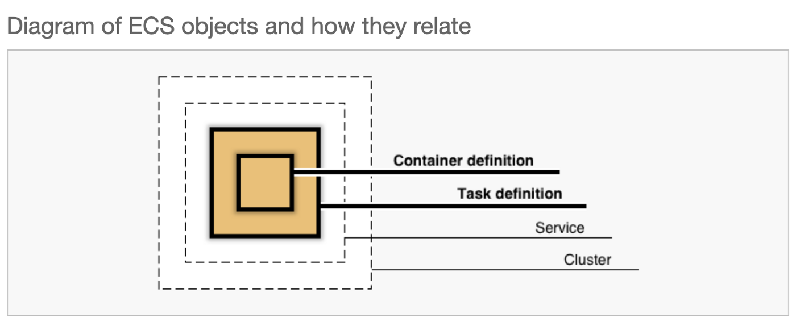
## Steps to Deploy Appsmith on ECS (using EC2 Launch Type):
1. [Create an ECS Cluster](aws-ecs.md#step-1-create-an-ecs-cluster)
2. [Create Task and Container Definitions](aws-ecs.md#step-2-create-task-and-container-definitions)
3. [Create and Run an ECS Service](aws-ecs.md#step-3-create-and-run-an-ecs-service)

> Note: Please switch to the old AWS console UI to follow the steps in this tutorial.
### Step 1: Create an ECS Cluster
1. Navigate to Amazon ECS and choose clusters on the side bar and select Create Cluster.

    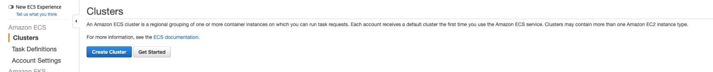

2. Choose **EC2 Linux + Networking**, and select next step.

3. Enter your cluster name 
4. Instance configuration:
   - Select the provisioning model as **On-Demand Instance**.
   - Select the server size you wish to use, and set the **Number of instances** as **1**.
   - Select the **Amazon Linux2 AMI** for the EC2 AMI ID dropdown, and enter the required EBS volume size.
   - Select a **Key pair**. Please refer to [**Prequisite 2**](aws-ecs.md#2-generate-an-ssh-key-pair), if you have not already created one.

    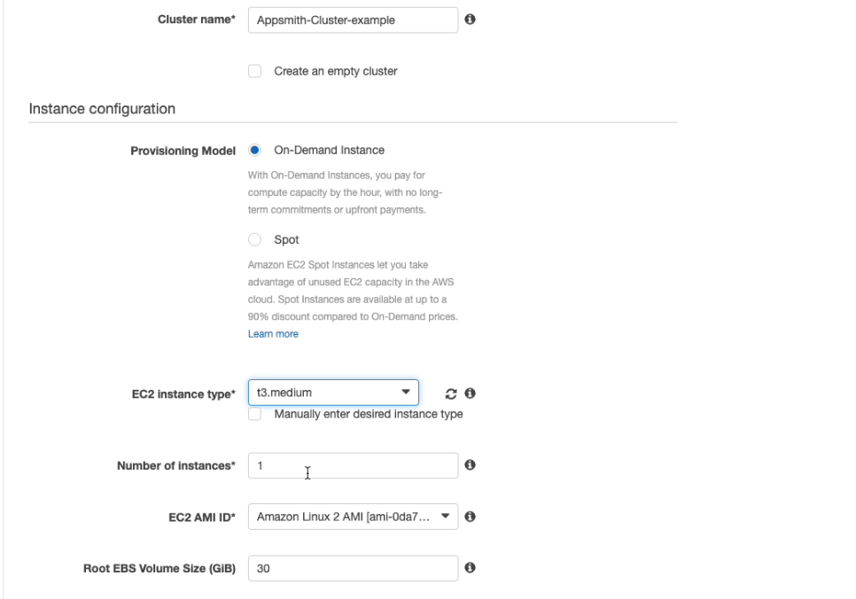

5. Networking Section
   - Select the **default VPC** followed by selecting the **first subnet** from the drop-down.
   - Select the **security group** created in [**Prequisite 3**](aws-ecs.md#3-create-an-aws-security-group).

    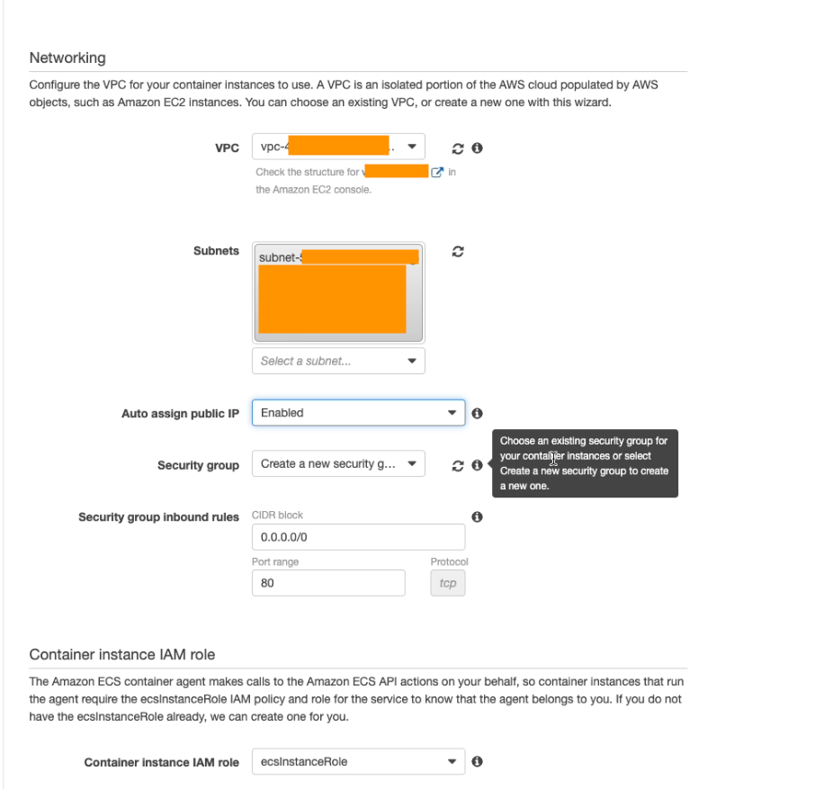

6. Enable container insights (this gives CloudWatch monitoring and helps debugging).
7. Leave the Container instance IAM role as default (**ecsInstanceRole**), if you do not have one aws will create it for you.
8. Hit the **Create button**. It may take a minute for your cluster to be ready.

    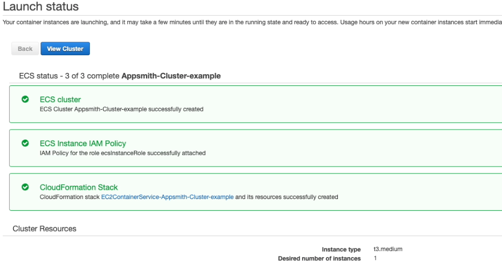

### Step 2: Create Task and Container Definitions
Once the cluster is created, you will need to create a task that will be run on the cluster created in [**Step 1**](aws-ecs.md#step-1-create-an-ecs-cluster). 
1. On the side bar, choose **Task Definitions** and select **Create new Task Definition**.
2. Choose **EC2** as the **launch type**, and proceed to the next step.
3. Configure task and definition
   - Enter the task definition name.
   - Leave the Task role **blank**.
   - Select the **default** Network mode

    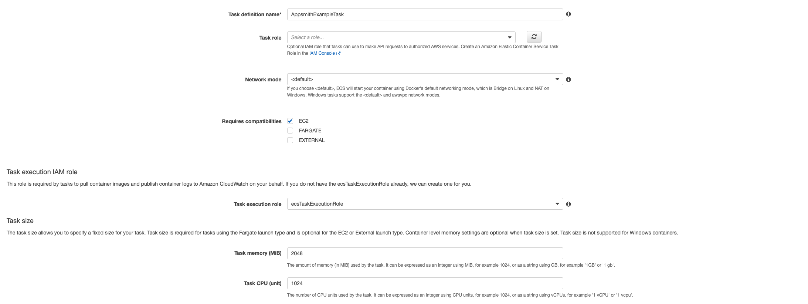
4. Select the default Task execution IAM role (**ecsTaskExecutionRole**). AWS will create one for you if you do not have one.
5. Set the required **task size** (memory & cpu)
6. Go to the **Volumes** section and add a new volume. Enter the Name as `Docker_Endpoint`, set Volume type as **Bind Mount** and set the **Source path** to `/var/run/docker.sock`.
    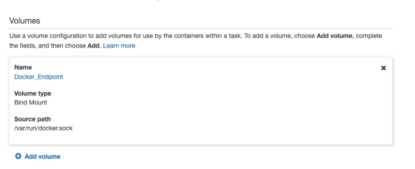
7. Configure **Appsmith container configuration**.
  - Hit **Add container** button.
  - Enter the container name, and set the Image to `appsmith/appsmith-ce`
  - Add port mappings for the ports **80->80,443->443, 9001->9001**
  - Enable **Auto-configure CloudWatch Logs** for log configuration
  - Hit **Add**
    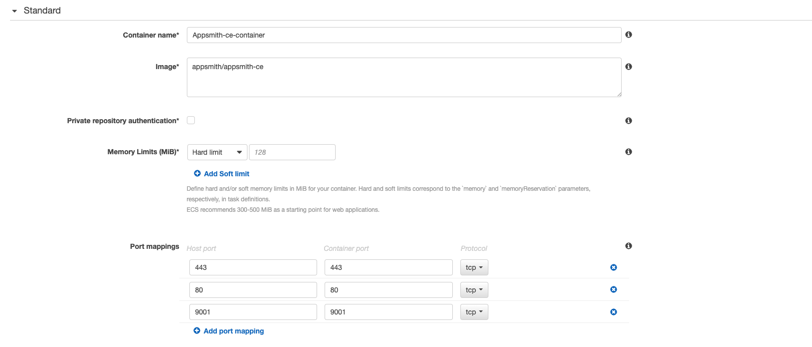
8. Configure Watchtower container configuration.
  - Hit **Add container** again.
  - Enter the container name, and set Image to `containrrr/watchtower`
  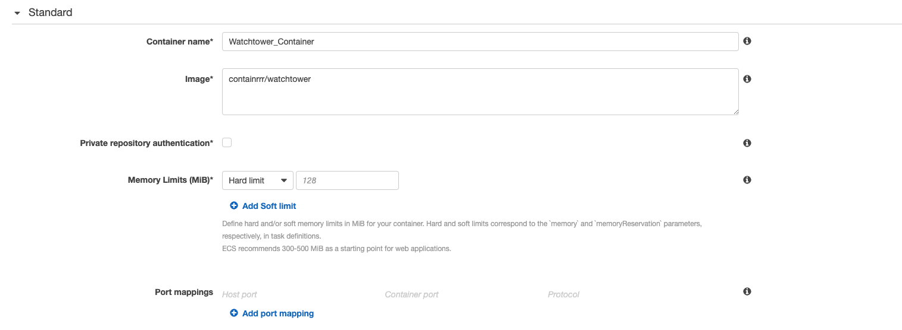
  - Set the *Monut points Source volume* to `Docker_Entrypoint` and set the Container path to `/var/run/docker.sock`
  - Enable **Auto-configure CloudWatch Logs** for log configuration
  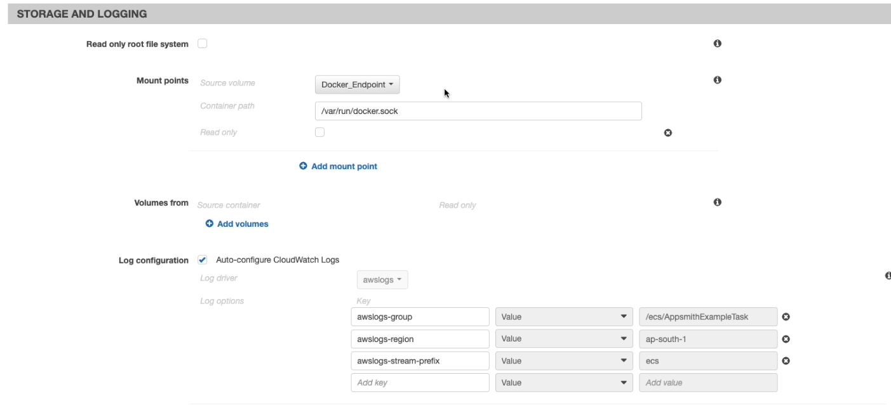
  - Hit **Add**
  
9. Finally, hit the **Create** button.

### Step 3: Create and Run an ECS Service.
1. Navigate to **clusters dashboard** and click on the ECS cluster created in [**Step 1**](aws-ecs.md#step-1-create-an-ecs-cluster).
2. On the cluster details, under the **Services tab** hit the **create** button.

   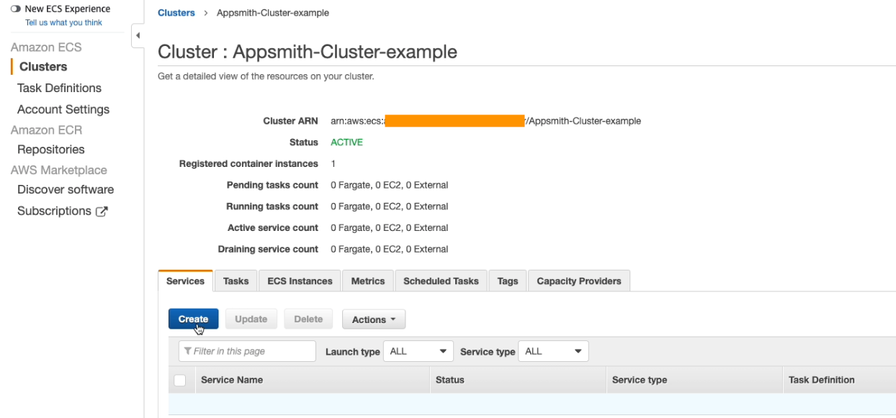
3. Configure Service
  - Select **EC2** as Launch Type
  - Select the **Task Definition** created in [**Step 2**](aws-ecs.md#step-2-create-task-and-container-definitions) with the latest revision.
  - Select the **Cluster** created in [**Step 1**](aws-ecs.md#step-1-create-an-ecs-cluster)
  - Enter the service name
  - Select the **REPLICA** Service type
  - Set the **Number of tasks** to **1**
  - Leave the remaining fields and sections with the **default values**, and proceed to the next step.
     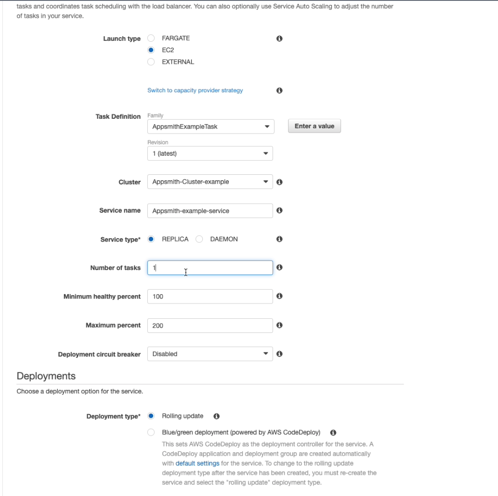
4. Configure network - Proceed to the next step with the **default** configurations.
     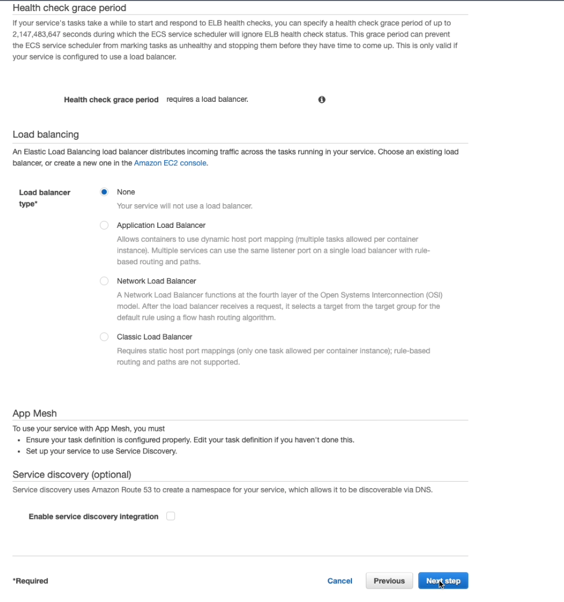
5. Set Auto Scaling - Proceed to the next step with the **default** configuration.
     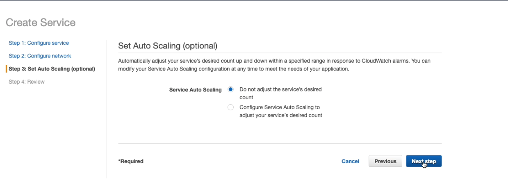
4. Review the Service configurations and hit the **Create Service** button.
     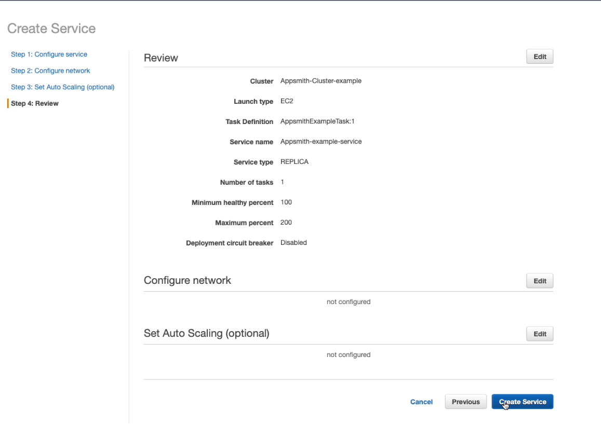
5. The following screen will appear showing the **launch status**, click on **View Service** button.
    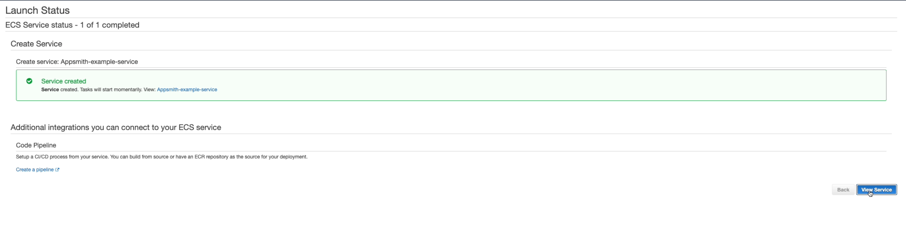
6. You will be directed to the **service detail** page. Your task listed under the **Tasks tab** on the cluster. refresh the table until the status is **RUNNING**.
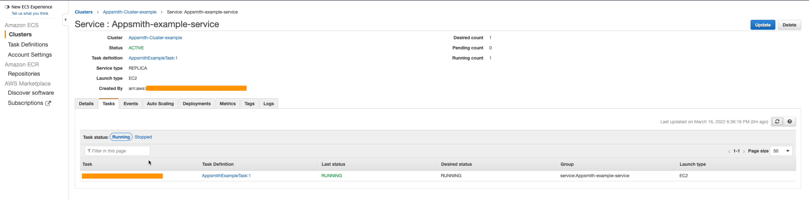
7. Cick on the **task** to get the details of your running service.
  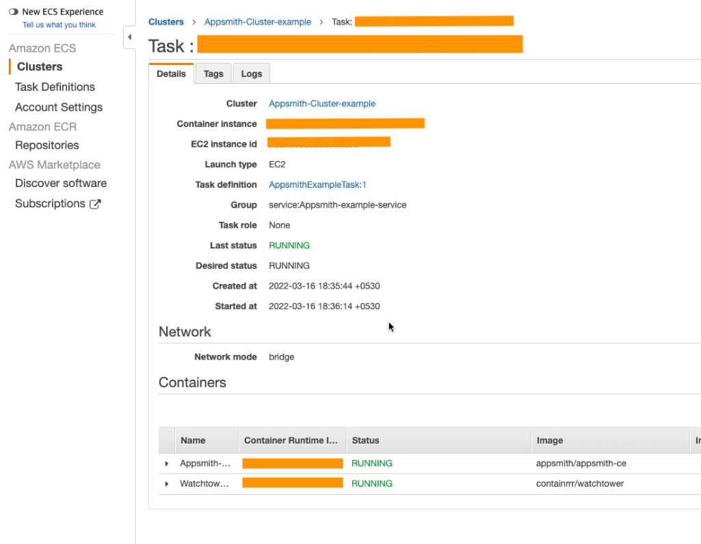
8. Finally, click on the **EC2 instance id** to navigate to the EC2 console with your ECS instance (which is basically an EC2 instance running the container service) listed.
  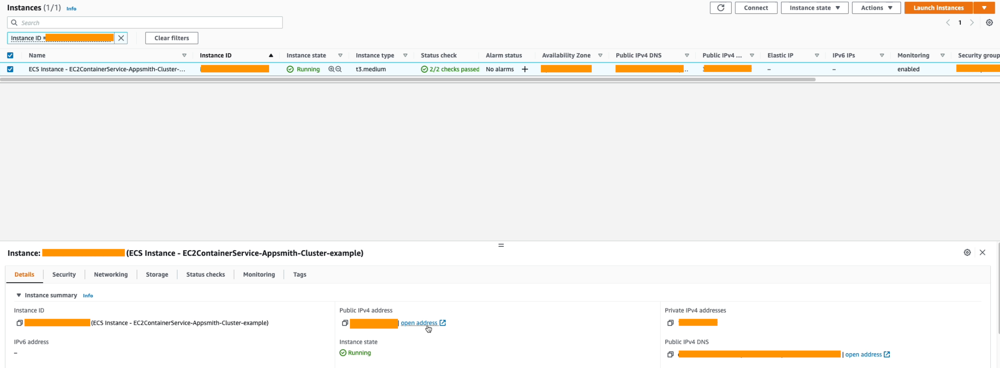
9. Find the **public IP address** or **DNS name** and enter it on your browser to see Appsmith's welcome page.
  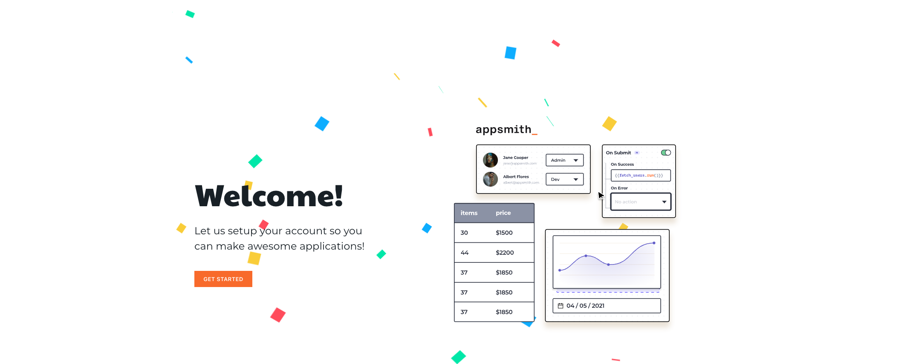

## Troubleshooting

If you encounter any errors during this process, check out our guide on [debugging deployment errors](../troubleshooting-guide/deployment-errors.md), if you are still facing an issue please reach out to [support@appsmith.com](mailto:support@appsmith.com) or join our [Discord Server](https://discord.com/invite/rBTTVJp) to directly speak to the appsmith team!

## Further Reading

* [Configuring Self Hosted Instances](instance-configuration/#configuring-docker-installations)
* [Managing the Appsmith instance](instance-management.md)
* [Tutorials](../tutorials/)
