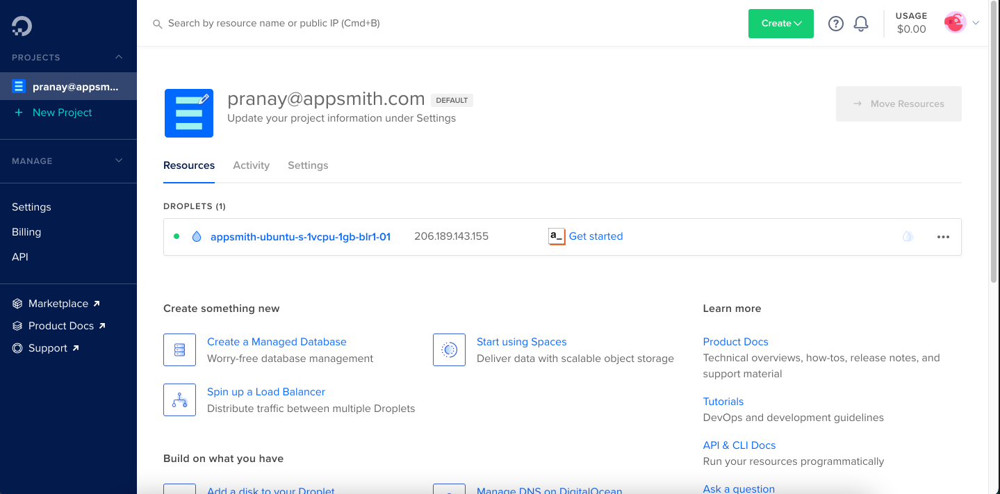
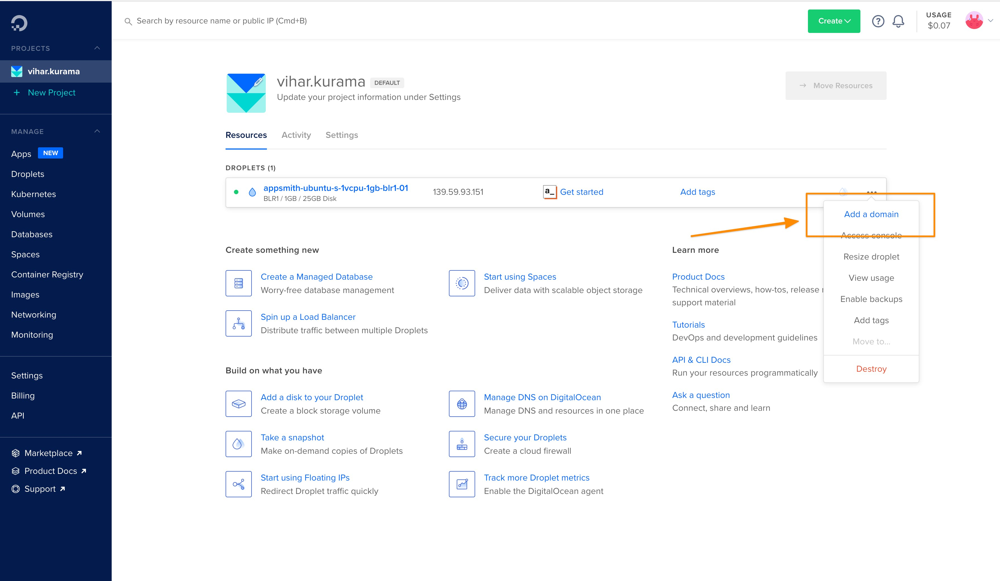

# DigitalOcean

You can deploy Appsmith on DigitalOcean using the Appsmith droplet from Digital Ocean’s 1-Click Apps Marketplace and host it on our custom domain.  


Login to your DigitalOcean account to get started. If you are a new user, use this[ link](https://marketplace.digitalocean.com/apps/appsmith?refcode=469c9f1431e4) and get a $25 credit on DigitalOcean!

### Setting up Appsmith on DigitalOcean

Once logged in, follow the steps listed below:

* Find Appsmith from the DigitalOcean marketplace [here](https://marketplace.digitalocean.com/apps/appsmith).
* Click on the Create Appsmith Droplet button; this will redirect you to a new page where you can set up all your configurations.


For a base configuration, use the following settings.

```bash
Shared CPU: Basic
CPU Options: Regular Intel with SSD (1 GB CPU / 25GB SSD / 1000GB Transfer )
Data Center Region: (Choose the nearest location to your place)
Additional Options: IPV6 Enabled
```


* In the authentication section, you can either choose SSH or set up a password if you want to log in to your server.
* Lastly, click on the Create Droplet button.


It will take a few minutes \(approximately 3-4 minutes\) to install Appsmith on the DigitalOcean droplet. You’ll find the deployed droplet on your dashboard with all the details of the selected configuration.



To use Appsmith, copy the IPv4 address from the settings and open it in a new tab. This will take you to Appsmith’s login page. Since this is a new instance, click on sign up to create a new account on Appsmith.


#### Hosting on a Custom Domain

To host the Appsmith DigitalOcean droplet on a custom domain, you’ll need to select the Add a domain option from the dashboard.



It redirects you to a new page. Add your domain name there. Once that’s done, it’ll give you records of the name servers. Copy the details of the NS \(name servers\).  Use the custom name server’s configuration on your domain provider. Sometimes, it might take up to 24-48 hours for this to go live!

