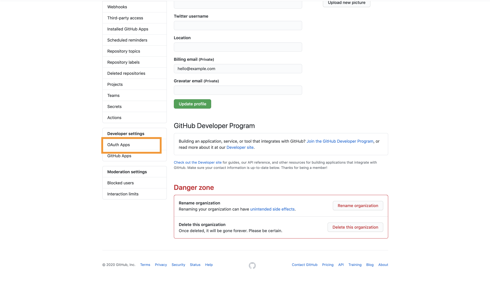
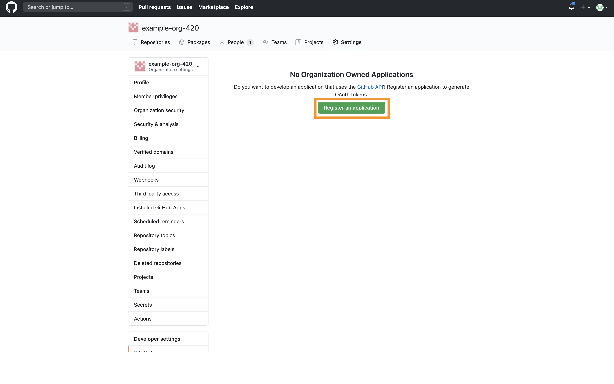

# Github OAuth


To enable Github Sign in, login to your [Github Account](https://github.com)

**1. Navigate to the** [**Organizations section**](https://github.com/settings/organizations) **of your profile and the settings of the organization under which you want to create an OAuth App**


**2. Navigate to the OAuth Apps section of the organization settings page**



**3. Create a new OAuth App**



**4. Configure the OAuth Credentials for a web application**

**Homepage URL:** The domain on which you are hosting Appsmith with https **`(ex: https://app.appsmith.com)`**

**Authorization Callback URL:** Append **/login/oauth2/code/github** to the Homepage URL **`(ex: https://app.appsmith.com/login/oauth2/code/github)`**


**5. Update the docker.env file in your Appsmith deployment folder**

```text
# ********* Github OAUth **********
APPSMITH_OAUTH2_GITHUB_CLIENT_ID=YOUR_GITHUB_CLIENT_ID
APPSMITH_OAUTH2_GITHUB_CLIENT_SECRET=YOUR_GITHUB_CLIENT_SECRET                                                                                                                          18,61         28%
# ******************************
```

**6. Restart docker & nginx**

```text
sudo docker-compose rm -fsv appsmith-internal-server nginx && sudo docker-compose up -d
```

Github Login should now be enabled for your Appsmith installation

