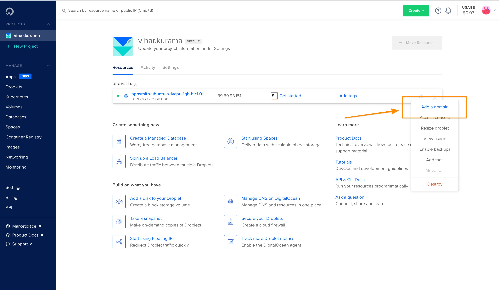

# Custom Domain

You can easily make Appsmith available on a custom domain by updating your domain's DNS records to point to the instance running Appsmith. Most domain registrars / DNS-providers have documentation on how you can do this yourself.

* [GoDaddy](https://in.godaddy.com/help/create-a-subdomain-4080)
* [Amazon Route 53](https://aws.amazon.com/premiumsupport/knowledge-center/create-subdomain-route-53/)
* [Digital Ocean](https://www.digitalocean.com/docs/networking/dns/how-to/add-subdomain/)
* [NameCheap](https://www.namecheap.com/support/knowledgebase/article.aspx/9776/2237/how-to-create-a-subdomain-for-my-domain)
* [Domain.com](https://www.domain.com/help/article/domain-management-how-to-update-subdomains)

## Docker/K8s

After configuring your custom domain as above, getting HTTPS support is super easy. Just tell Appsmith about the custom domain and you're on.

Configure the `APPSMITH_CUSTOM_DOMAIN field` in your [instance configuration](./) with your custom domain

```bash
// Docker Example 
APPSMITH_CUSTOM_DOMAIN=appsmith.mydomain.com
```

[Restart the appsmith container](./)

## AWS AMI

* Once your instance is ready, connect to that instance \(via SSH\) using your key pair \(Create in step 2\) and the public IP of your instance \(Created in step 4\) via the terminal or any SSH Client that you have
* Move to `/home/ubuntu/appsmith/scripts`
* Run `configure-ssl.sh` script

  ```text
  ./configure-ssl.sh
  ```

* You will be asked to your input domain to proceed with the configuration\(Please make sure that you have mapped your domain with EC2 Instance's public IP\)

  

* There will be an option for you to configure SSL for your domain

  

At this point, you should be able to browse to the cloud server, by entering your custom domain directly into your browser’s address bar. You should be able to see your web app home page now

## Heroku

1. Go to the **Settings** tab in your Heroku app
2. Click the `Add domain` button in the `Domains` section
3. Input your domain name & click `Next`. Heroku will provide you a DNS target that you can map your domain with .
4. Go to your DNS provider and make sure that your custom DNS Record \(Ex. **appsmith.yourcompany.com**\) is updated to map to the `DNS Target`


* Once you use a custom domain, You might want to set up SSL for your dyno. Please check the official document of Heroku [how to configure SSL](https://devcenter.heroku.com/articles/ssl)
* Your dyno will need to be upgraded to at least "**Hobby"** type to use this feature of Heroku


## DigitalOcean

To host the Appsmith DigitalOcean droplet on a custom domain, you’ll need to select the Add a domain option from the dashboard.



It redirects you to a new page. Add your domain name there. Once that’s done, it’ll give you records of the name servers. Copy the details of the NS \(name servers\). Use the custom name server’s configuration on your domain provider. Sometimes, it might take up to 24-48 hours for this to go live!


Your Appsmith instance should be available at [https://appsmith.mydomain.com](https://appsmith.mydomain.com) with automatic certificate provisioning and renewals


