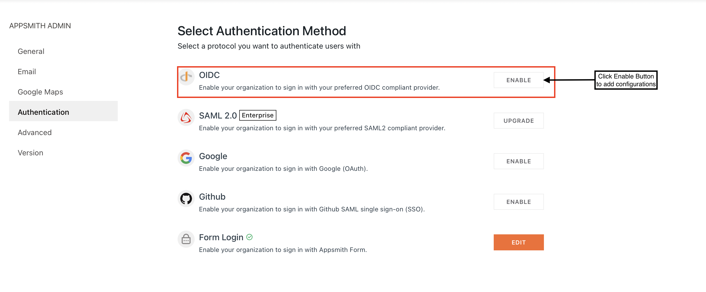

# OpenID Connect(OIDC)

OpenID Connect (OIDC) is an authentication protocol built on OAuth2.0 paradigm. You can use OIDC to securely sign-in users to your application.


OpenID Connect is available **only in the** [**enterprise edition**](https://www.appsmith.com/pricing) for **self-hosted instances**, and only the **Superuser** of your **Appsmith Instance** can set up **OIDC**.


## Capture Redirect URL for OIDC Configuration


You will have to add the redirect URL to your preferred OIDC Provider’s settings.


For OIDC configuration in Appsmith, follow the steps below (the below steps are irrespective of the SSO provider you choose):

* On your Appsmith Application, go to **Profile > Admin Settings.**

.png>)

* Navigate to **Authentication** and open the types of authentication available on Appsmith.

.png>)

* Select OIDC, click on **Enable**

* Copy the **Redirect URL**


Save the **`Redirect URL`** as you’ll need it to configure in OIDC Provider’s settings.


## OIDC Providers

Appsmith provides some popular OIDC integrations that you can choose from. Click on the available providers to follow the exhaustive guide for integrating with them:


[auth0.md](auth0.md)



[ping-identity.md](ping-identity.md)



[okta.md](okta.md)


