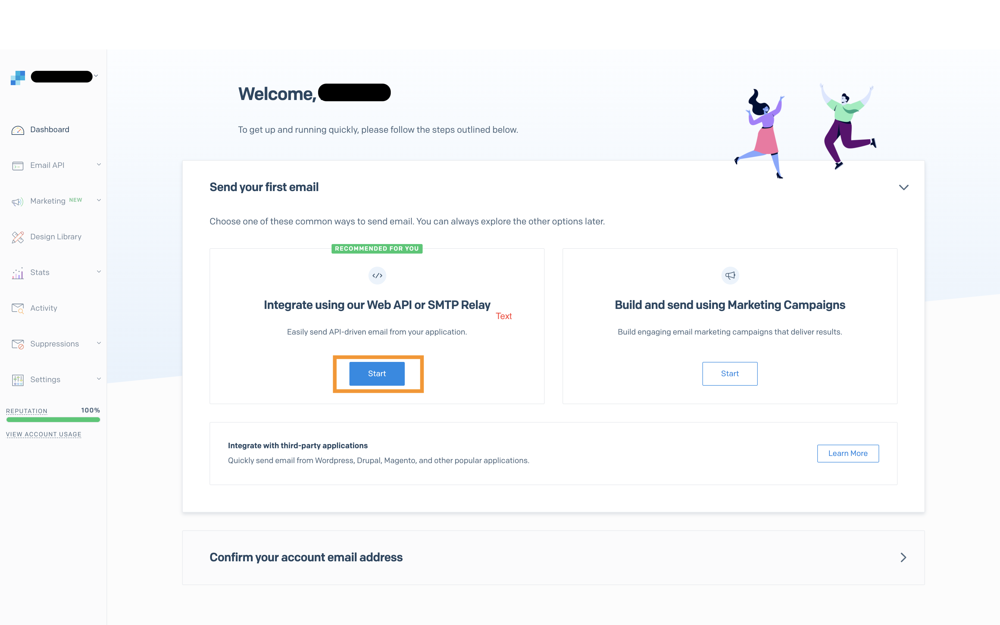

# Sendgrid

To configure Sendgrid as your SMTP server, [create an account](https://signup.sendgrid.com/) & login to Sendgrid.

**1. Navigate to the** [**integration section**](https://app.sendgrid.com/guide/integrate)\*\*\*\*



**2. Select the SMTP Relay integration option**


**3. Create a new API key and copy all the fields**


**4. Navigate to Sendgrids** [**Senders section**](https://app.sendgrid.com/settings/sender_auth/senders)


**5. Create a new sender identity from which emails will be sent**


**6. Update the docker.env file in your Appsmith deployment folder**

```text
# ***** Email **********
APPSMITH_MAIL_ENABLED=true
APPSMITH_MAIL_FROM=YOUR_SENDER_IDENTITY_EMAIL_ID
APPSMITH_REPLY_TO=YOUR_SENDER_IDENTITY_EMAIL_ID
APPSMITH_MAIL_HOST=smtp.sendgrid.net
APPSMITH_MAIL_PORT=587
# ***** Set to true if providing a TLS port ******
APPSMITH_MAIL_SMTP_TLS_ENABLED=true
APPSMITH_MAIL_USERNAME=YOUR_SENDGRID_USER_NAME
APPSMITH_MAIL_PASSWORD=YOUR_SENDGRID_API_KEY
APPSMITH_MAIL_SMTP_AUTH=true
# ******************************
```

**5. Restart docker & nginx**

```text
sudo docker-compose rm -fsv appsmith-internal-server nginx && sudo docker-compose up -d
```

Once you've verified your sender identity, your email service should be configured correctly

