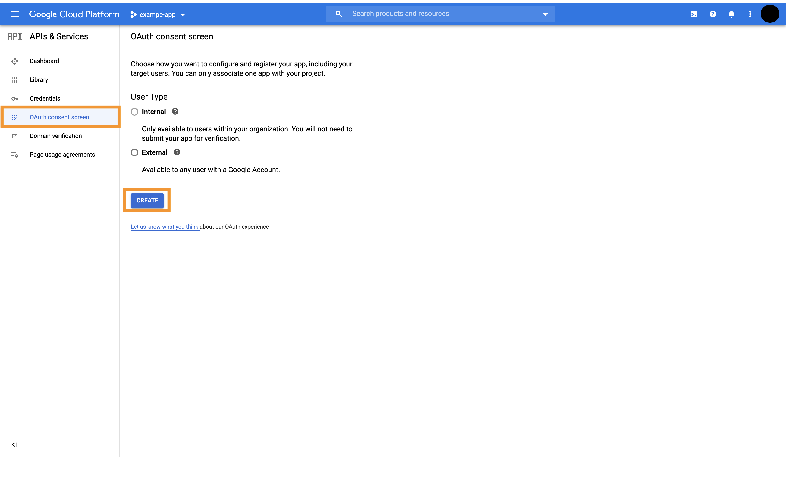
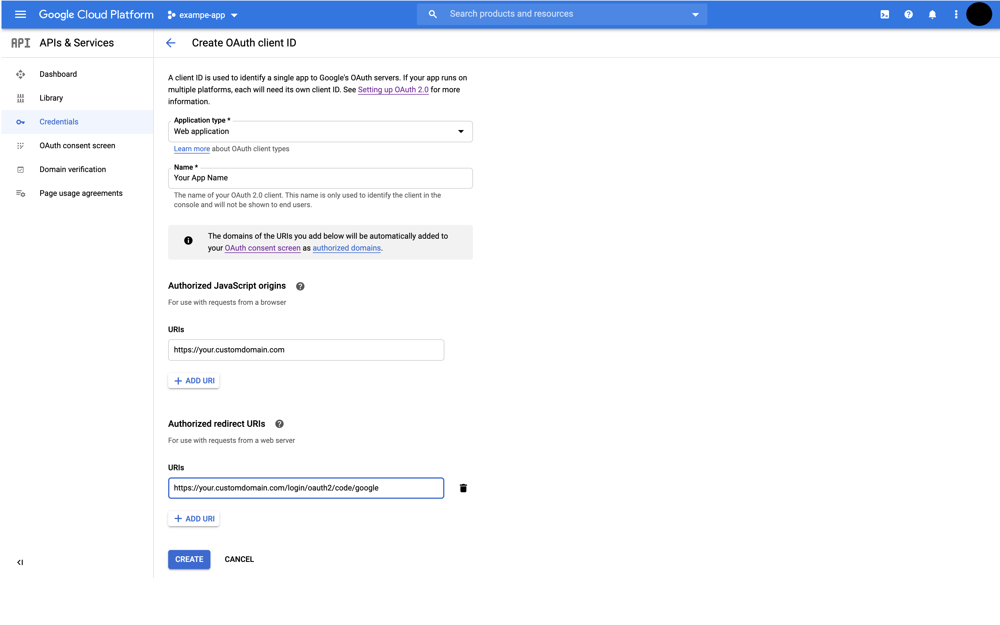

# Google OAuth


To enable Google Sign in, login to your [google cloud console](https://console.cloud.google.com/)

**1. Navigate to the** [**OAuth consent section**](https://console.cloud.google.com/apis/credentials/consent) **under APIs & Services**



**2. Configure the consent screen with the domain on which you want to host Appsmith**


**3. Navigate to the** [**credentials section**](https://console.cloud.google.com/apis/credentials) **and create new OAuth Credentials**


**4. Configure the OAuth Credentials for a web application**

**Javascript Origins:** The domain on which you are hosting Appsmith with https **`(ex: https://app.appsmith.com)`**

**Redirect URIs:** Append **/login/oauth2/code/google** to your Javascript origins **`(ex: https://app.appsmith.com/login/oauth2/code/google)`**



**5. Update the docker.env file in your Appsmith deployment folder**

```text
# ******** Google OAuth ********
APPSMITH_OAUTH2_GOOGLE_CLIENT_ID=YOUR_CLIENT_ID
APPSMITH_OAUTH2_GOOGLE_CLIENT_SECRET=YOUR_CLIENT_SECRET
APPSMITH_OAUTH2_ALLOWED_DOMAINS=YOUR_DOMAIN_NAME
# ******************************
```

* replace `YOUR_CLIENT_ID` and `YOUR_CLIENT_SECRET` with the client ID and client secret generated in the step above
* replace `YOUR_DOMAIN_NAME` with a second-level domain name **`(ex: abc.com)`**, to only allow users with an email address from that domain name to log in **`(ex: john@abc.com)`**
    * **Note**: you can provide several domain names using a comma-separated list

**6. Restart docker & nginx**

```text
sudo docker-compose rm -fsv appsmith-internal-server nginx && sudo docker-compose up -d 
```

Google Login should now be enabled for your Appsmith installation

