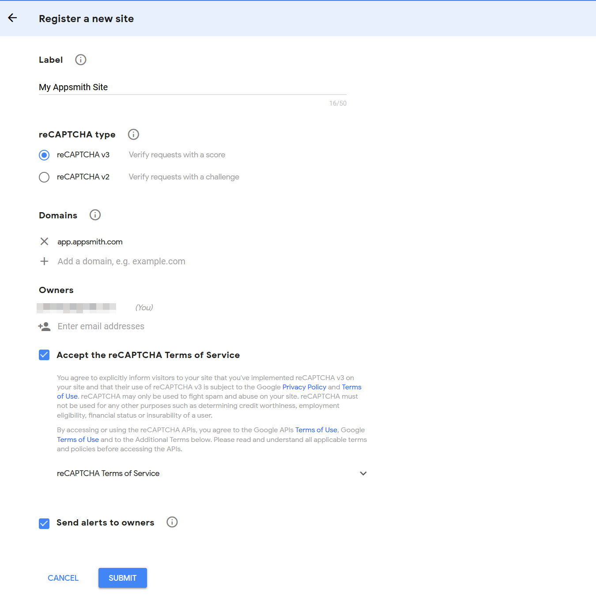
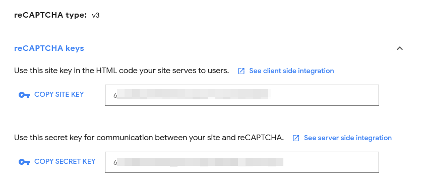

# Google reCAPTCHA

[Google reCAPTCHA v3](https://www.google.com/recaptcha) is a service provided by Google that returns a user score without any interaction from the user. This can integrated with [buttons](../widget-reference/button.md)  to prevent bots from clicking the button on your website without a human present.

**1. Go to the reCAPTCHA** [**add site page**](https://www.google.com/recaptcha/admin/create)

**2. Create a new site with version reCAPTCHA v3 and the domain `app.appsmith.com`**



**3. Copy the site and secret key**



**4. Paste the site key in the** [**button**](../widget-reference/button.md) **reCAPTCHA field**


**5. Configure the server side integration on your backend**

> The exact steps will depend on your backend - see [Google's reference](https://developers.google.com/recaptcha/docs/verify) for detailed instructions.

Make a `POST` request to `https://www.google.com/recaptcha/api/siteverify` with the `secret` (secret key) and `response` (user response) parameters to retrieve the score in a JSON format:

```js
{
  "success": true|false,      // whether this request was a valid reCAPTCHA token for your site
  "score": number             // the score for this request (0.0 - 1.0)
  "action": string            // the action name for this request (important to verify)
  "challenge_ts": timestamp,  // timestamp of the challenge load (ISO format yyyy-MM-dd'T'HH:mm:ssZZ)
  "hostname": string,         // the hostname of the site where the reCAPTCHA was solved
  "error-codes": [...]        // optional
}
```