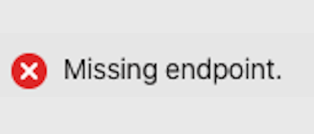
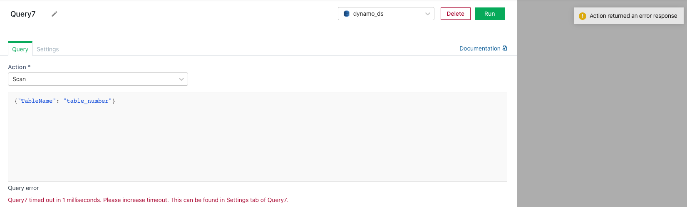
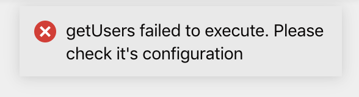

# Action Errors

## Datasource Errors



### Missing Endpoint / Host Error

```
Missing endpoint
```

```
Missing endpoint(s)
```

```
Missing host for endpoint
```


```
Missing endpoint and url
```

```
Missing hostname
```

``` 
No endpoint(s) configured
```

These messages indicate that the `Host address` field in the [datasource creation form](https://docs.appsmith.com/core-concepts/connecting-to-data-sources/connecting-to-databases) has been left empty. 

This error can be fixed by editing the [datasource creation form](https://docs.appsmith.com/core-concepts/connecting-to-data-sources/connecting-to-databases) and typing in the host address for the datasource. 

### Invalid Host Error

``` 
Invalid host provided. It should be of the form http(s)://your-es-url.com
```

This message indicates that the provided URL format is not correct. 

This error can be fixed by editing the [datasource creation form](https://docs.appsmith.com/core-concepts/connecting-to-data-sources/connecting-to-databases) and providing the host URL in the correct 
format. 

### Missing Port Error

```
Missing port for endpoint
```

This message indicates that the `Port` field in the [datasource creation form](https://docs.appsmith.com/core-concepts/connecting-to-data-sources/connecting-to-databases) has been left empty.

This error can be fixed by editing the [datasource creation form](https://docs.appsmith.com/core-concepts/connecting-to-data-sources/connecting-to-databases) and typing in the port address for the datasource.


### Missing Username Error

```
Missing username for authentication 
```

This message indicates that the `Username` field in the [datasource creation form](https://docs.appsmith.com/core-concepts/connecting-to-data-sources/connecting-to-databases) has been left empty. The 
`Username` field is usually nested inside the `Authentication` sub section.

This error can be fixed by by editing the `Username` field in the [datasource creation form](https://docs.appsmith.com/core-concepts/connecting-to-data-sources/connecting-to-databases).

### Missing Password Error

``` 
Missing password for authentication
```

This message indicates that the `Password` field in the [datasource creation form](https://docs.appsmith.com/core-concepts/connecting-to-data-sources/connecting-to-databases) has been left empty. The
`Password` field is usually nested inside the `Authentication` sub section.

This error can be fixed by by editing the `Password` field in the [datasource creation form](https://docs.appsmith.com/core-concepts/connecting-to-data-sources/connecting-to-databases).


### Mandatory Parameter / Field Empty Error

``` 
Mandatory parameter 'Access Key' is empty.
```

``` 
At least one of the mandatory fields in plugin's datasource creation form is empty
```

This message indicates that one of the mandatory fields, for example `Access Key`, has been left empty in the 
[datasource creation form](https://docs.appsmith.com/core-concepts/connecting-to-data-sources/connecting-to-databases).

This error can be fixed by filling the mentioned mandatory field(s) in the [datasource creation form](https://docs.appsmith.com/core-concepts/connecting-to-data-sources/connecting-to-databases).

### Cannot Delete Datasource Error

``` 
Cannot delete datasource since it has 1 action(s) using it.
```

This message indicates that the datasource attempting to be deleted has some query action configured on it.

This error can be fixed by deleting any queries dependent on this datasource before attempting to delete the datasource.

## Query Execution Errors



### Timeout Error

If your API / DB Query times out, it could be due to one of the following reasons

* Your API / Database is behind a VPC which is not accessible from the appsmith Instance. This can be fixed by 
  [whitelisting the appsmith instance](../core-concepts/connecting-to-data-sources/) in your database or VPC.
* Your API / Query is taking too long to respond. This can be fixed by fetching smaller datasets using 
  [server-side 
  pagination](../core-concepts/displaying-data-read/display-data-tables.md#pagination) or increasing the timeout of 
  the API / Query in the [settings section](https://docs.appsmith.com/core-concepts/connecting-to-data-sources/connecting-to-databases/query-settings).

### Configuration Error

``` 
getUsers failed to execute. Please check it's configuration
```

This message indicates an error in the configuration of the action. You can navigate to the [API](https://docs.appsmith.com/core-concepts/connecting-to-data-sources/connect-to-apis/execute-apis) / [Query](https://docs.appsmith.com/core-concepts/connecting-to-data-sources/connecting-to-databases/querying-a-database) in this
state and see the error it encountered. If the error occurred intermittently, it is likely due to a value in the configuration not being available at the time that the API / Query was run.

### Mandatory Parameter Empty Error

``` 
Mandatory parameters 'Action' and 'Bucket Name' are missing
```

``` 
Required parameter 'File Path' is missing
```

``` 
Missing action name (like `ListTables`, `GetItem` etc.)
```

``` 
Document/Collection path cannot be empty
```

``` 
Missing Firestore method
```

A message of this type means that at least one of the mandatory / required fields in the query editor form is missing.

This error can be fixed by editing the [query editor form](https://docs.appsmith.com/core-concepts/connecting-to-data-sources/connecting-to-databases/querying-a-database) and providing the parameter mentioned in the error message.

### Missing Query Error

```
Missing required parameter: Query
```

``` 
needs a non-empty body to work
```

``` 
Body is null or empty
```

Any one of these messages indicated that the body of the query has been left empty. 

This error can be fixed by editing the [query form](https://docs.appsmith.com/core-concepts/connecting-to-data-sources/connecting-to-databases/querying-a-database) and providing a query body.

### Invalid Query Error

``` 
Not a valid Redis command
```

```
Query preparation failed while inserting value
```

A message of this type indicates that the syntax of the query body is invalid.

This error can be fixed by providing a valid syntax in the [query editor form](https://docs.appsmith.com/core-concepts/connecting-to-data-sources/connecting-to-databases/querying-a-database).

### Encoding Error

```
File content is not base64 encoded 
```

This message indicates that the query was expecting a [base64 encoded](https://en.wikipedia.org/wiki/Base64) value as content body, but the actual value 
passed to it was not base64 encoded.

This error can be fixed by passing a base64 encoded value as file content parameter in the query.

### Invalid Number Error

``` 
Parameter 'Expiry Duration of Signed URL' is NOT a number
```

This message indicates that the query parameter mentioned in the message expects a number but a non-numerical value has 
been provided in the [query form](https://docs.appsmith.com/core-concepts/connecting-to-data-sources/connecting-to-databases/querying-a-database). 

This error can be fixed by editing the [query form](https://docs.appsmith.com/core-concepts/connecting-to-data-sources/connecting-to-databases/querying-a-database) and providing a valid number as input for the mentioned parameter.

### JSON Parsing Error

``` 
Error parsing the JSON body
```

``` 
Error converting array to ND-JSON
```

``` 
Unable to parse condition value as a JSON list
```

This message indicates that the [JSON](https://www.w3schools.com/whatis/whatis_json.asp#:~:text=JSON%20stands%20for%20JavaScript%20Object,describing%22%20and%20easy%20to%20understand) string passed to 
the query as a parameter is not a valid JSON string.

This error can be fixed by editing the [query form](https://docs.appsmith.com/core-concepts/connecting-to-data-sources/connecting-to-databases/querying-a-database) and passing a valid JSON string as parameter.

## REST API Errors



### Missing URL Error

```
DEFAULT_REST_DATASOURCE is not correctly configured. Please fix the following and then re-run: \n[Missing URL.]
```

This message indicates that the REST API's URL field in the [API editor form](https://docs.appsmith.com/core-concepts/connecting-to-data-sources/connect-to-apis/execute-apis) has been left empty. 

This error can be fixed by editing the [REST API form](https://docs.appsmith.com/core-concepts/connecting-to-data-sources/connect-to-apis/execute-apis) and providing a URL. 
    
### Missing Client Secret / Client ID / Access Token Error

``` 
DEFAULT_REST_DATASOURCE is not correctly configured. Please fix the following and then re-run: \n[Missing Client Secret, Missing Client ID, Missing Access Token URL]
```

This message indicates that the mentioned parameter fields - `Client Secret` / `Client ID` / `Access Token URL` have 
been left empty. These fields are nested in the `Authentication` sub-section which becomes visible if the 
`Authentication Type` field has been chosen as [OAuth 2.0](https://docs.appsmith.com/core-concepts/connecting-to-data-sources/connect-to-apis/authentication/oauth2-authentication)

### Secret Key Required Error

``` 
Secret key is required when sending session details is switched on, and should be at least 32 characters in length.
```

This message indicates that `Send Appsmith signature header` field has been marked as `Yes` but the `Session Details Signature Key` field is left empty.

This error can be resolved by filling in the `Session Details Signature Key` field or by disabling the  `Send Appsmith signature header` field by selecting `No`.