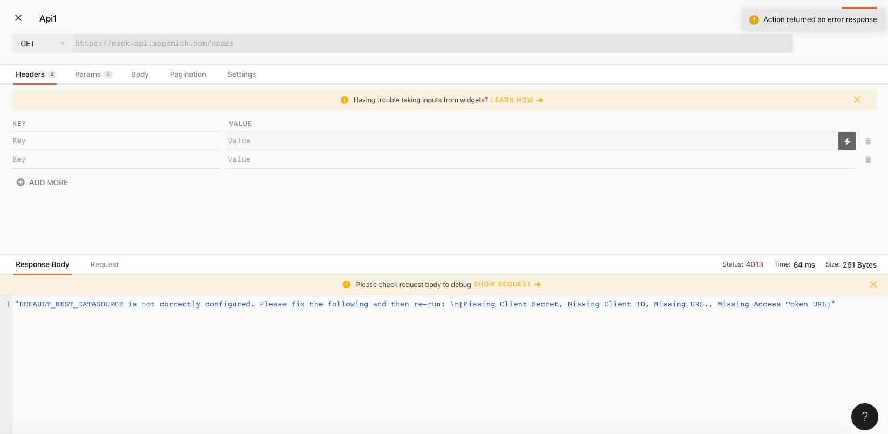

# Action Errors

## **Configuration Error**

This message indicates an error in the configuration of the action. You can navigate to the API / Query in this state and see the error it encountered. If the error occurred intermittently, it is likely due to a value in the configuration not being available at the time that the API / Query was run. 

## **Timeout Error**

If your API / DB Query times out, it could be due to one of the following reasons

* Your API / Database is behind a VPC which is not accessible from the appsmith Instance. To resolve this, you have to [whitelist the appsmith instance](../core-concepts/connecting-to-data-sources/) in your database or VPC.
* Your API / Query is taking too long to respond. Consider fetching smaller datasets using [server side pagination](../core-concepts/displaying-data-read/display-data-tables.md#pagination) or increasing the timeout of the API / Query in the settings section.

