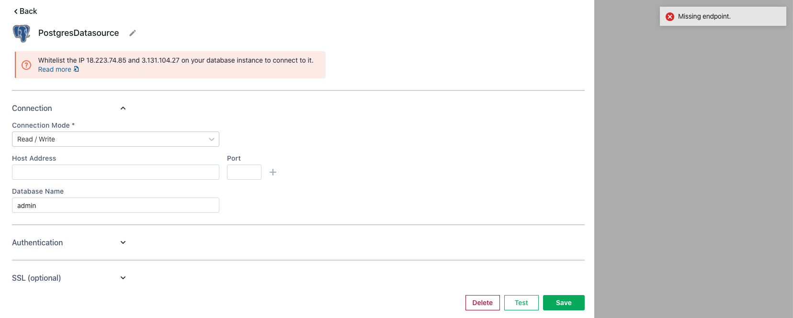

# Datasource Errors



Following are the list of errors we often see while creating new Datasources:

* Missing endpoint
* Missing endpoint(s)
* Missing host for endpoint
* Missing endpoint and URL
* Missing hostname
* No endpoint(s) configured

These messages indicate that the `Host address` field in the [datasource creation form](https://docs.appsmith.com/core-concepts/connecting-to-data-sources/connecting-to-databases) has been left empty. This error can be fixed by editing the [datasource creation form](https://docs.appsmith.com/core-concepts/connecting-to-data-sources/connecting-to-databases) and typing in the host address for the datasource.

### Invalid Host Error

```
Invalid host provided. It should be of the form http(s)://your-es-url.com
```

This message indicates that the provided URL format is not correct. This error can be fixed by editing the [datasource creation form](https://docs.appsmith.com/core-concepts/connecting-to-data-sources/connecting-to-databases) and providing the host URL in the correct format.

### Missing Port Error

```
Missing port for endpoint
```

This message indicates that the `Port` field in the [datasource creation form](https://docs.appsmith.com/core-concepts/connecting-to-data-sources/connecting-to-databases) has been left empty.

This error can be fixed by editing the [datasource creation form](https://docs.appsmith.com/core-concepts/connecting-to-data-sources/connecting-to-databases) and typing in the port address for the datasource.

### Missing Username Error

```
Missing username for authentication
```

This message indicates that the `Username` field in the [datasource creation form](https://docs.appsmith.com/core-concepts/connecting-to-data-sources/connecting-to-databases) has been left empty. The `Username` field is usually nested inside the `Authentication` sub section.

This error can be fixed by by editing the `Username` field in the [datasource creation form](https://docs.appsmith.com/core-concepts/connecting-to-data-sources/connecting-to-databases).

### Missing Password Error

```
Missing password for authentication
```

This message indicates that the `Password` field in the [datasource creation form](https://docs.appsmith.com/core-concepts/connecting-to-data-sources/connecting-to-databases) has been left empty. The `Password` field is usually nested inside the `Authentication` sub section.

This error can be fixed by by editing the `Password` field in the [datasource creation form](https://docs.appsmith.com/core-concepts/connecting-to-data-sources/connecting-to-databases).

### Mandatory Parameter / Field Empty Error

```
Mandatory parameter 'Access Key' is empty.
```

```
At least one of the mandatory fields in plugin's datasource creation form is empty
```

This message indicates that one of the mandatory fields, for example `Access Key`, has been left empty in the [datasource creation form](https://docs.appsmith.com/core-concepts/connecting-to-data-sources/connecting-to-databases).

This error can be fixed by filling the mentioned mandatory field(s) in the [datasource creation form](https://docs.appsmith.com/core-concepts/connecting-to-data-sources/connecting-to-databases).

### Cannot Delete Datasource Error

```
Cannot delete datasource since it has 1 action(s) using it.
```

This message indicates that the datasource attempting to be deleted has some query action configured on it.

This error can be fixed by deleting any queries dependent on this datasource before attempting to delete the datasource.
