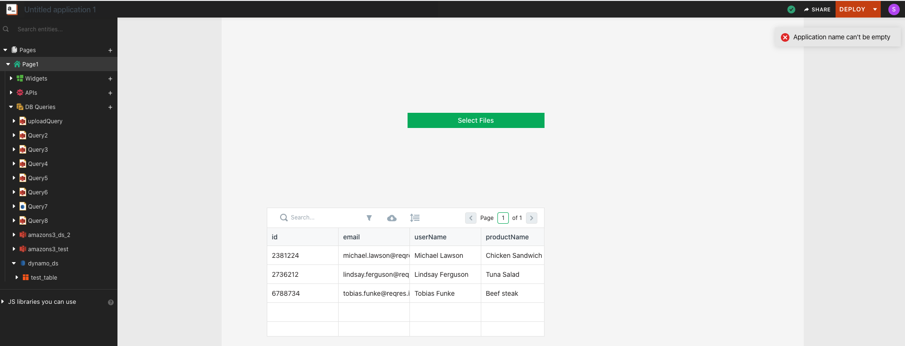
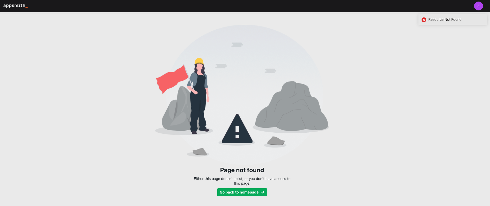

# Application Errors

## Invalid / Empty Name Error



```text
Application name can't be empty
```

This error indicates that the application name field has been left empty.

This error can be fixed by editing the application name field and providing a non-empty string as the application name.

## Duplicate Name Error

```text
Entity name: <name> is already being used
```

This error indicates that the name being assigned to the entity has been used before.

This error can be fixed by assigning a new unique name to the entity.

## Login / Signup Errors


### Account Already Registered Error

```text
There is already an account registered with this email. Please sign in instead
```

This error indicates that the email used to sign up has already been used before.

This error can be fixed by either using a different email to signup or doing `login` instead of `signup`

### Reset Password Error

#### No User Error

```text
Unable to find user <email>
```

This error indicates that the email provided to the reset password form is not registered with Appsmith.

This error can be fixed by providing an email that has been used to register with Appsmith before. Alternatively, any new un-registered email can be used to create a new account using the sign-up option.

## Page Access Error



```text
Either this page doesn't exist, or you don't have access to
this page.
```

This message indicates one of the following:

* The page URL is invalid. This error can be fixed by getting the correct page URL from the admin/developer.
* The User does not have [permission](https://docs.appsmith.com/core-concepts/access-control) to access the page. This error can be fixed by requesting page access permission

  from the admin/developer.

