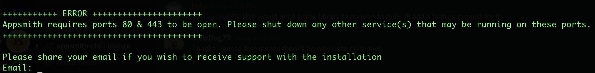
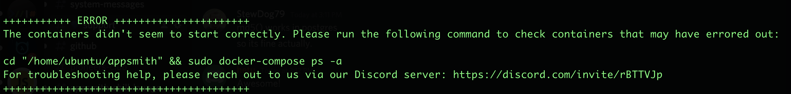

# Deployment Errors

## Ports Unavailable



If you encounter the error that ports 80 & 443 are not open, we recommend that you kill all processes on these ports and start again. If the processes on these ports cannot be stopped, you can run appsmith on another port.

1. Comment out the line: [check\_ports\_occupied line](https://github.com/appsmithorg/appsmith/blob/0051c3f78fe8a22a48afd17d0785cda0dbe855eb/deploy/install.sh#L475) in the install.sh script and run it again. This will ensure that the script does not check for port availability of **80/443**.
2. Once the docker-compose file is installed, the script will try to start the containers and fail because of port conflicts.
3. In the file `docker-compose.yml` , change the ports for the Nginx container to a custom port
4. Run `docker-compose up -d`


To kill a previous version of appsmith running on these ports, run the following:

* sudo su
* docker container kill $\(docker ps -q\) 


## Containers Failed to Start



If you chose to initialize a new database and are seeing this error, it could be due to an error while fetching dependencies during installation. Deleting the current installation direction, killing the docker containers, and restarting the installation should work in most cases. If it does not, please reach out to us on [discord](https://discord.com/invite/rBTTVJp)

If you are trying to connect to an existing MongoDB and the containers failed to start it may be due to one of the following reasons:

1. Incorrect MongoDB credentials
2. Empty Salt / Password for encryption  

Restart the installation process with valid values for the above

## Unable to access Appsmith

* Ensure your security groups are configured to allow traffic to ports 80 & 443 on your installation instance. 
* You can access the running application on [**http://localhost**](http://localhost) in any browser or the **public IP** of your machine.
* You may need to wait 2 - 3 minutes before accessing the application to allow Nginx to start.

## OAuth Sign Up not working

If your deployment is behind an ELB / Proxy, you must update the nginx configuration of the deployment. In the file**`data/nginx/nginx.app.conf.template`** modify the line:

```text
proxy_set_header X-Forwarded-Proto $scheme;
```

with

```text
proxy_set_header X-Forwarded-Proto $http_x_forwarded_proto;
```

This will ensure that the redirect URLs are correct during OAuth2 logins. This works even if the ELB is configured to run on a custom port.

