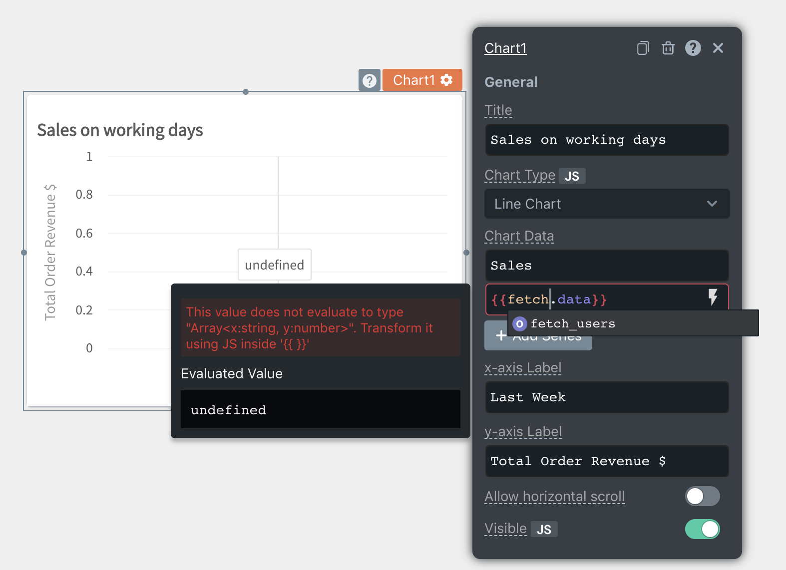

# JS Errors

### Data Type Mismatch

This error occurs when the value in the property of the widget does not match the data type required by the property.

**Common Scenarios:**  

* **Working with Tables**

While working with tables, we see this error often, as the Table Data property expects an Array data type and we might bind JSON objects from APIs directly without transformation. In this case, we should see the error as `This value does not evaluate to type "Array"`. The solution for this is to make sure the data sent into Table Data property is of array data type. By default we should see the following config in the Table Data property when a table widget is dropped on the canvas:

```text
[
  {
    "step": "#1",
    "task": "Drag a Table",
    "status": "✅",
    "action": ""
  },
  {
    "step": "#2",
    "task": "Create a Query fetch_users with the Mock DB",
    "status": "--",
    "action": ""
  },
  {
    "step": "#3",
    "task": "Bind the query to the table {{fetch_users.data}}",
    "status": "--",
    "action": ""
  }
]
```

While binding data from any APIs or DB Queries, use the moustache operator to render the data onto the table widgets. For example, you can use the mock database to query the list of users and display it onto the table using the following syntax in the Table Data property:

```text
{{ fetch_users.data }}
```

* **Working with Dropdowns**

While adding options for single select or multi-select dropdowns, we might face a data mismatch error, usually, errors such as **This value does not evaluate to type "Array&lt;{ label: string, value: string }&gt;".** In such cases, make sure the options in objects containing a label and a value in an array. For example, this is how the options are added to dropdown widgets in the `Options` property.

```text
[
  {
    "label": "Blue",
    "value": "BLUE"
  },
  {
    "label": "Green",
    "value": "GREEN"
  },
  {
    "label": "Red",
    "value": "RED"
  }
]
```

* **Working with Charts**

The below image shows that there is an error in the Chart Data field of the Chart. To the left of the field, we can see a message which indicates that **The** **value does not evaluate to type Array&lt;x: string, y: number&gt;**


The Evaluated Value below indicates the current value of the field and in the image, we can see that the current value is an array while the error indicates that it must be an array&lt;x, y&gt;.

In cases like these, you can use javascript to transform the data to the correct data type or access the correct data inside the object. The below code reduces the fetch\_orders.data array to aggregate orders based on the date into an array &lt;x, y&gt; where x is the date of the order and y is the order amount

```javascript
{{
    _.values(fetch_orders.data.reduce((accumulator, order) => {
        if(accumulator[order.date]) {
            accumulator[order.date].y += order.orderAmount
        } else {
            accumulator[order.date] = { x:order.date, y: order.orderAmount  }; 
        }
        return acc;
    }, {}))
}}
```

* **Working with DatePicker Widget**

Appsmith Datepicker gives a wide range of date formats. However, you can set the default date using JS from an API or a query. While doing this, we might often encounter an error saying **Value does not match ISO 8601 standard date string**. This is because the selected date format does not match with the default date or the data range \(Min Date/Max Date\). 

For example, if the Date Format property is set to `YYYY-MM-DD HH:mm`, the default date, min/max date should be of the same format. You can also use the moment library to convert the date into a selected format. 

## Syntax Error

This error occurs when there is invalid javascript inside the handlebars `{{ }}`. The evaluated value of the field is displayed as undefined in this case. Double-check the number of braces in your code and consider re-writing your JS as [multi-line code](../core-concepts/writing-code/#multi-line-js).

In the example below, fetch is not defined anywhere in the application



## Cyclic Dependency Error

An app gets a cyclic dependency error when a node is directly or indirectly dependent on itself.

### Reactivity and Dependency Map

In Appsmith, we define all user-editable fields as nodes and to provide reactivity, a dependency map is created between these nodes to find the optimal evaluation order of these nodes. For eg: when you would refer to `{{Api1.data}}` in a Table1's `tableData` field, there is a dependency created between `Api1.data` and `Table1.tableData`. So every time `Api1.data` updates, we know `Table1.tableData` needs to update as well.

```text
// Table1.tableData depends on Api1.data
Api1.data -> Table1.tableData
```

Similarly, all parent nodes are implicitly dependant on the child nodes to ensure updates are propagated up an entity object. A more straightforward way to understand this is that if a child node updates, the parent node and its dependencies should also be updated.

```text
// Implicit. Parent depends on children
Api1.data -> Api1
Table1.tableData -> Table1

// Explicit. Table1.tableData depends on Api1.data
Api1.data -> Table1.tableData
```

The most common scenario when a cycle occurs is when you would try to bind a node to it's parent node. Since it is impossible to evaluate an app with a cyclic dependency, we will have to exit out and be in an error state till the cycle is resolved.

```text
// A cycle is formed
Table1 -> Table1.tableData
Table1.isVisible -> Table1
```

