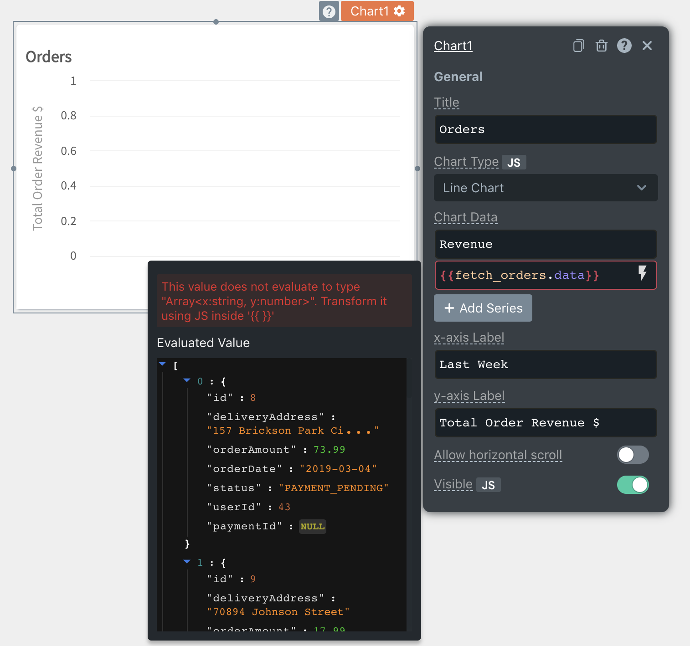

# JS Errors

## Data Type Mismatch

This error occurs when the value in the property of the widget does not match the data type required by the property.



The image shows that there is an error in the Chart Data field of the Chart. To the left of the field, we can see a message which indicates that the value does not evaluate to type `Array<x: string, y: number>`

The Evaluated Value below indicates the current value of the field and in the image, we can see that the current value is an array while the error indicates that it must be an array&lt;x, y&gt;.

In cases like these, you can use javascript to transform the data to the correct data type or access the correct data inside the object. The below code reduces the fetch\_orders.data array to aggregate orders based on the date into an array &lt;x, y&gt; where x is the date of the order and y is the order amount

```javascript
{{_.values(fetch_orders.data.reduce((accumulator, order) => { 
    accumulator[order.date] ? accumulator[order.date].y += order.orderAmount : 
        accumulator[order.date] = { x:order.date, y: order.orderAmount  }; 
      return acc 
    }, {}))
}}
```

## Syntax Error

This error occurs when there is invalid javascript inside the handlebars `{{ }}`. The evaluated value of the field is displayed as undefined in this case. Double-check the number of braces in your code and consider re-writing your JS as [multi-line code](../core-concepts/writing-code/#multi-line-js).

In the example below, fetch is not defined anywhere in the application


## Cyclic Dependency Error

An app gets a cyclic dependency error when a node is directly or indirectly dependent on itself.

### Reactivity and Dependency Map

In Appsmith, we define all user editable fields as nodes and to provide reactivity, a dependency map is created between these nodes to find the optimal evaluation order of these nodes. For eg: when you would refer to `{{Api1.data}}` in a Table1's tableData field, there is a dependency created between `Api1.data` and `Table1.tableData`. So every time `Api1.data` updates, we know `Table1.tableData` needs to update as well.

```text
// Table1.tableData depends on Api1.data
Api1.data -> Table1.tableData
```

In a similar way, all parent nodes are imlicitly dependant on the child nodes to ensure updates are propogated up an entity object. A simpler way to understand this is, if a child node updates, the parent node and all it's dependencies should also be updates.

```text
// Implicit. Parent depends on children
Api1.data -> Api1
Table1.tableData -> Table1

// Explicit. Table1.tableData depends on Api1.data
Api1.data -> Table1.tableData
```

The most common sceanrio when a cycle occuers is when you would try to bind a node to it's parent node. Since it is impossible to evalute an app with a cyclic dependency, we will have to exit out and be in an error state till the cycle is resolved

```text
// A cycle is formed
Table1 -> Table1.tableData
Table1.isVisible -> Table1
```

