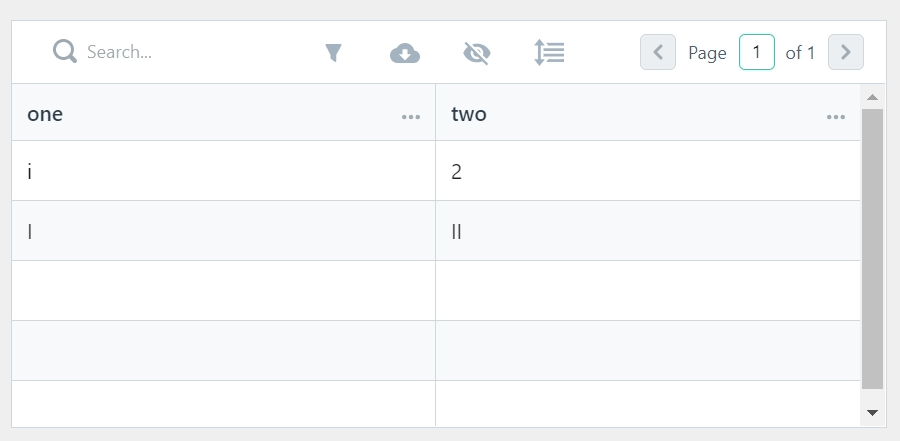

# Creating your first page

Now that your environment – an “app” – is set up, you’re ready to start doing work. 

Each application that you build in Appsmith, comprises of one or more pages. A page in Appsmith is where the three building blocks of your app - Widgets, APIs, and DB Queries come together to create a view. 

The first page you create will list all the products at Oakry. Let's use the default page **Page1** that was created when you created this app. Rename the page to **ProductListPage** by double clicking on **Page1.**

## Adding your first widget

The **ProductListPage** is blank. Let’s add a table-widget to it.

1. Navigate to **Product List → Widgets**
2. Click on **+**
3. Choose the **table widget** 
4. Drag and drop the table widget to the canvas on the right

This will create a new table. 

Let’s take a look at what you now see on screen:

* You can see that the table is populated with some default static data.
* You see a floating window, titled **Table1**, open up on the right of the table. This is the widget's property-pane; this is where you configure the widget’s properties. 
* The name **Table1** is the name of the table that we just created. It can be renamed to anything you like. Click on it to rename it to **Products\_Table**. The name property of a widget is its identifier. It is used to access its properties. Read about table-widget properties [here](https://docs.appsmith.com/widget-reference/table#properties). 
* The **Table Data** property in the pane defines what data will be displayed on the table. You can read more about the table-widget's properties in the [Table widget reference](https://docs.appsmith.com/widget-reference/table).


**To open a widget’s property-pane:**

1. Hover over it
2. Click on its name on the top right



**To rename a widget:** 

1. Open its property-pane
2. You’ll see the widget’s current name at the top 
3. Click on the name Type the new name 
4. Press Enter


Take a minute to check how the Array in Table Data maps to the the table's columns and their values. 

Let’s now play with **Table Data** to get a hang of how it affects the data displayed in the table:

1. Go to **Table Data** property of **Products\_Table**.
2. Copy-paste the following in it: `[ { "one" : "1", "two" : "2" }, {"one" : "I", "two" : "II"} ]`
3. You'll see the table as shown in Figure 3. 
4. Check how the **Array** in **Table Data** maps to the table's columns
5. Go to the first object of the array.
6. Change the value of the key **“one”** from **“1”** to **“i”**.
7. Verify that column **one** of the first row of the table now shows **i.**
8. Click on the **Deploy** button on the top right.

Open the application's URL in your web browser. You can see the table in Figure 4.

 


**Application hosting:**

By default, the deployed app is hosted on Appsmith's domain, i.e. app.appsmith.com. To host your app on your custom domain,  read the detailed steps [here](https://docs.appsmith.com/quick-start), depending on where you've set up Appsmith.


Let's go back to the **Table Data** field. When you place your cursor in the Table Data field, you  see a floating window having headings: 

1. **Expected Data Type**: Specifies the data type expected by the property field. You can set the property to a value whose type is either that of **Expected Data Type** or evaluates to the **Expected Data Type**. For the table widget, the **Expected Data Type** is **Array&lt;Object&gt;**. This tells you that **Table Data** can be set to anything that either is an **Array&lt;Object&gt;** or that evaluates to **Array&lt;Object&gt;**.
2. **Evaluated Value**: Shows in real-time what the input to the field evaluates to. This comes in handy when you write JavaScript code in the field, and you want to check whether it evaluates as expected.

By now, you have successfully displayed static data in your table. For your app to display product data from the database, you need to do the following:

1. Connect to your database 
2. Write a query to fetch the required data
3. Configure the table to show the query's results

Since your Personal Organization comes with a pre-configured mock PostgreSQL Database called **Mock Database**, the first step of connecting to a database is already done. However, when you build your own app, you’ll connect to your own database. If you’re new to Appsmith, read [this](https://docs.appsmith.com/core-concepts/connecting-to-databases) to learn to configure a database of your choice.

We'll jump to the second step of writing a query.

## Writing your first query

1. Click on **+** next to **DB Queries**
2. Choose **Mock Database**
3. Note that the **Mock Database** is a PostgreSQL database
4. Click on **New Query**
5. You’ll see a query created with the name **Query1**
6. Rename the query to **ProductsQuery**
7. Copy-paste the query shown below in the **Query** tab `SELECT "productId", "productName", "category", "mrp" FROM products ORDER BY "productId";`
8. Click on **Run**
9. Note the pop-up informing that the query ran successfully


**Auto-save:** 

The query is saved as soon as it's created, without you having to explicitly save it. The same would be the case with any API, widgets, and any changes you make you any entity of your app.

Appsmith auto-saves all the changes you make in the configuration of your app in real-time, so you never lose your work. However, these changes reflect in the live application only after you deploy.


## Accessing query results from a widget

The next step is to display the query results in the **Products\_Table** :

1. Navigate to **ProductListPage → Widgets → Products\_Table**
2. Open **Product\_Table’**s properties
3. Copy the following in the **Table Data** property: `{{ProductsQuery.data}}`
4. Your table now displays **ProductsQuery**’s results
5. Click the **Deploy** button on the top right
6. Click on the **View Application** button on the modal that shows up
7. You'll see a page displaying your query results in a table like below: 

Let’s see how this works:

1. By using mustaches `{{ }}`, you’re asking Appsmith to resolve what is within it as JavaScript code. You can write JavaScript anywhere in Appsmith within mustaches.
2. By using the query’s name within mustaches `{{ ProductsQuery }}`, you’re accessing the entire query object of **ProductsQuery**.
3. By accessing the data key of the **ProductsQuery** object, you’re accessing its results. 
4. By setting the **Table Data** to `{{ ProductsQuery.data }}`, you’re telling **Products\_Table** to display the results of **ProductsQuery**
5. Setting **Table Data** to `{{ ProductsQuery.data }}`

   also ensures that whenever **ProductListPage** loads, **ProductsQuery** runs automatically. You can, although, change this default behavior by toggling the field "**Run query on page load**" on the **Setting** tab of **ProductsQuery**.

## Reactive Programming

Appsmith follows the [Reactive Programming paradigm](https://en.wikipedia.org/wiki/Reactive_programming).

In reactive programming, when you set `a := b + c`, the value of `a` is automatically updated whenever the values of `b` or `c` change, without the program having to re-execute the statement to determine the presently assigned value of `a`.

As against imperative programming, where after `a` is assigned the result of `b + c` in the instant the expression is evaluated, later the values of `b` and `c` can change with no effect on the value of `a`.

Let's extend this to what you did in the previous section by setting:

`Table Data of Products_Table := {{ ProductsQuery.data }}`

The data displayed on **Products\_Table** will be updated automatically,  whenever **ProductsQuery** is run, i.e. without you having to write explicit code to re-evaluate **TableData** of **Products\_Table**. 

So, in Appsmith, whenever you bind a field to a dynamic variable, the field's value will be automatically updated when the value of the dynamic variable changes.

## Variables and Names

In the previous sections, we've used names to access widgets, and queries. For example, you accessed a query's result by accessing a property on the query's name. In that sense, think of widgets, APIs and DB Queries in Appsmith as variables having a name. Similar to variables in other programming languages:

1. They represent an object, be it a widget, an API object, or a query object
2. They support a set of methods
3. They have a scope; they can be accessed from only within their parent page
4. All names within a page must be unique - be it widget names, query name, or API names.

As you'll see in the next section, the inverse of this is also possible, i.e a widget's state can also be accessed by a query. Furthermore, all the building blocks of an Appsmith page - Widgets, DB Queries, and APIs can access each other's data and/or state using their names. 

## What's next?

When you’re comfortable with the basics of using the table-widget, setting up a DB query, and connecting the widget to display query results, read [part 2 ](https://app.gitbook.com/@appsmith/s/appsmith/~/drafts/-MNXsPmxVacsRbqB7S_f/v/v1.3/tutorial/part-2-creating-a-basic-form)of the tutorial to learn to use widgets that enable you to accept and process user input.

