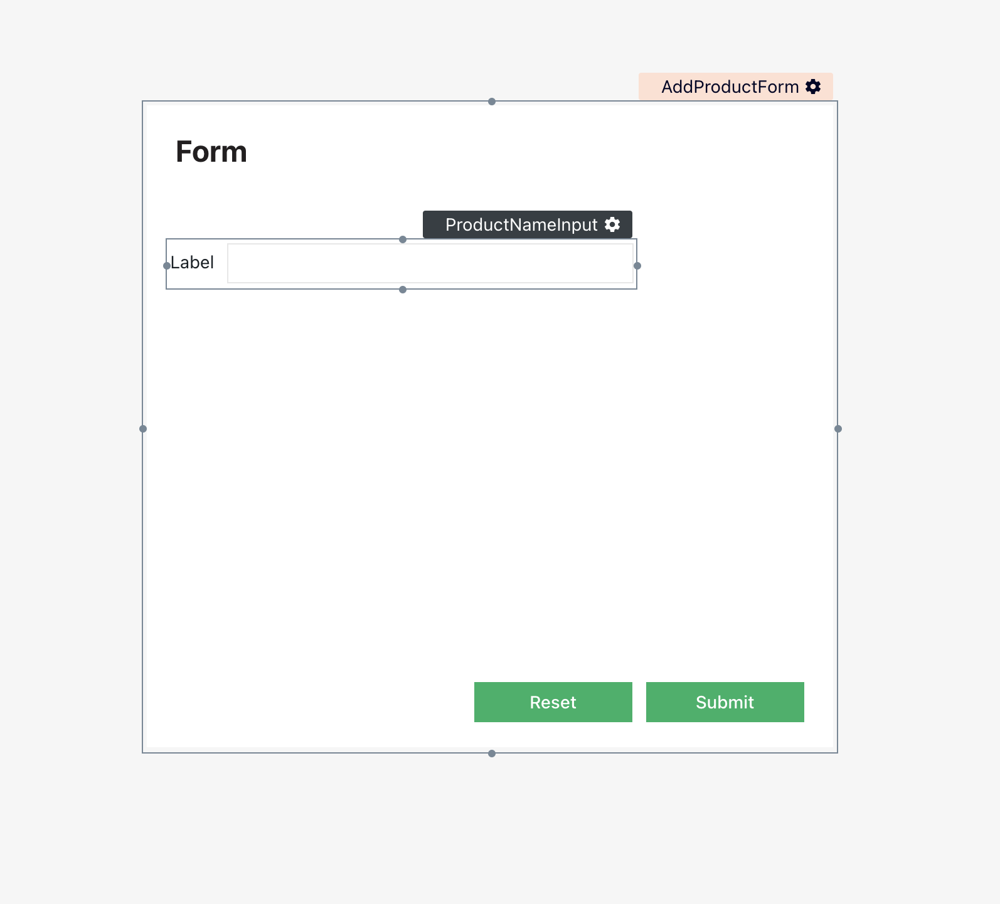
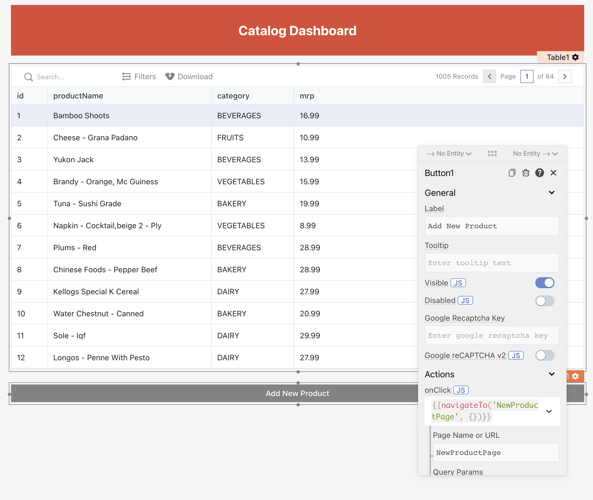

# Using forms

In the first part of this tutorial, you've created a single page app to view products for **Oakry**. In this part, you'll extend the app to a multi-page app, where you'll be creating a new page that allows users to add a new product to:

* Create a new page having a form to accept the new product's details from a user
* Add validations to the form fields
* Access widgets state in queries to insert dynamic input
* Bind the form's submit button to trigger the addition of a new product

We'll also add a button on the **ProductListPage** that opens this form. Let's get started!

## Creating your first form!

Now to add new products to the catalogue, you'll have a create a new form widget. To keep things more organised, do this on a new page to not affect the catalogue page. Follow the below steps:

1. Create a new _**Page**_ by clicking on the "+" icon next to the **Pages** directory.
2. Rename the page to **`NewProductPage`**
3. Find and add a new **Form** widget by clicking on the "+" icon under the Widget directory to the page.
4. Rename the form to **`AddProductForm`**


When you create a new page, the base directory structure having Widgets, APIs, and DB Queries automatically gets created.


## Adding Input Widgets to Form

The created form does not have any input fields. Now, add a new [input widget](https://docs.appsmith.com/widget-reference/input) onto the empty form \(_AddProductForm_\) by simply selecting it and dropping it on to canvas. Rename, the input widget to `ProductNameInput`.

Below is a screenshot of how your form should look like: 



This looks incomplete without a text label. Let’s fix that by adding a [text widget](https://docs.appsmith.com/widget-reference/text) next to the left of **ProductNameInput**. Also, update the **Text** property from its properties modal to **`Product Name`:** to change the display text.

## **Configuring Input Widgets**

You can also configure input fields on Appsmith. For example, you can set data-types, placeholders, custom error messages and many more. Now, open the `ProductNameInput` properties and set the following:

1. Modify **Data Type** to `Text`
2. Enable **Required** field by clicking on the toggle button

The Data Type property sets the allowed data-type of input, in this case, you can only enter text inputs. However, based on your use-cases you can change it to number, password or an email. The **Required** field makes the input to the field mandatory.

> It also disables the form-submit button if no input is provided in a mandatory field. To check out more properties and configuration do check out the docs [here](https://docs.appsmith.com/widget-reference/input#properties).

## Adding Dropdown Widget to Form

Now, let's add one more field to the **`AddProductForm`** that enables users to choose the product category. For this, you'll have to drag and drop a [dropdown widget](https://docs.appsmith.com/widget-reference/dropdown) and rename it to **`CategoryDropdown`**. Also, to keep the form clean, add a text widget next to **`CategoryDropdown`**. Lastly, set its **Text** property to **Category**.

Below is a screenshot of how your form should look like:


Now, open the dropdown settings and set the **Selection Type** property to **`Single Select`**, this will allow the user to select only one value from the dropdown.



Now, if you look at the `CategoryDropdown` widget, you'll see some default options already added to it. Below are the steps for updating these according to the items relevant to Oakry: _Vegetables_, _Bakery_, _Fruits_, _Beverages_, and _Dairy_.

1. Open **CategoryDropdown** properties settings.
2. Click on the **Options** field. The value in this field is used to specify the options of the dropdown.
3. See that the **Expected Data Type** is `Array<{ label: string, value: string }>`
4. Now update the options, by coping the below snippet to the `Options` field.

```javascript
[
  {
    "label": "VEGETABLES",
    "value": "VEGETABLES"
  },
  {
    "label": "BAKERY",
    "value": "BAKERY"
  },
  {
    "label": "FRUITS",
    "value": "FRUITS"
  },
  {
    "label": "BEVERAGES",
    "value": "BEVERAGES"
  },
  {
    "label": "DAIRY",
    "value": "DAIRY"
  }
]
```

Also, set the **Default Option** to `blank` and toggle the **Required** field to `true`.

## Writing your First Transformation

Notice that to set **CategoryDropdown**'s options, you had to copy-paste the values in a text editor. It was cumbersome. You can use JavaScript transformation to simplify that:

Open `CategoryDropdown` properties and add the following snippet to the `Options` field:

```javascript
{{
    _.map(
      ["vegetables", "bakery", "fruits", "beverages", "dairy"],
      function (category) {
        return { label: category.toUpperCase(), value: category.toUpperCase() };
      }
    );
}}
```

> To see it it's working, you can check the **Evaluated Value** and verify that it matches the **Expected Data Type**.

In the above code snippet, a simple `_.map` method from **lodash**, and a `toUpperCase()` method from JavaScript to transform `Array<Strings>` into `Array<{ label: string, value: string }>`.

By extension, you can transform any data into the desired format and type. For example, your input array can be values returned by a query that you can transform to `Array<{ label: string, value: string }>`.


**Data Transformation:**

Using JavaScript transformation, you specify a JavaScript function that applies the transformations that you want. You can include methods to check whether input records match a particular condition, and you can either drop or forward records on the basis of the results.

Since you can Appsmith supports JavaScript just about everywhere, you can use JavaScript, or one of the [supported JS libraries](https://docs.appsmith.com/core-concepts/writing-code/ext-libraries) to transform data in any widget, API, or DB Query.


## Wrapping up the Form

So far, the form has can accept a name and the category of the product. Now, add a new [input widget](https://docs.appsmith.com/widget-reference/input) and rename it to `MrpInput`. This will be taking the number as an input, hence change the `Data Type` to `Number.` Lastly, add a [text widget](https://docs.appsmith.com/widget-reference/text) next to `MrpInput` and set it's `Text` property to MRP\($\).

The current title of the form is also a text widget with default title mentioned as **Form**. Let's rename the title to **Add a Product \(Oakry\)**. Below is a screenshot of how the Page looks like:


## Writing regex validations

Your form now has all the required widgets in place with some basic properties configured. Let’s add some regex validations to reject bad input from users.

Start with **ProductNameInput**:

1. Open its properties modal 
2. Set **Regex** to `^\s*[a-zA-Z]{3,50}\s*$`
3. Set **Error Message** to **Must be alphanumeric having length between 3 and 50**

Let’s see what you did there:

* By setting the **Regex**: 
  * You restricted the text to the characters of the English alphabet
  * You ensured that the length of the product name will at least be 3 and at most be 50
* By setting the **Error Message**, you specified the error users will see when regex validation on their input fails

Try filling in both valid and invalid values in **ProductNameInput** to verify that it works.

Now, let’s configure MrpInput to accept only decimal values greater than or equal to $1.00

1. Set **Regex** to `^\s*(?=.*[1-9])\d*(?:\.\d{1,2})?\s*$`
2. Set **Error Message** to **Value must be greater than 0 and up to 2 decimal places**

Verify that the regex validates the input as expected, and throws the error message in case of a mismatch.


**Real-time app changes:**

Since Appsmith editor reflects changes in the app in real-time. So you will be able to test the changes while building, and without having to deploy every time.


## Submitting the form

Your form is now both more user-friendly, and less error-prone. Let's configure it to trigger the addition of a new product. It will involve two steps:

1. **Setting up an insert query** that adds a new product to the table
2. Wiring the Submit button of the form to **run the insert query**

## Accessing widget properties in queries

Your form will have the value filled in by the user. You want to insert those values via your query. Let’s see how to do that:

1. Navigate to **Pages → NewProductPage → Datasources → +**
2. Navigate to **Mock Database → New Query**
3. Rename the query to **AddProductQuery**
4. Copy the following in the Query tab  

   ```sql
   INSERT INTO products ("productName", "category", "mrp") VALUES ('{{ProductNameInput.text}}', '{{CategoryDropdown.selectedOptionValue}}', '{{MrpInput.text}}')
   ```

5. Run the query
6. You’ll see the notification for a successful query run

Let’s see the query. The main query syntax is the same as that of PostgreSQL, following the format:

```sql
INSERT INTO table_name
 (col1, col2, col3,  colN)
VALUES
 (val1, val2, val3, … valN)
```

The only difference is that you’re using the mustache template to write JavaScript within the insert query:

* To get the value filled by the user in **ProductNameInput**, you accessed its `text` property.
* To get the value of the selected option of **CategoryDropdown**, you called the property `selectedOptionValue` on it.

What you did here is that you accessed the widgets' property in your query. This is the inverse of what you did in part 1 where you accessed **ProductsQuery**'s results in the **Products\_Table** widget. To reiterate, widgets, APIs, and DB Queries belonging to the same parent page can access each other's property/data by referencing the appropriate property on their respective names.

## Triggering action on UI events

Your query **AddProductQuery** is now set up to insert dynamic user input from the form. Let's bind the Submit button of the form to invoke **AddProductQuery**:

1. Open the properties of **SubmitButton**
2. Go to **Action → onClick**
3. Choose **Execute DB Query → AddProductQuery**

Try creating a new product using the form. You’ll notice that you don't have a way to tell whether the product got added after submitting, or not. It's because you haven't set up a success or an error message. Let's do that:

1. Open the properties of **SubmitButton**
2. Navigate to **onClick → onSuccess** 
3. Choose **Show Message**
4. Type **Yay, product creation successful!**
5. Navigate to **onClick → onError**
6. Choose **Show Message**
7. Type **Nay, product creation failed!**

Try filling the form again with some valid and invalid values to verify that it works as expected.

## Configuring actions using JavaScript

In the previous section, you used the properties GUI to define **onSuccess** and **onError** events for the **Submit** button. You can do the same using JavaScript. Let's see how.

Click on the **JS** icon next to **onClick**. You’ll see that the long hierarchical GUI that represents **onClick → onSuccess** and **onClick → onError,** converts to JavaScript code like below:

```javascript
{{
    AddProductQuery.run(
        () => showAlert('yay'), 
        () => showAlert('nay')
    )
}}
```

What you see above is the **`run()`** method defined by Appsmith. You can call the method on any DB Query, or an API. This method has the following signature:

```javascript
run(onSuccess: function, onError: function, params: object): void
```

Clicking on **JS** enables two things:

1. If the field is blank, it allows you to write JavaScript. That is, instead of using the GUI, you could have written this JavaScript yourself to configure the **onSuccess** and **onError** events.
2. If the field is already populated using the GUI, it converts the configured behavior to JavaScript code. Like it did above. You can modify this JavaScript to further customize the behavior. 

Note that you bound one action each with the success and error events. In [part 3](https://app.gitbook.com/@appsmith/s/appsmith/~/drafts/-MNo2nMKgdMWZ9VCFlcr/v/v1.3/tutorial/part-3-widget-interaction/running-multiple-actions-on-submit), you'll learn to bind more than one action with each of the events.


For more information about writing JavaScript in Appsmith, please refer to this guide [Writing JavaScript in Appsmith](https://docs.appsmith.com/how-to-guides/writing-javascript-in-appsmith)


## Connecting multiple pages

You've created a new page **AddProductPage** with a form that allows users to add new products. Now, you want to open this page when the user clicks on an **"Add new product"** button from the **ProductListPage**. Let's set this up:

1. Navigate to **Pages** **→ ProductListPage**
2. Drag-drop the [button widget ](https://docs.appsmith.com/widget-reference/button)at the bottom right of the table
3. Rename widget to **AddProductButton**
4. Change button label to **Add New Product**
5. Go to **Action → onClick → Navigate To** 
6. Type **AddProductPage** in **Page Name** field

Your **ProductListPage** now looks like:



Let's test this. Click on the "**Add New Product"** button on the ProductListPage. You'll see that the **AddProductForm** page opens up, ready for you to fill the form.

But what's happening here? By selecting the [Navigate To](https://docs.appsmith.com/function-reference/navigateto) option, you set up the button to open a new page when it is clicked. You then specified the name of that page in your app, so Appsmith knows where to redirect the user to.

## What's next?

When you’re comfortable with the basics of building a form, accessing widget's p roperty in DB queries, and binding events using both GUI & JavaScript, read [part 3 ](https://app.gitbook.com/@appsmith/s/appsmith/~/drafts/-MNXsPmxVacsRbqB7S_f/v/v1.3/tutorial/part-2-creating-a-basic-form)of the tutorial to learn to take and process user input.

