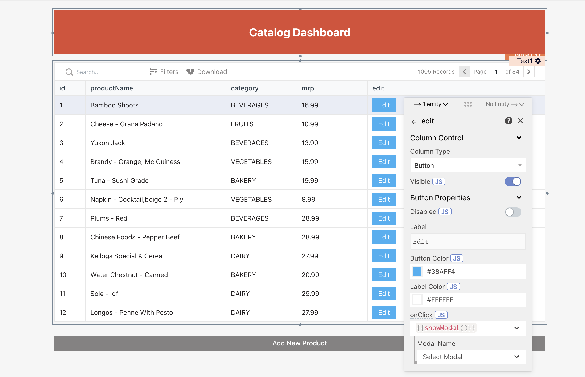

# Creating interactive views

By now, you've built a multi-page tool that allows you to view all products, and add a new product. The following tutorial walks you through building the functionality to edit a product. During this, you'll learn to:

1. Access one widget's state from another
2. Set up an API to update a product
3. Execute multiple actions on a single event

## Accessing properties between widgets

You've built a page to view all products, and another page to add a new product. We now move on to the third functionality of enabling a user to edit a product. Let's add an **Edit** button in each row of the table. On clicking the **Edit** button, a form modal will open which will allow users to edit the product in the corresponding row.

1. Open **Products\_Table**’s properties
2. Click on **ADD A NEW** **COLUMN** under **Columns**
3. Click the ⚙️ icon to access column settings
4. Change the column type to **Button**
5. Label the button as **Edit** under button properties

You'll see an Edit button in the last column of each row. A Row Button adds a button action for each row. Let's configure the Edit button.

1. Open **Products\_Table**’s properties
2. Go to **Button column's** settings by clicking the ⚙️ icon
3. Choose the action **Open Modal** from the **onClick** dropdown
4. Choose **New Modal**
5. Rename the new modal to **EditProductModal** using its properties
6. Choose **Modal Type** as **Form Modal**
7. Rename the modal’s title to **Edit Product**

The **Product\_Table** now looks like this:



Click on the **Edit** button of any row. You will see that **EditProductModal** is an empty form. Let’s populate the form with widgets such that:

* It looks exactly like the **AddProductForm**
* Its properties are configured in the same way as that of **AddProductForm**


**Naming:**

The names of widgets inside your **EditProductModal** are the same as that of the names of widgets inside **AddProductForm**. This is valid because they both belong to different parent pages. Names must be unique only within the page - across widgets, APIs, and DB queries, that is, a widget and an API within the same parent page also can't be assigned the same name.


After doing this, **EditProductModal** will look like below:


Notice, that like **AddProductForm**, all the form-fields in **EditProductModal** are empty. However, to edit a product, you'll want them to be pre-filled with the values of the product that you want to update. This means that:

* **ProductNameInput** should show the **productName** value of the selected row
* **MrpInput** should show **mrp** value of the selected row
* **CategoryDropdown** should show **category** value of the selected row
* **ProductNameInput** should show the value of column **productName** of the selected row
* **MrpInput** should show the value of column **mrp** of the selected row
* **CategoryDropdown** should show the value of column **category** of the selected row

Let's configure all the above.

To set a default value of **ProductNameInput**:

1. Open properties of **ProductNameInput**
2. Set **Default** **Text** to `{{Products_Table.selectedRow.productName}}`
3. Verify that the **Evaluated** **Value** of the property is as per the value in the selected row

Note that you just wrote JavaScript to set the **Default Text**. Here, `Products_Table.selectedRow` has all the column values of the selected row. By referencing **`productName`** on it, you're accessing the value of **productName** column. By setting **Default** **Text** to this, you’re pre-filling the form with this value.

What you did above was that you accessed the [table widget's](https://docs.appsmith.com/widget-reference/table) property [selectedRow's](https://docs.appsmith.com/widget-reference/table#selected-row) column values, in the [form widget](https://docs.appsmith.com/widget-reference/form). Appsmith allows you to access the property of one widget in another widget using a set of properties exposed by every widget. For example, here you used the [table widget's ](https://docs.appsmith.com/widget-reference/table)[`selectedRow`](https://docs.appsmith.com/widget-reference/table#selected-row)property. For a widget, check its exposed properties under the **Internal Properties** section in its **Widgets Reference** guide.

Note that since the scope of a widget is limited to its parent page, a widget shares its properties only with other widgets, queries, and APIs defined within the same page. For example, in this case, `Products_Table.selectedRow` can be accessed only in other widgets, queries, and APIs of **ProductListPage**. `Products_Table.selectedRow` can't be accessed from any widget, query, or API of **AddProductPage**.


**Accessing data across pages:**

To access a widget's properties or an APIs/DB Query's results on another page, there are two ways:

1. Store the data in your browser cache using the [storeValue](../../framework-reference/store-value.md) function, so that it's available for accessing even when the user moves to another page in your app.
2. Pass the data as a query param in the URL of the page you redirect the user to. This can be done using the [navigateTo](../../framework-reference/navigateto.md) function.


Let's now set a default value for **MrpInput**:

1. Open properties of **MrpInput**
2. Set **Default** **Text** to `{{Products_Table.selectedRow.mrp}}`
3. Verify that the **Evaluated Value** of the property is as per the value in the selected row

To set a default value for CategoryDropdown:

1. Open **CategoryDropdown**'s properties
2. Set **Default** **Option** to `{{Products_Table.selectedRow.category}}`
3. Verify that the **Evaluated** **Value** of the property is as per the value in the selected row

Verify that when you click on the Edit button of a row, your form will get populated with the selected row's values.

## Writing your first API

Your edit form is ready to take user input. Now you will configure its Confirm button to trigger the update of the product via an API. It involves two steps:

1. Setting up the required API
2. Wiring the form-submit to trigger the API

In this section, we'll set up the API.

You'll use the below API to update a product:

`PUT https://mock-api.appsmith.com/products/:id`

It is a mock API exposed by Appsmith to help you learn API basics. It doesn't require any Auth. It accepts JSON input, and gives JSON output. Let's set it up on your app:

1. Navigate to **ProductListPage → Datasources**
2. Click **+ Create New**
3. Choose Create new API
4. You'll see a Postman-like interface
5. Rename the API to **UpdateQueryApi**
6. Choose method as **PUT**
7. Copy-paste the below in **URL** `https://mock-api.appsmith.com/products/{{Products_Table.selectedRow.id}}`
8. Copy-paste the below in **Body**
9. Run the API
10. Verify that the API runs successfully

```
{
	"productName" : "{{ProductNameInput.text}}",
	"mrp" : "{{MrpInput.text}}",
	"category" : "{{CategoryDropdown.selectedOptionValue}}"
}
```

By using the mustache template in the URL, you're passing the ID of the product to be updated. To build the request body, you're writing JavaScript within mustaches to pass the new values.


**A word on sharing widget properties:**

Here, you are accessing widgets' properties in an API. This is in line with what you learned in the previous sections - that you can access a widget's properties from other widgets, APIs, and DB Queries. Irrespective of where you access a widget's properties from, the method of access remains the same, i.e. it follows the syntax\_``.\_


## Configuring multiple actions on UI events

The API to update a product is ready. In this section, you'll bind the **Confirm** button of **EditProductModal** to run **UpdateProductApi**.

1. Open **EditProductForm**'s properties
2. Rename **label** to **Update**
3. Go to **Actions → Call an API**
4. Choose **UpdateProductApi**
5. Go to **onSuccess**
6. Choose **Execute DB Query → ProductQuery**
7. Go to **onError**
8. Choose **Show Alert**
9. Set the **Message** to **Product update failed!**
10. Set **Type** to **Error**

Let’s see what you did there:

* You configured the **Confirm** button to run **UpdateProductApi**.
* Now, you want the **Products\_Table** to show the updated list of products after the new product gets added successfully. For that, you set the **onSuccess** event of the button to execute **ProductQuery**, i.e. if the **UpdateProductApi** runs successfully, **ProductQuery** will be executed. Here you're following the reactive programming paradigm of Appsmith, that is, you are triggering an auto-update of the data displayed by the **Products\_Table** by calling `ProductsQuery.run()` .
* You set the **onError** event of the button to show an alert message, i.e. if **UpdateProductApi** returns an error, an alert message will be shown.

Try to edit a product, and click **Confirm** to verify that it works. You'll see that you see success/error notifications on the top left, but the form-modal remains open after submitting. Let's configure it to close the form if the update is successful. On error, you'll keep the form open for making further edits.

## Triggering multiple actions on a UI event

To bind multiple actions to a button event, let's write some JavaScript:

1. Click on **JS** of **onClick** on **EditConfirmButton**
2. The **onClick** field converts to JS
3. Set it to

```javascript
{{
  UpdateQueryApi.run(
  () => { 
          ProductsQuery.run(); 
          closeModal('EditProductModal')
        },
  () => showAlert('Product update failed!'))
}}
```

This is in line with what you learned in [part 2](https://docs.appsmith.com/tutorial-1/part-2-using-forms) about using JavaScript to define widget behavior. Whereas there you wrote JavaScript to trigger one action **onSuccess** of **onClick**, here you're configuring two actions. The first argument to the `run()` method is a JavaScript anonymous function that triggers two actions **onSuccess** of **onClick** -

* Execute the **ProductQuery**
* Close the modal

Note that since these actions run asynchronously, they all run in parallel. You can trigger as many actions **onSuccess** and **onError** as required by wrapping them within an anonymous JavaScript function.

Try to edit a product again, and verify that the form-submit works as expected.


**GUI vs JavaScript: What to use when?**

By extension, understand that you can write any JavaScript to customize widget behavior. Often, in Appsmith, you'll be able to customize more by writing JavaScript, than by using the GUI.

For example, configuring multiple actions to be run **onSuccess** is supported only via JavaScript because it's easier to write code for it than to configure it using the GUI.

Similarly, to configure conditional behavior, writing ternary conditions in JavaScript is easier, and more extendible; and hence GUI doesn't provide for it.

We recommend that you spend some time fiddling with JavaScript on Appsmith.


## Sharing your app

Let's deploy your app for the final time. Once deployed, you can share your deployed application with both internal and external users:

1. Click on the **"Share"** button on the top right
2. Invite a user using their email ID
3. Select an appropriate role for the user
4. Share the application’s URL with the user

You can also make the application public, in which case, anyone with the URL to the application can view the application without having to sign in. You can read more about [access control here](https://docs.appsmith.com/core-concepts/access-control).

**What's next?**

The basic Catalog Dashboard is now up and running. This also marks the end of the beginner tutorial. At this point, you should know enough to start a project of your own and start fooling around. The following resources will come in handy as you need to learn new tricks:

* [Core Concepts](https://docs.appsmith.com/core-concepts/)
* [Widget Reference](https://docs.appsmith.com/widget-reference)
* [Function Reference](https://docs.appsmith.com/function-reference/)
