# Build an anime application
This tutorial assumes you have basic familiarity with [Appsmith](https://appsmith.com). If not, please create an account to get started. It is very easy to get started with it. Here are some [good resources](https://docs.appsmith.com/).

## Main features
- Page 1:
  - Search for an anime from a list of available titles (display name, source, dynamic wallpaper)
  - Like / Dislike a title of your choice
- Page 2:
  - See top rated anime

## What you will learn
- Building a more complex application using Appsmith
- Build multiple pages for your application
- Connecting an API as a data source
- Connecting MsSQL database as a data source
- Binding dynamic data from your database / API yo your application widgets
- Learn about `TreeSelect`, `List`, `Image`, `IconButton` and other widgets

## Application
You can check the complete application from the tutorial [here](https://app.appsmith.com/applications/615f5becea18372f05104dc1/pages/615f5becea18372f05104dc3).

Here are some preview screenshots from the application we would be building towards:


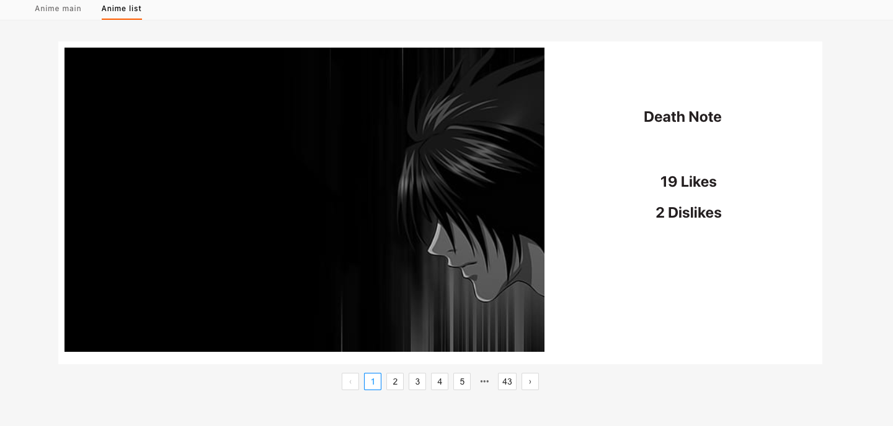

## Building main page UI
Let's first start with the main page of our application. This page should give a user the ability to search and find anime from a list. Based on the user's choice, the user should be able to see the name, some info and wallpaper for the anime.

First things first, let's first build the UI for our application.

Now, since we talked about giving user the choice to search and choose an anime from a list, the widget `TreeSelect` sounds perfect. It gives a drop down and also the ability to search through the list by typing. 

Let's drag and drop that to our application. It should look something like this:

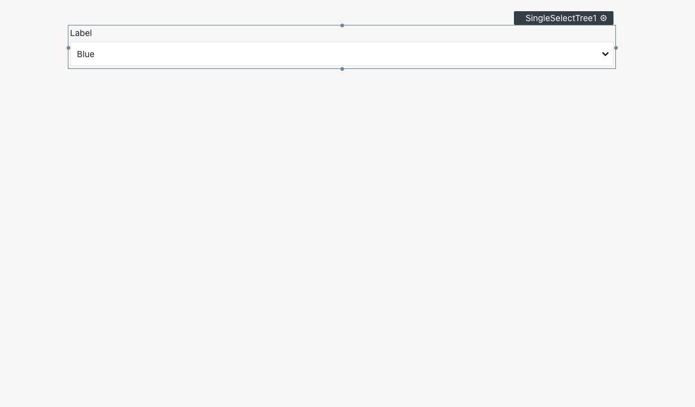

Now, I am also thinking of adding a wallpaper image for the anime that the user chooses. So, of course we arrive at the `Image` widget. So, let's drag and drop the Image widget now. The page should look like this now:

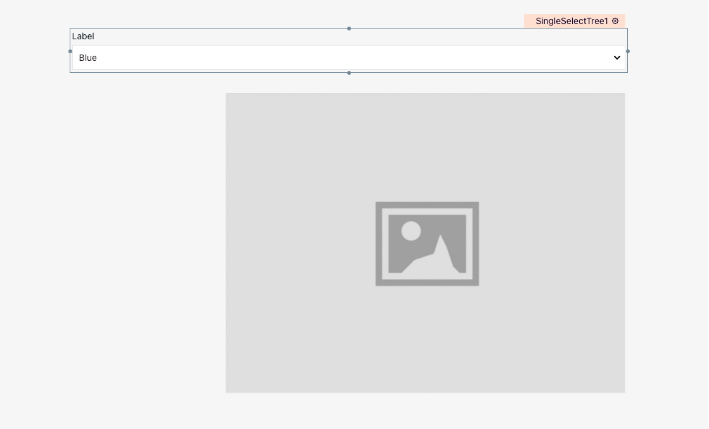

Now, what we need to have are the Like / Dislike buttons and the Name or Source of the anime material. So, of course we will add a... 
`Container` widget.

What? You were not expecting this one?

Okay, okay, I know, I led you on wrong. Sorry about that. Cool, so basically we would need `Text` widgets for displaying the Name and Source of the anime. And some buttons for the Like and Dislike features.

But in the UI, I was thinking of aggregating them all, that's why a `Container` widget. This will allow us to add all of these widgets inside it. So, let's drag and drop a container widget.

After this, let's drag and drop two `Text` widgets for Name and Source. Also let's use `IconButton` widgets instead of simple buttons since it would look better with icons. So we will have two Icon buttons now.

After dropping all of these in the pages, the application would look something like this:


If your styling looks a bit different, don't worry, try fiddling with the settings of the `IconButton` and the other widgets. You might find a lot of ways to make the overall look better.

Okay, now that I think about it, we should also have two widgets two show the number of `Likes` and `Dislikes` that were recorded. So, let's add in two more text widgets for it.

The page should look something like this now:

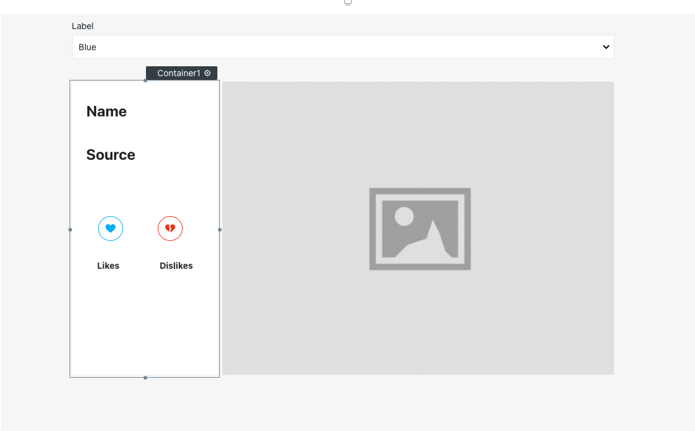

So far so good, right?

## Connecting data

We don't have any data integrated to it, yet. So, let's work on that. 

I am going to be using my own data sources in this case. One is a public API which I have named [AniPi](https://anipi.herokuapp.com/) and other one is a MsSQL table that I have hosted on [Somee.com](https://somee.com).

[AniPi](https://anipi.herokuapp.com/) is public and free to use. It is still a work in progress from my side but I will be making the repo public soon!

So, I am going to be using the wallpaper and titles part of AniPi in this case. The MsSQL table will be used to store the Likes, Dislikes and some other info.

Let's first see how to connect an MsSQL database with Appsmith.

### MsSQL connection
At the left hand side menu, you can see `Datasources` and there's a `+` sign beside it. It looks something like this:

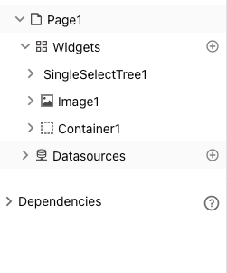

If you click on it, you can see the active connections and there's also a tab that says `Create New`. On clicking it, you will find a screen like this which will show you all the options of database that you can setup for your Appsmith application. It looks something like this:


For connecting an MsSQL database, click on the MsSQL option and you will be greeted with a screen like this:


Here you can fill up the connection credentials, and click on Test to check your connection. And when you're done you can click on Save to save your connection. Now you can see your connection on the Datasources page like this:

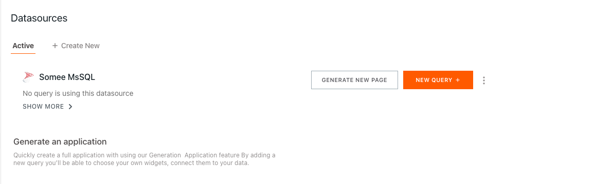

Now that we've also setup the connection, let's quickly write a query for getting the information from the table. Click on the `New query` button next to your database connection. Don't forget to name it to something that makes sense to find easily what each query does later on.

In this case, the query looks like this:

```
SELECT * FROM AnimeLike WHERE Id = {{SingleSelectTree1.selectedOptionValue}}
```

The `SingleSelectTree1.selectedOptionValue` is the selected value from the `TreeSelect` widget. I will explain how this work in a bit more detail later on, when we discuss about connecting the actual widget to this.

We also have to write queries for updating `Likes` and `Dislikes` values in the table on the button clicks. The query looks like this:

```
UPDATE AnimeLike
  SET Likes = Likes + 1
  WHERE Id = {{ SingleSelectTree1.selectedOptionValue }};
```

### AniPi connection
From AniPi, I am going to be using all titles and wallpapers API. So, let's see how we can integrate an external API like AniPi with Appsmith. For this again, click on the plus icon from the Datasources entry in the left hand side menu.

When you get to this screen like before, you have to choose `Create new API`:


After that you will be greeted with a page like this:

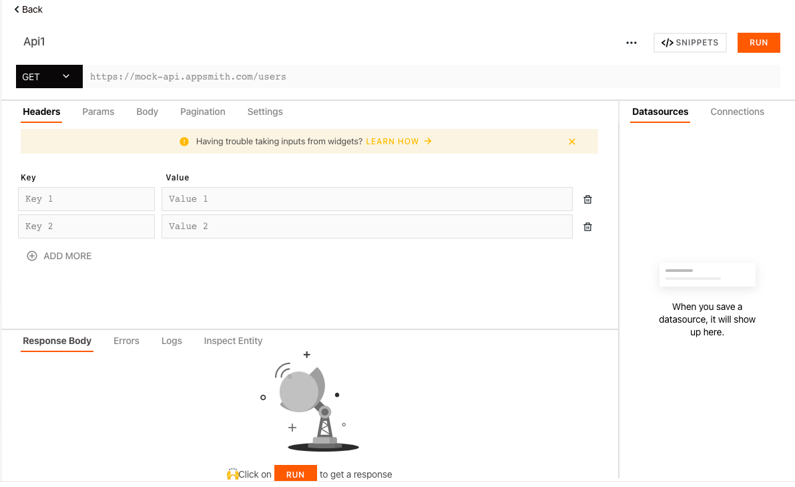

From the [Anipi docs](https://anipi.herokuapp.com/), the URL for the endpoint is `https://anipi.herokuapp.com/api/titles/all`. Let's fill up the details for the API in the screen above. After filling the details up, the screen would look something like this:

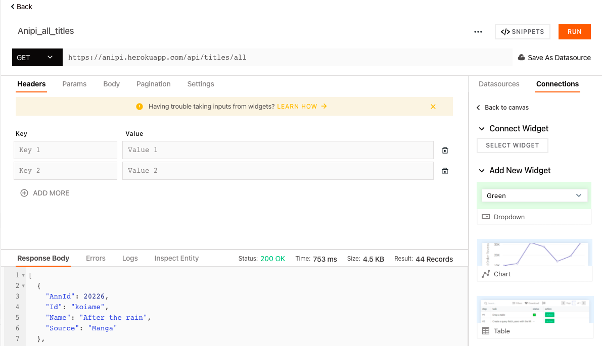

You can also click on `Run` to check if the connection to the API works.

Simple, right?

Let's also quickly setup the wallpaper API.

For that, again setup everything like before. The only change here is that wallpaper API needs the `Id` of the anime. So, the endpoint setup in Appsmith will look something like this:

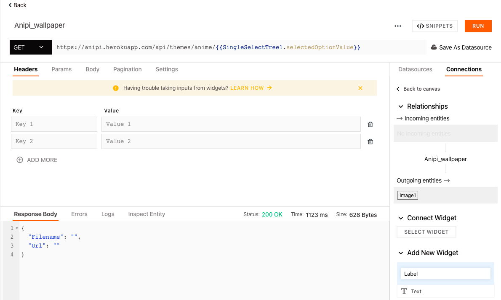

I will get to the whole `{{SingleSelectTree1.selectedOptionValue}}` from previous and this page in next section.

## Binding data to widgets
Let's get back to the main page of the application. We already have added the widgets in the page, now let's bind the actual data to it from our data sources.

First let's setup the data in the dropdown. Click on the settings icon next to it and replace the current value with this:

```
{{
AniPi_all_titles.data.map((row) => {
      return { label: row.Name, value: row.Id };
  });
}}
```

If you're familiar with `map()` function in JavaScript, this would be very easy to understand but if you want a quick refresher, here's a [good resource](https://docs.appsmith.com/core-concepts/displaying-data-read) to check out.

Here, `AniPi_all_titles` is the query that gets all the titles from AniPi. Once you do this, your dropdown will now show the titles of the anime and you can also find them by typing and searching.

Also, one thing that you should notice here is that your dropdown is named `SingleSelectTree1`. This is the identifier that we have also used in the queries above. If this is not the name for you, you should use the identifer name for your dropdown in the queries.

Let's now also setup the URL for the image. Click on the settings icon of your image widget and replace the value with `{{Anipi_wallpaper.data.Url}}`. Here `AniPi_wallpaper` is the query name for getting the wallpaper info from AniPi in Appsmith.

And the title of the anime value to `{{AnimeLike_get.data[0].Name}}`. The likes and dislikes value text widget to `{{AnimeLike_get.data[0].Likes}}` and `{{AnimeLike_get.data[0].Disikes}}` respectively. Here, `AnimeLike_get` is the query for getting the data from the MsSQL database.

Also, we have to increment the likes and dislikes for an anime in our database on the button clicks. We already have written the queries for it above, let's connect them to the IconButtons that we added for liking and disliking.

Click on `onClick` JS for the Like button. Choose the option `Execute a query` from the list, and then click on the query of your choice. It would look something like this:

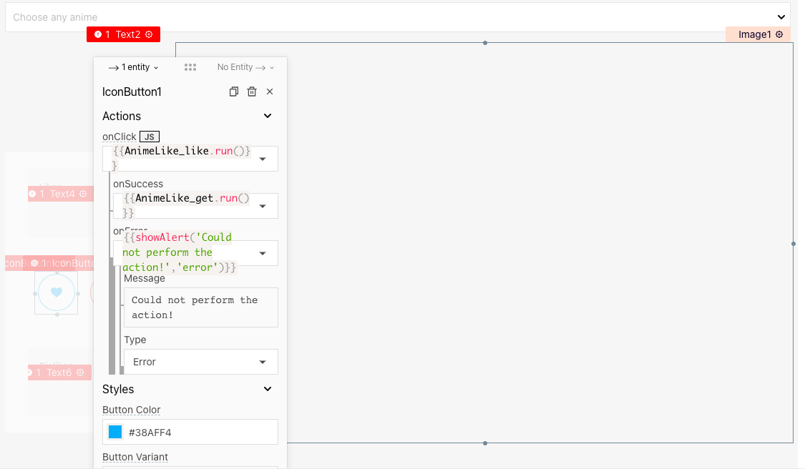

Similarly for the dislike button.

And we're all done for our anime main page for searching. Also, don't bother about saving, Appsmith auto saves everything for you. Click on the deploy button on the right top corner and see your page in action.

What? The wallpaper and details are not changing on choosing the anime from your dropdown?

Oh, yes, forgot to tell that you have to setup this. Click on the settings icon of the `SingleSelectTree1` and setup queries to execute `onOptionChange`. Choose the wallpaper and MsSQL queries, i.e. `AniPi_wallpaper.run()` and `AnimeLike_get.run()`.

This will ensure the dynamic changing of data when you choose the anime from the dropdown. It would look something like this:

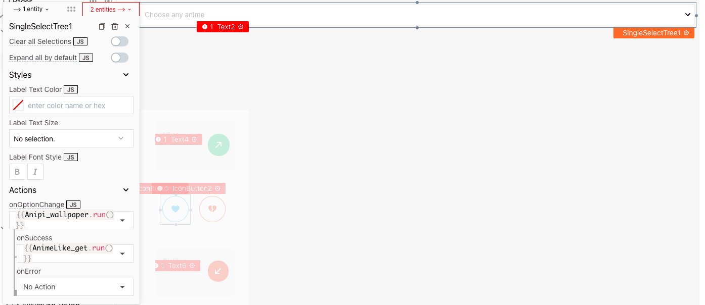

Oh, also AniPi gives you different wallpapers for each anime from a list of wallpapers, so you will have a page with dynamically changing anime wallpaper.

Looks cool, right?

## Building list page UI
Now that we're done with the main page, let's build the UI for the list page for our application. This page will show anime in the order of the likes that were given to the anime in the page we built above.

On the left hand side menu, click on plus icon next to `Pages` on the top, and create a new page.

Since, we will be showing a whole list of anime, what would be the best widget? `List`, right? Cool, so let's drag and drop a List widget. The page would look something like this now:

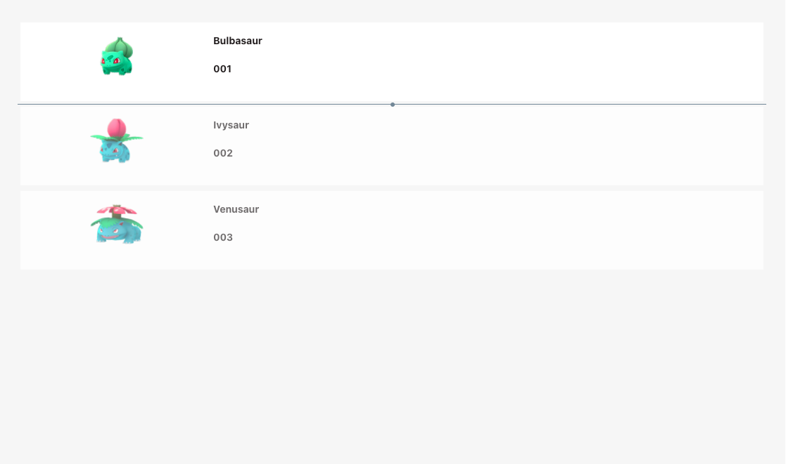

Also, for the UI purposes, I am making each list item very large, so for that just pull the first item from the list to the end of the list. It would look something like this:

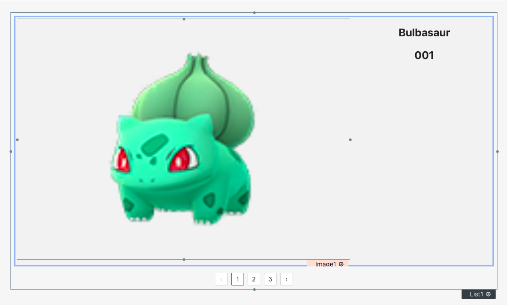

You will also have to setup the data source for your list. In my case, I already have the data in the `AnimeLike` table, so my query looks like this:

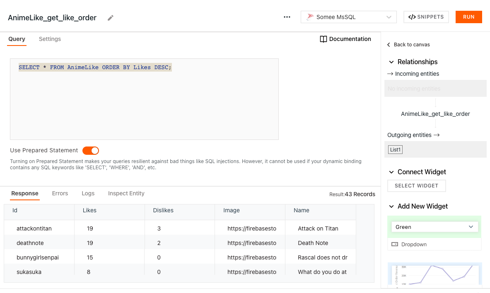

So, now, let's connect the data to the widgets. It's similar to how we did before.

Click on the settings icon of the List widget and set the value to `{{AnimeLike_get_like_order.data}}`. Now go to the image widget's settings and set the value to `{{currentItem.Image}}` and the text widget's value to `{{currentItem.Name}}`.

You can also add two other text widgets inside the first item of the list and set the values to `{{currentItem.Likes}}` and `{{currentItem.Dislikes}}` respectively to show the number of likes and dislikes for the anime.

Remember that the List widget in Appsmith duplicates all the styling and editing of the first item to all others. So, you're almost done now! It would look something like this after styling a bit:

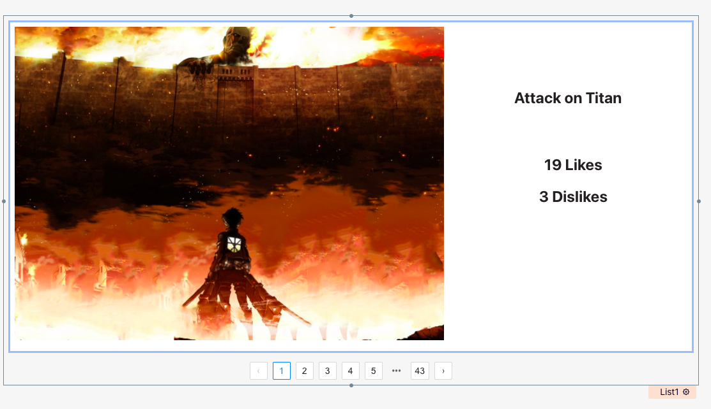

Also, let's not forget to update stuff `onListItemClick` like this:

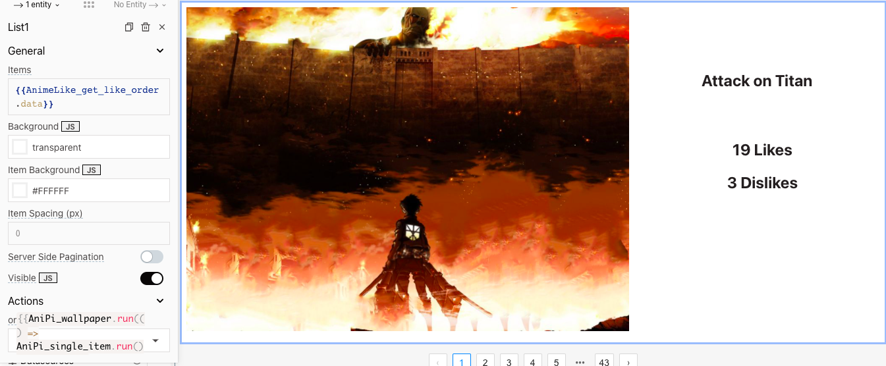

And that's it, deploy and show off!

You can visit the application we built [here](https://app.appsmith.com/applications/615f5becea18372f05104dc1/pages/615f5becea18372f05104dc3) and I hope you learnt something useful here :)
