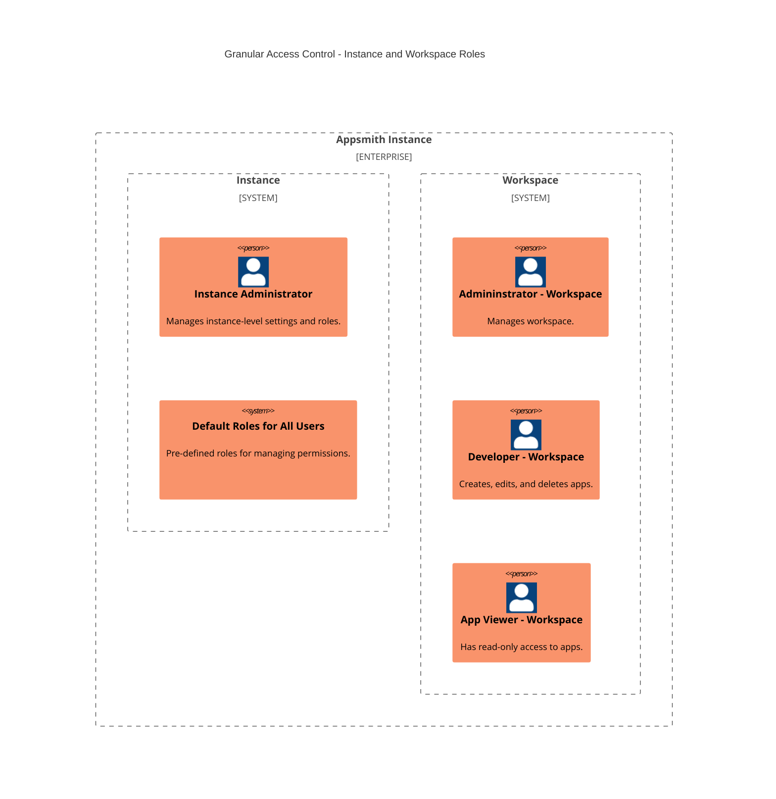

<!-- vale off -->

 <h1>Default Roles</h1>

<Tags
tags={[
{ name: "Business", link: "https://www.appsmith.com/pricing", additionalClass: "business" }
]}
/>

<!-- vale on -->

Default roles in Appsmith are fundamental components of Granular Access Control in Appsmith, designed to simplify access management. This page provides an in-depth explanation of default roles and their significance in the Granular Access Control.

:::info
To view the default roles available for your Appsmith instance, toggle the **Default Role** option on the Roles screen. 
:::

## Significance

Default roles provide standardized permission sets tailored to meet different user roles and responsibilities within app-building experience on Appsmith. Their significance lies in:

- **Ready-to-Use Permission Models:** Default roles provide ready-to-use sets of permissions for roles like administrators, developers, and viewers. Users can assign these roles to app users if the permissions align with their access control needs.
  
- **Reference for Creation of Custom Roles:** They also act as a reference, showing how permissions are linked to different resources within workspaces such as apps, pages, queries, datasources and environments, and more. This understanding helps users to create their own custom roles tailored to their specific requirements.

## Scopes

Default roles in Appsmith have two primary scopes, each serving distinct purposes within the access control framework. 

### Instance level

Instance-level roles have permissions that govern access to Appsmith instance, affecting all workspaces and users within the instance. Some instance-level roles can be tailored to provide specific access to all users. The instance-level roles include:

#### Instance Administrator Role

The Instance Administrator Role operates at the highest level of the Granular Access Control. Users in this role handle tasks such as configuring instances, managing user groups and roles, creating workspaces, and monitoring audit logs. They ensure the operation and security of the instance but do not access individual workspace or app content. For more information about permissions assigned to an instance administrator, see [Instance Administrator Role](/advanced-concepts/granular-access-control/reference/instance-administrator-role) reference.

#### Default Roles for All Users

Default Roles serve as a basic set of permissions assigned to all users across the instance. Initially, these roles have no specific permissions assigned and act as blank templates. Instance administrators can fully customize this role to tailor permissions according to specific business needs. For more information on configuring permissions applicable to all users, see the [Configure Permissions applicable to All Users] guide.

### Workspace level

Workspace-level roles control access within a specific workspace. These roles are pre-defined, offering standard access controls tailored to each workspace, and user cannot customize them. They include:

#### Administrator Role for a Workspace 

An Administrator Role assigned to a Workspace grants full control over all entities within a workspace, allowing users to perform actions such as creating, editing, and deleting entities. Administrators do have some limitations; they lack authority to create workspaces, view audit logs, or manage roles, groups, or users. For more information about permissions assigned to an administrator role for a workspace, see [Administrator Role] reference.

#### Developer Role for a Workspace 

The Developer Role grants users extensive access to different elements within a workspace, such as apps, pages, queries, datasources, and environments. For example, users assigned a developer role can create, edit, and delete apps within the workspace, and manage associated entities like pages. For more detailed information about the permissions associated with the Developer Role, see the [Developer Role] reference.

#### App Viewer Role for a Workspace

The App Viewer Role offers users read-only access to apps within a workspace. For example, users assigned an App Viewer role can only view app content and are restricted from making any modifications like editing or deleting apps, pages, and more. For more detailed information about the permissions associated with the App Viewer Role, see [App Viewer Role] reference.

