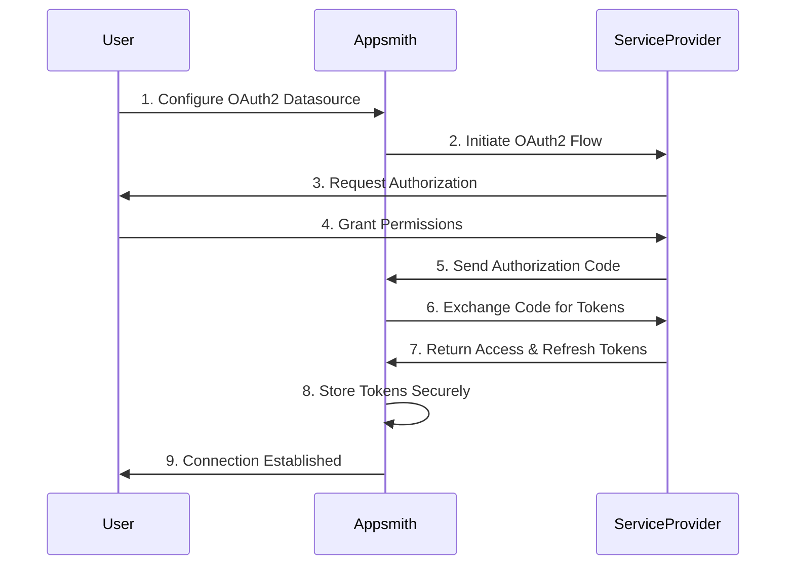
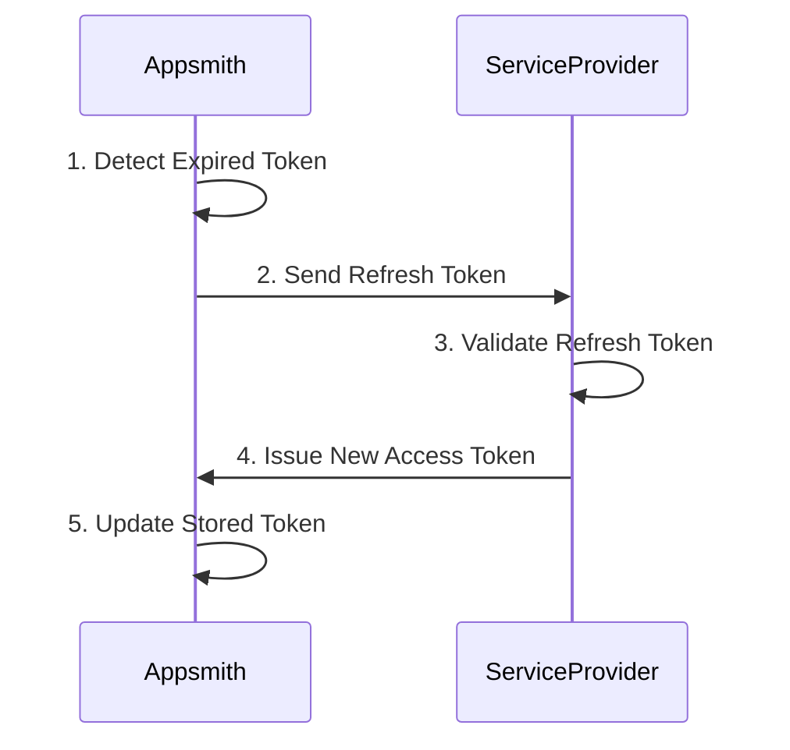
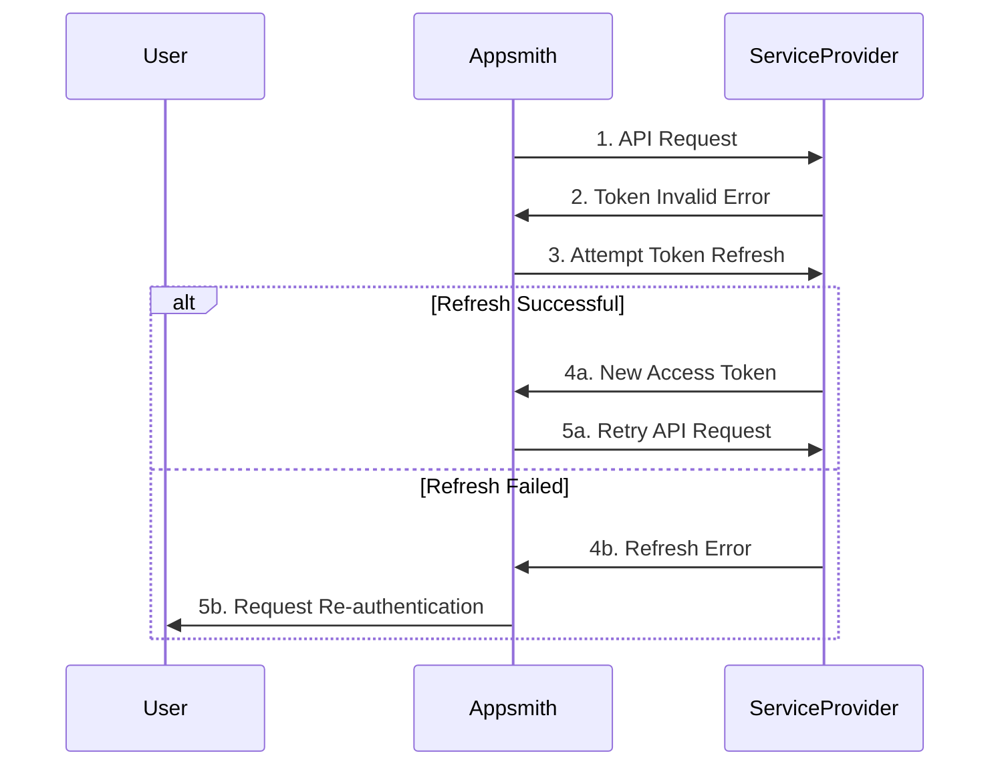

# OAuth2 Flow Diagrams

This page provides visual representations of OAuth2 authentication flows in Appsmith to help you understand how the authentication process works.

## Authorization Code Flow

## Token Refresh Flow

## Error Handling Flow

## Common OAuth2 Errors

Here are some common OAuth2 errors you might encounter and their typical causes:

1. **invalid_request**
   - Missing required parameters
   - Invalid parameter values
   - Multiple credentials provided

2. **invalid_client**
   - Client authentication failed
   - Invalid Client ID or Secret
   - Unauthorized client

3. **invalid_grant**
   - Authorization code expired
   - Refresh token invalid
   - Redirect URI mismatch

4. **unauthorized_client**
   - Client not authorized for grant type
   - Application permissions revoked
   - Invalid scope requested

5. **invalid_scope**
   - Requested scope is invalid
   - Scope exceeds granted permissions
   - Unknown scope values

## See Also

- [OAuth2 Authentication Overview](/connect-data/authentication/oauth2-authentication)
- [Environment Variables Configuration](/getting-started/setup/environment-variables)
- [Authentication Setup](/getting-started/setup/instance-configuration/authentication)
