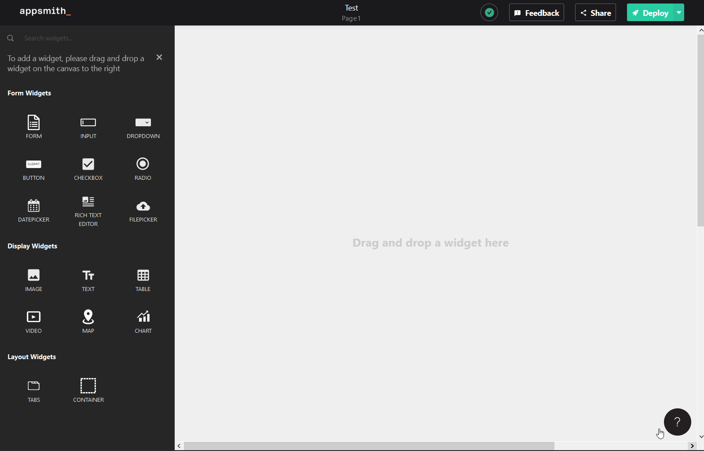

# Button

| Property | Description |
| :--- | :--- |
| **Label** | Sets the label of the button. |
| **Button Style** | Sets the style of the button. You can choose from three button styles: Primary, Secondary & Danger Button. |
| **Visible** | Controls widget's visibility on the page. When turned off, the widget will not be visible when the app is published  |
| **Disabled** | Disables input to the widget. The widget will remain visible to the user but a user input will not be allowed.  |
| **Google Recaptcha Key** | Adds a [Google ReCAPTCHA v3](https://www.google.com/recaptcha/) check to the button. The token will be accessible from the API pane with the `recaptchaToken` key (see [Google reCAPTCHA](../third-party-services/google-recaptcha.md)).  |

| Action | Description |
| :--- | :--- |
| **onClick** | Sets the action to be run when user clicks a button. Default supported actions are: Call API, Navigate to Page, Navigate to URL or Show Alert. |

