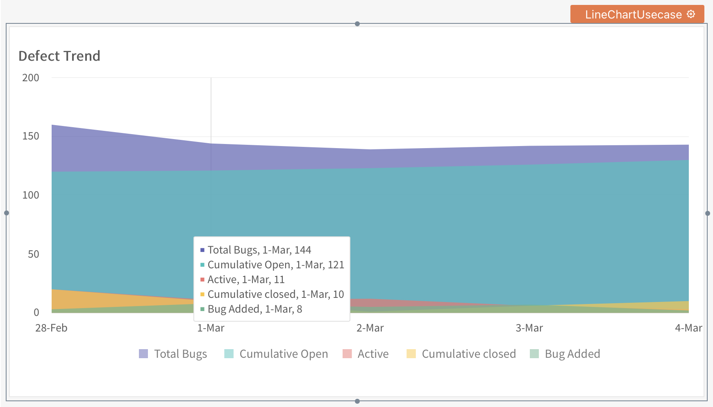

# Chart

When communicating with a larger audience, visual representation of data is beneficial. It is more readable and gives a better understanding of problems/achievements. You can drill down to view specific information when selecting a segment of data.

A **Chart** widget is a visual representation of data. It allows you to visualize the bottlenecks in processes. With the root cause in hand, you can amend the methods to make calculated decisions.



## Add to Canvas

To add a chart widget to your canvas, drag a chart widget from a widget pane available on the left navigation bar.

Navigate to PAGES —> Select Widget Tab —> Write “**chart”** in the search bar —> Drag the widget on the canvas.


How to add a Chart widget to canvas?



You can move the chart widget and position it on the screen according to your convenience.


## Properties

The widget properties allow you to enhance the look and feel of a Chart widget and personalize the same as per your needs. You can find the properties pane on the right side of the canvas.


Ensure that you select the widget to access its properties on the right bar.


The properties pane follows the same structure for almost all the widgets and includes or excludes properties not specific to the selected widget.

| **Property**                 | **Description**                                                                                                                 | **Example**                                                                                                                                                                                     | **Code Snippet**            |
| ---------------------------- | ------------------------------------------------------------------------------------------------------------------------------- | ----------------------------------------------------------------------------------------------------------------------------------------------------------------------------------------------- | --------------------------- |
| **Name**                     | Allows you to provide a unique name of the widget.                                                                              | You will want to name the chart as “SalesReportChart” if you are preparing data for Sales Report.                                                                                               |                             |
| **Title**                    | Use the property to provide a heading.                                                                                          | As you work on Sales data, you can set the title as “Sales Report.”                                                                                                                             |                             |
| **Chart Type**               | You can choose one of the charts from the available options or create your custom chart by selecting the “custom chart” option. | For example, you can represent the data in a line/bar/pie and many more options with custom chart type.                                                                                         |                             |
| **Visible**                  | Allows you to show/hide a widget.                                                                                               | You can either use a toggle or code to turn it off/on.                                                                                                                                          | `{{widget_name.isVisible}}` |
| **Animate Loading**          | With this property, you can control a widget’s animation on the page load.                                                      | You can use a toggle to turn it on/off. When turned off, the widget will load without any skeletal animation. You can also turn it off/on using javascript by enabling the JS label next to it. |                             |
| **Allow Scroll**             | Allows you to enable a scroll bar to scroll the contents.                                                                       | You can use a toggle to turn it on/off.                                                                                                                                                         |                             |
| **x-axis Label**             | You can use this property to provide a specific name to the x-axis.                                                             | For example, you can name the x-axis as **Cities** if your chart data represents data of cities.                                                                                                |                             |
| **y-axis Label**             | You can provide a specific name to the y-axis by using this property.                                                           | For example, you can name the y-axis as **Temperature** if your chart data shows temperature changes for different cities.                                                                      |                             |
| **x-axis Label Orientation** | You can define the orientation of the x-axis label by using this property.                                                      | There are four available options that you can use: auto, stagger, slant, and round.                                                                                                             |                             |
| **Adaptive Axis**            | Allows you to either set the axis value to zero or allow the axis values to determine the values based on data.                 | For example, if you are working on data with yAxis values in the range of 1-10, then the adaptive axis will determine the minimum value is 1 for yAxis. And the data is plotted accordingly.    |                             |

## General

You can choose the properties under this head to name, show/hide, chart type, or animate the loading of the widget.

Let’s deep dive into the properties available under this head.

### Name of Widget

As soon as you select the widget, you can see an editable box available on top of the properties pane.

You can use the default name in the box or provide a meaningful name to the widget. You’ll also see the default naming convention follows the pattern WidgetType followed by a number.&#x20;


It’s advisable to rename the widget to give some meaningful name. It makes it easy to pass parameters by using the widget name to the APIs or queries.


### Title of Widget

When you are working with data, it is crucial to understand what type of data it is. A title given to the chart will let you identify the data. It is especially beneficial to have multiple charts and refer them with names while presenting the data. With this property, you can provide a meaningful title to your chart.

### Chart Type

Appsmith platform offers several quick and easy ways to represent your data. With the Chart Type property, you can select one of the following types to visualize your data:

* Line Chart
* Bar Chart
* Pie Chart
* Column Chart
* Area Chart
* Custom Chart

#### **Line Chart**

A line chart represents the data by connecting the individual data points to form a line. It showcases the relationship between two sets of values and where one depends on the other. It will show how the value changes over time or how the different values change over time relative to each other.&#x20;

For example, you are working on defect tracking for a project and want to express the data to visualize bugs raised, closed, and the active bugs that the team is working on for your sprint. You can group the defects raised in these categories and use a line chart to show bugs introduced for a 5-day window.

Let’s use a line chart to visualize the data.


How to plot a line chart on Appsmith?


As you can see in the video, we use the `Chart Series` property head to supply the data and details related to identifying the data points.

* `Series Title` - the name of the series. In the example above, it is _**Total Bugs**_.
* `Series Data` - stores the data points for the total bugs.
* `X-axis Label` - to define a title for the x-axis.
* `Y-axis Label` - to define a title for the y-axis.

To get a comparative study, you will add data for each category: bugs raised, active bugs, and closed bugs. To add more series, click on the button `+Add Series` and embed the data into `Series Data`, as shown in the video below.


How to add series to capture more data points?


Similar to cumulative open, you can also add details for active bugs.


How to add data points for active bugs?


In the series data, you can also bind it to fetch the defect data from an API/Query.


How to add data points by binding an AP response?


Here, you saw that you fetched the data from an API call by using a mustache sign `GetClosedDefectCountFromAPI` and you can use as below:

```
{{GetClosedDefectCountFromAPI.data}}
```


When doing a comparative chart analysis, you can plot different data points to analyze their behavior in the same course of time by supplying the series data.


#### **Bar Chart**

A bar chart represents data points in the form of rectangles. You can use a bar chart to show comparisons between different groups or categories of data. Bar charts measure change over time.


Except for the Custom Chart Type, you can easily change from one type of chart to another by selecting a different chart type.


For a bar chart also, you can add the data for the `x` and `y` axes and add them to series data.

You can add more series by clicking the `+Add Series` button and plot data points for a comparative study.


#### **Pie Chart**

A pie chart represents data points in a circle divided into slices. It designates the numerical proportions between the data points. Unlike bar or line charts, pie charts do not show changes over time. Each slice depicts the percentage occupied in a whole circle.


You can only use a single series of data to plot a pie chart.



#### Column Chart

A column chart represents the change over time between different categories and represents the data points in the form of rectangles. In a column chart, groups are organized along the horizontal axis and values on the vertical axis.



The main difference between a bar chart and a column chart is how the data is represented on the axis. A bar chart represents data horizontally: the values on the x-axis and categories on the y-axis. In contrast, a column chart represents the values on the y-axis and categories on the x-axis.


Like bar charts for column charts also, you can add more categories by clicking the `+Add Series` button.

#### Area Chart

An area chart is a special data segment type of line chart where the data points are connected to form a line, and the space below the line is also filled to show the area occupied by a category.

Area graphs effectively represent the fall and rise of data series over time.



Like a line chart for an area chart also, you can add more categories and their data by clicking the `+Add Series` button.

#### Custom Chart

Appsmith integrates with[ FusionCharts](https://www.fusioncharts.com/dev/chart-guide/list-of-charts) and provides a wide array of chart types that you can use as part of a custom chart.

You can select **Custom Chart** from the **Chart Type** dropdown to initialize it. On selecting the Custom Chart type, you can see a property **Custom Fusion Chart** where you can define the configuration of the FusionCharts.


FusionCharts offers almost 100+ variants. You can learn more about the charts from the FusionCharts official docs[ here](https://www.fusioncharts.com/dev/chart-guide/list-of-charts/).


A custom chart configuration needs data in the form of two keys: type and dataSource.

**type**

The type is used to define the chart type recognized by the FusionCharts. You can[ get a list of all the supported types available](https://www.fusioncharts.com/dev/chart-guide/list-of-charts) on FusionCharts.

**dataSource**

The datasource defines the customization options and the data points to create a chart.

It has two attributes chart and data. The chart object can customize the chart and includes options like caption, xAxisName, and yAxisName.

The data attribute represents the data in an array format with the key-value pairs as `[{“label”: “string value”, “value”: “string value”}]`

Below is an example configuration for the Custom Fusion Chart property:

```
{
  "type": "",
  "dataSource": {
    "chart": {},
    "data": []
  }
}
```

Let’s take an example to create custom Fusioncharts.


A two-dimensional column chart&#x20;


As you can see, you can choose the `Custom Chart` option from the `Chart Type` property. Once you select the custom chart type, you can see a new property `Custom Fusion Chart`.


You can embed the configuration into the custom fusion chart property or can add an API/query data by using a mustache syntax to add the required configuration.


To plot a column chart in a 2-dimensional look and feel, you can use the configuration as below:

```
{
  "type": "column2d",
  "dataSource": {
    "chart": {
      "caption": "Monthly Revenue for the year 2021",
      "xAxisName": "Month",
      "yAxisName": "Revenue",
      "theme": "fusion"
    },
    "data": [
      {
        "label": "Jan",
        "value": 42000
      },
      {
        "label": "Feb",
        "value": 810000
      },
      {
        "label": "Mar",
        "value": 72000
      },
      {
        "label": "Apr",
        "value": 55000
      },
      {
        "label": "May",
        "value": 91000
      }
    ]
  }
}
```

In the above code snippet, you’ll see that you plotted a column chart to showcase the monthly revenue pattern for last year, say - 2021.

Say you have multiple sister companies under your business name and are targeting to showcase the monthly revenue chart for Harry’s SuperMart. In this case, you can use `subCaption` to define the company name.

```
 “subCaption”: "Harry's SuperMart"
```


Add a sub caption


The revenue displayed is in USD($), and in that case, you can choose a series (`y-axis`) to show `$` as a prefix. You can use `numberPrefix` and add the dollar($) sign.

```
 “numberPrefix": "$"
```


Add a number prefix


You have a monthly target revenue of say $70,000 and would want to plot it in the chart. You can use `trendlines` to add this detail to your chart.

```
"trendlines": [
    {
      "line": [
        {
          "startValue": "700000",
          "valueOnRight": "1",
          "displayvalue": "Monthly Target"
        }
      ]
    }
  ]
```


Add trendlines



`trendlines` are vertical or horizontal lines that help users quickly understand the emphasized data point. For example, a monthly target.


#### Example Custom Charts

Below are a few examples of custom charts that you can use as a starting point.

**Pareto 3D Chart**

A Pareto chart is a type of bar graph. It represents the frequency of change. The bar graphs follow a pattern from the longest bars on the left to the shortest on the right. Pareto charts are used to identify the areas of improvement.

Let’s take an example of a Pareto 3D chart to visualize the data by combining a line chart and column chart.


A Pareto 3D Chart



You can change the type of chart by changing the type in the configuration. For example, “type”: “pareto3d”


Below is a sample Pareto Chart with a 3-dimensional look and feel.

```
{
  "type": "pareto3d",
  "dataSource": {
    "chart": {
      "caption": "Common Car Damages",
      "subcaption": "PitStop Service Station",
      "xaxisname": "Reported Cause",
      "yaxisname": "No. of Occurences",
      "theme": "fusion"
    },
    "data": [
      {
        "label": "Burned out bulb",
        "value": "41"
      },
      {
        "label": "Discharged Battery",
        "value": "20"
      },
      {
        "label": "Blown fuse",
        "value": "14"
      },
      {
        "label": "Worn brake pads",
        "value": "11"
      },
      {
        "label": "Flat",
        "value": "9"
      },
      {
        "label": "Others",
        "value": "5"
      }
    ]
  }
}
```

You can add the below code snippet to have a customized tooltip.

```
"plottooltext": "$label accounted for &lt;b>$datavalue&lt;/b> cars which came for repairs"
```

**Pie 3D Chart**

You can also add a Pie 3D chart with the help of fusion charts.

Take a quick look at the video to know-how.


A three-dimensional Pie Chart


You can use the following sample code snippet to add to the custom fusion chart property and plot a pie chart in a 3-dimensional look and feel.

```
{
  "type": "pie3d",
  "dataSource": {
    "chart": {
      "caption": "Recommended Portfolio Split",
      "subcaption": "For a net-worth of $1M",
      "showvalues": "1",
      "showpercentintooltip": "0",
      "numberprefix": "$",
      "enablemultislicing": "1",
      "theme": "fusion"
    },
    "data": [
      {
        "label": "Equity",
        "value": "300000"
      },
      {
        "label": "Debt",
        "value": "230000"
      },
      {
        "label": "Bullion",
        "value": "180000"
      },
      {
        "label": "Real-estate",
        "value": "270000"
      },
      {
        "label": "Insurance",
        "value": "20000"
      }
    ]
  }
}
```

For a sliced view, you can use a property `enablemultislicing`. Below is a code snippet that you can add to the chart property to have this effect.

```
"enablemultislicing": "1"
```

**Stacked Column 3D Chart**

A Stacked Column represents a part of the whole comparison over time across a different set of data. For example, you can use a fusion chart on Appsmith to plot a stacked column chart in a 3-dimensional view.


A three-dimensional Stacked Column Chart


You can use the below code snippet to add and modify to see how a stacked column 3D chart works.

```
{
  "type": "stackedcolumn3d",
  "dataSource": {
    "chart": {
      "caption": "Deaths reported because of insect bites in India",
      "yaxisname": "Number of deaths reported",
      "subcaption": "(As per government records)",
      "plottooltext": "&lt;b>$dataValue&lt;/b> people died because of $seriesName in $label",
      "showsum": "0",
      "theme": "fusion"
    },
    "categories": [
      {
        "category": [
          {
            "label": "1994"
          },
          {
            "label": "1995"
          },
          {
            "label": "1996"
          },
          {
            "label": "1997"
          }
        ]
      }
    ],
    "dataset": [
      {
        "seriesname": "Hymenoptera",
        "data": [
          {
            "value": "15622"
          },
          {
            "value": "10612"
          },
          {
            "value": "15820"
          },
          {
            "value": "26723"
          }
        ]
      },
      {
        "seriesname": "Diptera",
        "data": [
          {
            "value": "3622"
          },
          {
            "value": "2612"
          },
          {
            "value": "5820"
          },
          {
            "value": "6723"
          }
        ]
      }
    ]
  }
}
```

### Visible

You can use Visible to show or hide the widget. By default, visible is enabled, so the widget is visible on page load. This property particularly comes in handy when you want to **hide/show** a widget programmatically or hide a widget on page load and then show it when a particular condition or data is available.

There are two ways in which you can manipulate this property.

* Enable the `JS` label next to Visible and write the javascript code that can handle the show and hide of the widget by manipulating visible property.
* Write your own JSObject and javascript code to link to any other widget and manage the show/hide.


You can get the reference of visible property by using `{{widget_name.isVisible}}` in your code.


For example, let’s drag a checkbox widget `Checkbox1` onto the canvas and bind it to the Visible property of the chart widget by enabling the `JS` label next to it. Add the following JavaScript code in the Visible property.

```
{{Checkbox1.isChecked}}
```


How to use visible property to show/hide a widget?


When you tick the checkbox, it will enable the Visible property, and the chart will be visible in the app.

## Events

You might want to fetch more data based on clicks on a chart. Events on the chart capture the user interaction.

| **Event**        | **Description**                                              | **Example**                                                                                                                                   | **Code Snippet**                                                                                                                                                                             |
| ---------------- | ------------------------------------------------------------ | --------------------------------------------------------------------------------------------------------------------------------------------- | -------------------------------------------------------------------------------------------------------------------------------------------------------------------------------------------- |
| onDataPointClick | Allows you to capture the click event and trigger an action. | You can perform[ various actions when the click event is triggered](https://docs.appsmith.com/core-concepts/writing-code/appsmith-framework). | <p>You can refer to the values of the Chart widget -</p><p><code>{{widget_name.selectedDataPoint.x}}</code> for x-axis, and <code>{{widget_name.selectedDataPoint.y}}</code> for y-axis.</p> |

With many out-of-the-box chart representations available on Appsmith, visualize and share your data across business functions.
