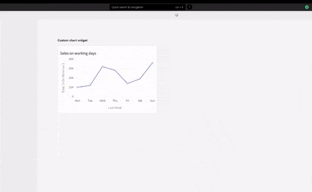

# Chart



## Properties

<table>
  <thead>
    <tr>
      <th style="text-align:left">Property</th>
      <th style="text-align:left">Description</th>
    </tr>
  </thead>
  <tbody>
    <tr>
      <td style="text-align:left"><b>Title</b>
      </td>
      <td style="text-align:left">Sets the title of the Chart widget.</td>
    </tr>
    <tr>
      <td style="text-align:left"><b>Chart Data</b>
      </td>
      <td style="text-align:left">
        
Displays a chart based on an array of objects with X and Y values. You
          can transform the data from an API using a map. Note: Multiple series of
          data can be displayed in a single chart widget using the Add series button

        
<b>{{ apiName.data.map((value) =&gt; { return { x: value.date, y: value.count } }) }}</b>
        

      </td>
    </tr>
    <tr>
      <td style="text-align:left"><b>Chart Type</b>
      </td>
      <td style="text-align:left">Changes the type of chart displayed for the chart data. Available options
        are: Line chart, Bar chart, Pie Chart, Column Chart, and Area Chart,
        <a
        href="chart.md#custom-chart">Custom Chart</a><code>(new)</code>.</td>
    </tr>
    <tr>
      <td style="text-align:left"><b>x-axis Label</b>
      </td>
      <td style="text-align:left">Sets the label of the x-axis of your chart.</td>
    </tr>
    <tr>
      <td style="text-align:left"><b>Allow Horizontal Scroll</b>
      </td>
      <td style="text-align:left">Enables the horizontal scroll (x-axis scroll) inside the chart widget
        boundary.</td>
    </tr>
    <tr>
      <td style="text-align:left"><b>y-axis Label</b>
      </td>
      <td style="text-align:left">Sets the label of the y-axis of your chart.</td>
    </tr>
    <tr>
      <td style="text-align:left"><b>Visible</b>
      </td>
      <td style="text-align:left">Controls widget&apos;s visibility on the page. When turned off, the widget
        will not be visible when the app is published</td>
    </tr>
  </tbody>
</table>

## Custom Chart

In case your use case is not covered in the offered chart types, this option will let you extend all the functionalities offered by the underlying package \([fusioncharts](https://www.fusioncharts.com/)\). The new custom configuration requires an object with `type:string` and `datasource:object` attributes

| Property | Description |
| :--- | :--- |
| Type | All available charts under the fusion chart library. Find all type\(s\) [here](https://www.fusioncharts.com/dev/chart-guide/list-of-charts) |
| Datasource | Object consists of customization options and the data to be mapped. The object has 2 properties `{"chart": object, "data": array}`. The `chart` object has options which are used to customize the chart; caption, x/y axis label etc. Find all chart properties [here ](https://www.fusioncharts.com/dev/chart-attributes/area2d)based on the `type: string` you selected. The `data` property is a collection of object as `[{"label": string, "value": string}, ... ]`  |

