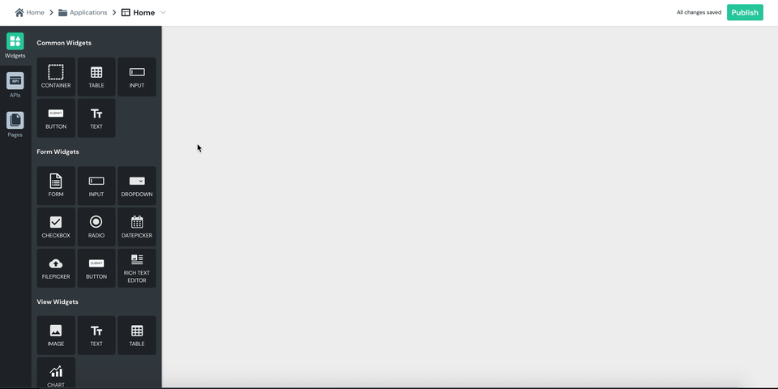

# Container

| Property | Description |
| :--- | :--- |
| **Background Color** | Changes the background color of the container. Allowed color formats are HTML color name, HEX, RGB, and RGBA |
| **Visible** | Controls widget's visibility on the page. When turned off, the widget will not be visible when the app is published  |
| **Scroll Contents** | Enables scrolling within the container's boundary and helps you organize more widgets in a small space on your app page.  |

