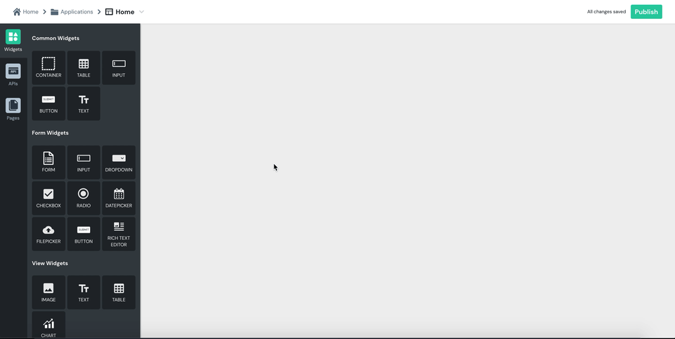

# Datepicker

## Properties

| Internal Property | Description |
| :--- | :--- |
| **selectedDate** | This is the date value that is displayed on the date widget. This value changes if the default value is updated or the user inputs a value. |

| Property | Description |
| :--- | :--- |
| **Label** | Sets the label of the Datepicker. |
| **Default Date** | Sets a default date that will be captured as user input unless it is changed by the user. |
| **Date Format** | The format of the date selected by the date picker |
| **Required** | When turned on, it makes a user input required and disables any form submission until an input is made. |
| **Visible** | Controls widget's visibility on the page. When turned off, the widget will not be visible when the app is published  |
| **Disabled** | Disables input to the widget. The widget will remain visible to the user but a user input will not be allowed. |

| Action. | Description |
| :--- | :--- |
| **onDateSelected** | Sets the action to be run when a user make_s_ a date selection on the widget. Default supported actions are: Call API, Navigate to Page, Navigate to URL or Show Alert. |

