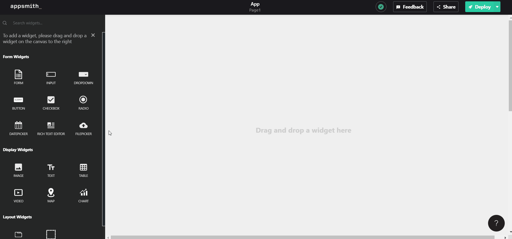

# Filepicker

## Upload File

You can upload files by creating a post API and referring to the base64 or binary version of the file in the post body.

```text
{{ Filepicker1.files[0].base64 }}

{{ Filepicker1.files[0].raw }}
```

## Properties

<table>
  <thead>
    <tr>
      <th style="text-align:left">Internal Property</th>
      <th style="text-align:left">Description</th>
    </tr>
  </thead>
  <tbody>
    <tr>
      <td style="text-align:left"><b>files</b>
      </td>
      <td style="text-align:left">
        <p>This is the array of files selected in the file picker. The base64 and
          binary versions of each file are present in each array object and can be
          accessed as</p>
        <p><b>{{ Filepicker1.files[0].base64 }}</b>
        </p>
        <p><b>{{ Filepicker1.files[0].raw }}</b>
        </p>
      </td>
    </tr>
    <tr>
      <td style="text-align:left"><b>uploadedFileUrls</b>
      </td>
      <td style="text-align:left">This is the data that was bound in the Uploaded File URLs property for
        access to be uploaded in an API.</td>
    </tr>
  </tbody>
</table>

| Property | Description |
| :--- | :--- |
| **Label** | Sets the label of the Filepicker. |
| **Maximum  No. of files** | Enables you to set the maximum number of files allowed to be uploaded by a user. |
| **Maximum File Size** | Enables you to set the maximum allowed size of each file that a user can upload. |
| **Allowed File Types** | Enables you to set constraints on the type of file a user can upload - images, videos, audios, text files, etc. |
| **Required** | When turned on, it makes a user input required and disables any form submission until an input is made. |
| **Visible** | Controls widget's visibility on the page. When turned off, the widget will not be visible when the app is published |
| **Uploaded File URLs** | This property specifies the URLs of the uploaded files that the file upload API returned. You can bind it to the API using  |

| Action | Description |
| :--- | :--- |
| **onFilesSelected** | Sets the action to be run when a user selects the files. You can immediately call an API to upload the base64 of the file to your cloud storage |



