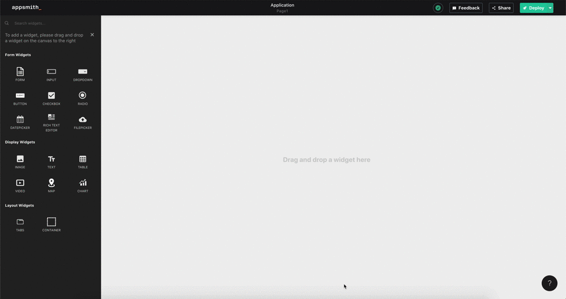

# Form

## Form Widgets

Form widgets are a class of widgets that are typically used to capture user information. These widgets may be used outside a form such as form filtering data but their primary use is to capture user input. These are the form widgets Appsmith supports

* [**Input**](input.md)
* [**Dropdown**](dropdown.md)
* [**Datepicker**](datepicker.md)
* [**Filepicker**](filepicker.md)
* [**RadioGroup**](radio.md)
* [**Checkbox**](checkbox.md)

## Sending Form data to an API

User inputs in a form can be sent to an API by binding the individual widgets inside a form to the API body or query params.

```text
{
  "name" : "{{ inputText.text }}"
}
```

Read more about submitting form data to an API below

[Sending widget data in post body](../core-concepts/apis/taking-inputs-from-widgets.md#passing-inputs-to-the-post-body)

## Form Button

The form button is provided by default to every form. It is used for form submission and resetting form inputs.

### Properties

| Property | Description |
| :--- | :--- |
| **Label** | Sets the label of the button. |
| **Button Style** | Sets the style of the button. You can choose from three button styles: Primary, Secondary & Danger Button. |
| **Disable Invalid Forms** | This property disables the form button if any form widget that is required does not have a user input or if their validation failed |
| **Reset Form on Success** | This property resets all the form widgets to their default values when the form buttons action succeeds |
| **Visible** | Controls widget's visibility on the page. When turned off, the widget will not be visible when the app is published |
| **Disabled** | Disables input to the widget. The widget will remain visible to the user but a user input will not be allowed. |

| Action | Description |
| :--- | :--- |
| **onClick** | Sets the action to be run when user clicks a button. Default supported actions are: Call API, Navigate to Page, Navigate to URL or Show Alert. |



