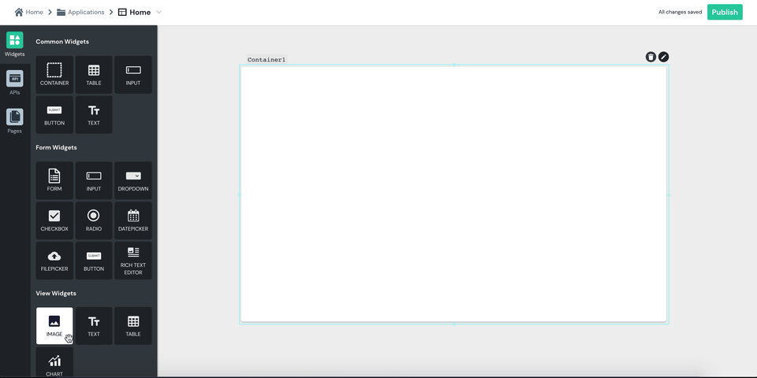

# Image

| Property | Description |
| :--- | :--- |
| **Image** | Renders the image from the URL or the Base64 that you set. |
| **Default Image** | Sets a default image, from a URL or a Base64, that will be displayed if no image is rendered via the "Image" property. |
| **Visible** | Controls widget's visibility on the page. When turned off, the widget will not be visible when the app is published  |

