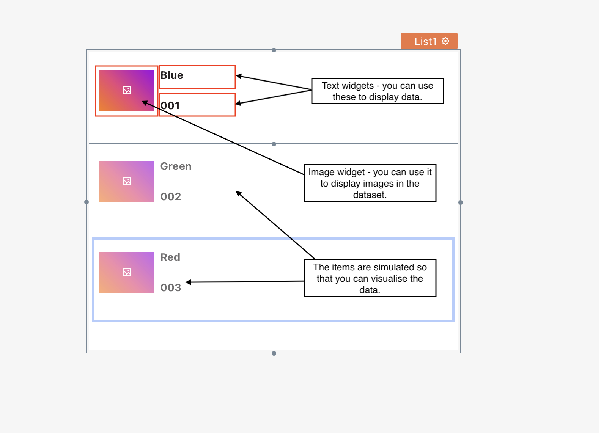
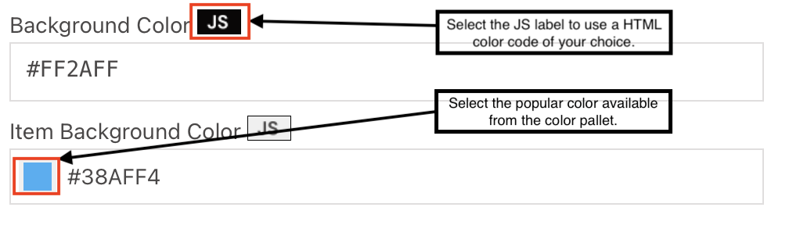

# List

You can use a list widget to display structured data collection. For example, You have a dataset of employees with each entity having properties like name, designation, department, etc. You can use a list widget to iterate over the employee collection and display the data one after the other. The list widget gives you the flexibility to supply this dataset and takes care of the iteration without writing any code.


List widget is in beta right now. It can only render widgets for display purposes like text, image, etc., in the template, but we plan to offer more features in the future.





## Usage

List widget provides you with an out-of-the-box functionality to iterate over a structured data collection. The datasets can be static or generated by the response from API/queries.

## Add to Canvas

To add a list widget to your canvas, drag a list widget from a widget pane available on the left navigation bar.

Navigate to PAGES —> Select Widget Tab —> Write “**list”** in the search bar —> Drag the widget on the canvas.



Now that you have a list widget added to the canvas, you can move it anywhere on the canvas by simply dragging the widget.

## Components

Typically, a list widget is a collection of other widgets that you can embed to display data. Once you drag the list widget on the canvas, you can see it has embedded widgets like an[ image](https://docs.appsmith.com/widget-reference/image) and two[ texts](https://docs.appsmith.com/widget-reference/text) available.



For example, you are building an employee directory and want to display the name, image,  designation, and department. You can use the below components to display the employee data in a list widget:

* Text widget - to display employee name.
* Image widget - to show employee’s picture.
* Text widget - to populate designation.
* Text widget - to display department.

So, your list widget will be a collection of three text widgets and one image widget.

The platform provides a list widget with an embedded image and two text widgets. You can add more widgets as per your requirement.


In the beta version of the List widget, you can only use widgets to display the data like images, text, and more. However, the widgets that need users to provide inputs like text box, checkbox, and more, are not available in beta but will be added as part of future releases.


To add more widgets to your list, navigate to the left bar under **PAGES**, click on the **Widget** tab, and search for a widget like **Text**. **Drag** the widget on the first item for the list in the widget.

.png>)


Add the widgets only on the first item container in the list. The widgets will be replicated for the other items whenever the data renders automatically. We’ll learn more about how the embedded widgets replicate on a dataset in the subsequent section below.


The next thing you would like to do is set up some data for the list widget. You can do that by configuring properties for the widget.

## Properties

The widget properties allow you to modify the look and feel of the widget and define the data binding. You can also specify the operations you want to perform on the list widget in the properties pane.

The properties structure generally follows the same conventions for the widgets available on the platform, with some variations to cater to specific properties depending on the type of widget that you would be using. In the case of a list widget, the properties pane is **available on the right bar** and has two subheads: General and Events.


Ensure that you select the widget to access its properties on the right bar.


| **Property**               | **Description**                                                                    | **Example**                                                                                                                                                                                     | **Code Snippet**             |
| -------------------------- | ---------------------------------------------------------------------------------- | ----------------------------------------------------------------------------------------------------------------------------------------------------------------------------------------------- | ---------------------------- |
| **Name**                   | Allows you to provide a unique name to the widget                                  | Say you are using a list to display employees so that you can name the widget as - EmployeeList.                                                                                                |                              |
| **Items**                  | Allows you to bind static or dynamic data collection to the widget.                | You can supply a static JSON or bind query/API response.                                                                                                                                        | \{{query\_name.data\}}       |
| **Background Color**       | Allows you to choose the background color of the widget.                           | You can select the color from the color pallet or use an HTML color Code by enabling a JS label next to it.                                                                                     |                              |
| **Item Background Color**  | Allows you to set an item background color.                                        | You can select the color from the color pallet or use an HTML color Code by enabling a JS label next to it.                                                                                     |                              |
| **Item Spacing**           | Allows you to set the padding between the adjacent items.                          | You can supply padding in pixels(px) like 5px.                                                                                                                                                  |                              |
| **Server-side Pagination** | Allows you to set pagination for large datasets returned as subsets to the client. | You can define the [pagination for the large datasets](https://docs.appsmith.com/core-concepts/displaying-data-read/display-data-tables#pagination).                                            |                              |
| **Visible**                | Allows you to show/hide a widget.                                                  | You can either use a toggle or code to turn it off/on.                                                                                                                                          | \{{widget\_name.isVisible\}} |
| **Animate Loading**        | Allows you to control a widget’s animation on the page load.                       | You can use a toggle to turn it on/off. When turned off, the widget will load without any skeletal animation. You can also turn it off/on using javascript by enabling the JS label next to it. |                              |

## General

You can use the properties under this subhead to modify the look and feel of the widget, like background color, item spacing, etc., and bind the dataset.

Let's deep dive into each property available under this head.

### Name of Widget

You can see a textbox available at the top of the Properties pane. List1 is the default name given to a list widget added to the canvas. The number**{1}** in List1 is a running sequence. If you add more list widgets, the names of the subsequent list widgets could be like List2, List3, and more.




It’s advisable to rename the widget to give some meaningful name. It makes it easy to pass parameters by using the widget name to the APIs or queries.


### Items

Items are used to bind your dataset with the list widget. Either you want to iterate over static or dynamic data generated by executing a database Query/API call.

To have a dynamic data binding for the list widget, you can use the **Connect Data** button on the right bar or choose the Queries/API/JS functions from the left navigation bar available under the **Explorer** tab.



#### Connect Data

When you click on the **Connect Data** button, it navigates to the DataSources page, where you can either add new datasources or choose existing datasources. On the datasources page, once you have selected the datasource, you can either add queries or select available queries to bind the response to the list widget.[ Read more to add different datasources and create queries.](https://docs.appsmith.com/datasource-reference/querying-amazon-s3)

#### Explorer Tab

On the **Explorer** tab, you’ll have options to choose from Queries to Javascript(JS) functions to datasources and queries. Choose one of the options that would enable you to add data to the list widget.

#### Data Mapping

You can see a box displaying the static JSON data. You can replace the static JSON in the items pane or bind the query/API/JS response, and the list widget will use the data for generating the items.

If you wish to bind the dynamic response of the queries/API, then you can use mustache syntax (`{{ }}`) to embed the same. For example, You have written a query `“GetAllEmployees”` then to bind the response use `{{GetAllEmployees.data}}`. Typically, you will have a format of `{{QUERY_NAME.data}}` to bind the data returned by the query.

To better understand how to bind data to a list widget, let’s take an example of static Javascript Object Notation (JSON).

You’ll see that in the JSON snippet below, there is a collection of books with details like `bookId`, `bookName`, `bookImage`, `category`, `author`, `publishedDate`, and `price`.

```
[

  {

    "bookId": "001",

    "bookName": "Artificial Intelligence for Business Leaders",

    "bookImage": "https://m.media-amazon.com/images/I/511Y1LSr0JL.jpg",

    "category":"Computing, Internet & Digital Media",

    "author" :"Ajit K Jha",

    "publishedDate": "22-July-2020",

    "price": "INR 599"

  },

  {

    "bookId": "002",

    "bookName": "Bootstrap 4 Quick Start",

    "bookImage": "https://images-na.ssl-images-amazon.com/images/I/41GTBaVKAyL._SX404_BO1,204,203,200_.jpg",

    "category":"Computing, Internet & Digital Media",

    "author" :"Jacob Lett",

    "publishedDate": "20-March-2018",

    "price": "INR 439.90”

 }

]
```

Replace the above JSON snippet in the items pane. To display the data in the list widget, you’ll need five text widgets and one image widget. Drag and drop these widgets on the canvas, and remember to add the widgets on the **first item** of the list widget. You’ll see that the items will simulate iteration so that you can visualize iterated data.

Let’s bind each JSON field to the widgets embedded in the list widget. You can follow similar steps to bind the data for other widgets:

* Select the Image widget.
* In the right bar for General Properties, input the code snippet <mark style="color:orange;">`{{currentItem.bookImage}}`</mark>. Please note that <mark style="color:orange;">`currentItem`</mark>refers to the item read from the data collection. It is similar to the iterator reference of the collection you would be iterating over in the code. `bookImage` is the JSON attribute in the above code snippet.
* You will see that the image is now displayed, as the image widget renders the image available on the URL supplied in JSON.

Similarly, you can bind bookName, category, author, publishedDate, and price to the embedded widgets in the list widget. Once you link the data, you can see that the list widget will display the data for the JSON.


If you are binding the dynamic response of your query or API to the list widget, remember to use the query columns or API response object’s attributes to map to the individual widget by using <mark style="color:orange;">`currentItem.<attribute_or_column_name>`</mark>.


### Format

Now that the widget has data linked to it, let’s do some formatting changes to enhance the look and feel of the widget.

#### Background Color

You can use the property background color to change the widget’s background. You can select the available colors from the color pallet to change the background color.

#### Item Background Color

Like Background color, you can select the available colors from the pallet to change the item’s background color for your widget.




Tip: To change the background/item background color by using HTML Color codes, click the JS label next to Background Color/ Item Background Color label and supply the HTML Color code in the box below.


#### Item Spacing

You can use item spacing to add the padding to the list cells. Padding will ensure that you have some space included between the adjacent cells of the widget. Item spacing uses Pixels(px) as a unit. You can supply a number like 5 to the item spacing that adds the padding of 5px to the list cells.

### Server Side Pagination

You can use server-side pagination when a client receives only a subset of data from large datasets. It allows you to define the data limit that a Query or an API call can render. Thus, allowing you to paginate the data and determine the pagination boundaries.[ Read more on server-side pagination to paginate your large data sets](https://docs.appsmith.com/core-concepts/displaying-data-read/display-data-tables#pagination).

### Visible

You can use Visible to show or hide the widget. By default, visible is **on** that is enabled, so the widget is visible on page load. This property particularly comes in handy when you want to **hide/show** a widget programmatically or hide a widget on page load and then show it when a particular condition or data is available.

There are two ways in which you can manipulate this property.

* Enable the JS label next to Visible and write the javascript code that can handle the show and hide of the widget by manipulating visible property.
* Write your own JS object and javascript code to link to any other widget and manage the show/hide.


You can get the reference of visible property by using <mark style="color:orange;">`{{widget_name.isVisible}}`</mark> in your code.


For example, let’s drag a checkbox widget `Checkbox1` onto the canvas and bind it to the `Visible` property of the list widget by enabling the JS label next to it, add the following JavaScript code in the `Visible` property of the list widget.

```
{{Checkbox1.isChecked}}
```

When you check the checkbox, it will enable the Visible property, and shows the list widget. Whereas the uncheck on the checkbox will hide the widget.



## Events

You use events to capture a user interaction and perform various operations.

| **Event**       | **Description**                                              | **Example**                                                                                                                                   | **Code Snippet**                         |
| --------------- | ------------------------------------------------------------ | --------------------------------------------------------------------------------------------------------------------------------------------- | ---------------------------------------- |
| onListItemClick | Allows you to capture the click event and trigger an action. | You can perform [various actions when the click event is triggered](https://docs.appsmith.com/core-concepts/writing-code/appsmith-framework). | `{{widget_name.selectedItem.item_name}}` |

### onListItemClick

For a list widget, the event onListItemClick is fired whenever a user clicks or selects an item on the list. You can perform many[ supported actions](https://docs.appsmith.com/core-concepts/writing-code/appsmith-framework) on a list item click.

For example, show a message whenever a user clicks on a list item.


An individual item on the list is defined as the entire row. A row includes the widgets embedded into it. You can get the values of embedded widgets for the selected or clicked item in your code to perform various operations.




Take advantage of using the list widget to display your datasets and visualize your content in a better way.
