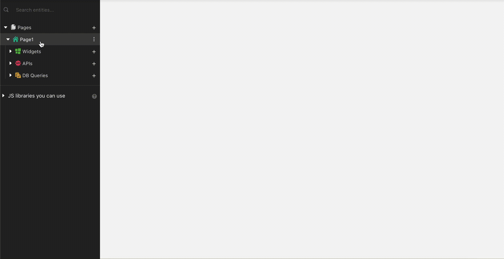

# Modal

| Property | Description |
| :--- | :--- |
| **Quick Dismiss** | Quickly dismisses or closes the Modal when the user taps outside the modal. |
| **Modal Type** | Sets the type of the modal\(Alert or Form Modal\). |
| **Scroll Contents** | This property enables scrolling within the contents of the modal |

## Reopening Created Modals

Selecting the created modal listed in the Entity Explorer will open it in Edit mode.

## Opening Modals via Widgets

To open the Modals via other widgets please refer to [Show Modal](../framework-reference/show-modal.md) function.

