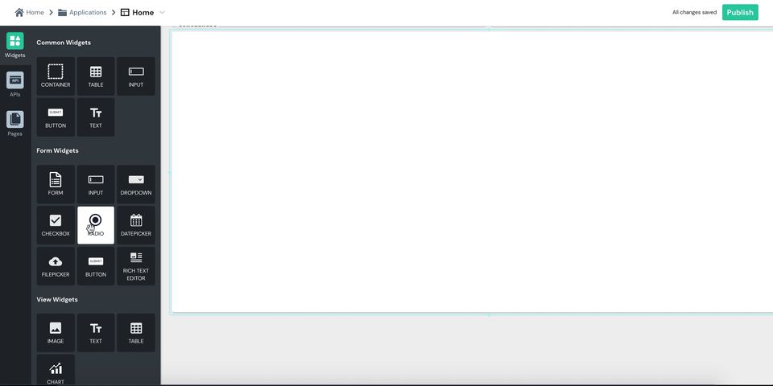

# Radio

| Property | Description |
| :--- | :--- |
| **Label** | Sets the label of the RadioGroup. |
| **Options** | Lets you set labels and values for different options in the option list of the Radio widget. |
| **Default Selected Value** | Sets a default value that will be captured as user input unless it is changed by the user. |
| **Required** | When turned on, it makes a user input required and disables any form submission until an input is made. |
| **Visible** | Controls widget's visibility on the page. When turned off, the widget will not be visible when the app is published  |

| Action | Description |
| :--- | :--- |
| **onSelectionChange** | Sets the action to be run when a user changes a selected option. Default supported actions are: Call API, Navigate to Page, Navigate to URL or Show Alert. |

