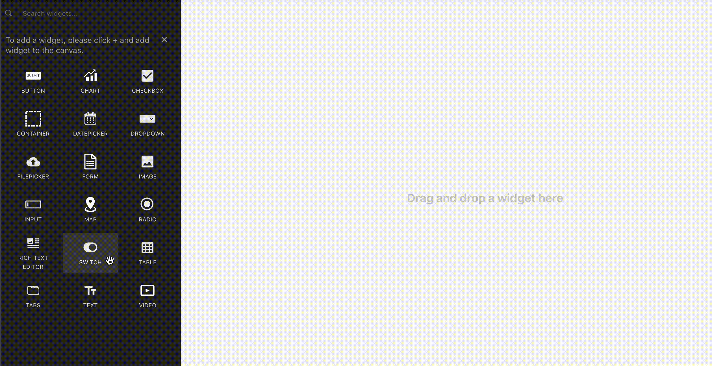

# Switch

| Property | Description |
| :--- | :--- |
| **Label** | Sets the label of the switch. |
| **Swap Label** | Swaps the position of switch's label to right or left. |
| **Default Selected** | Sets a default option that will be captured as user input unless it is changed by the user. |
| **Visible** | Controls widget's visibility on the page. When turned off, the widget will not be visible when the app is published  |
| **Disabled** | Disables input to the widget. The widget will remain visible to the user but user input will not be allowed.  |
| **isSwitchedOn** | This value is a boolean that is set to true if the switch is turned on.  |

| Action | Description |
| :--- | :--- |
| **onChange** | Sets the action to be run when the user toggles the switch. See a list of [supported actions](../core-concepts/writing-code/appsmith-framework.md) |

